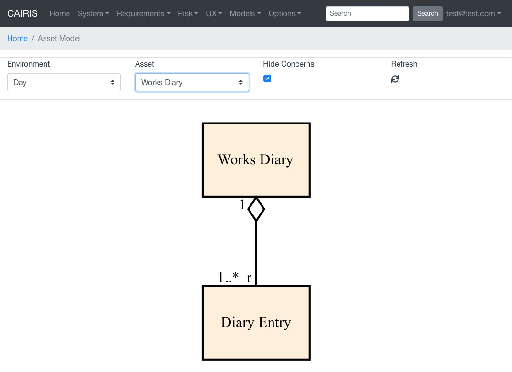
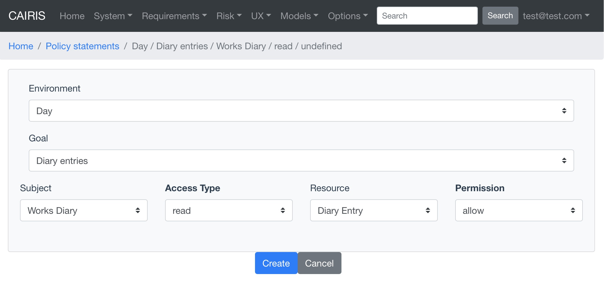
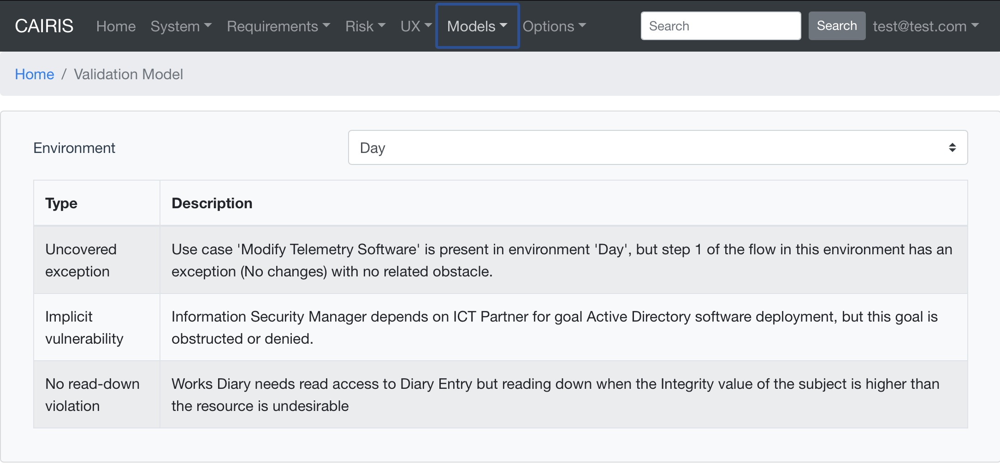

Modelling access control needs and policies
===========================================

Overview
--------

Access control needs can be modelled in CAIRIS, together with access control policy statements.  If both needs and policies are captured then model validation checks can identify potentially undesirable or insecure access possibilities.

Modelling access needs
----------------------

Indicating the need *subjects* have for accessing *resources* is captured in asset associations, where subjects and resources are system, information, or people assets.  The table below indicates permitted access needs for the different asset types.  For example, a person might read some information, but not vice-versa.  It may seem odd that information should be permitted to access resources but, during early stages of design, stakeholders might model some system that stores information as an information asset, or an information asset needs to access some resource because some out-of-scope system or person is handling that information, but capturing information-information access has some value.

.. table:: Permitted access needs between subjects (rows) and resources (columns)

   +-----------------+--------+-------------+--------+
   |                 | System | Information | People |
   +=================+========+=============+========+
   | **System**      |   Y    |      Y      |   N    |
   +-----------------+--------+-------------+--------+
   | **Information** |   Y    |      Y      |   N    |
   +-----------------+--------+-------------+--------+
   | **People**      |   Y    |      Y      |   Y    |
   +-----------------+--------+-------------+--------+

Asset models visually model desired access between subjects and resources, and the ends of asset associations can capture access control information.

Possible adornments for access needs are one or more of read (r), write (w), and interact (x).  The choice of *x* is inspired by the execute permission used in unix, but the use of the term *interact* allows for a wider range of interaction affordances than execution.  Where r, w, or x adornment are not shown on the end of an association, it is assumed no access needs to take place.  

For example, the figure above shows the relationship between a Works Diary and Diary Event.  Both are information assets and the former contains one or more of the latter.  The adornment on the tail end of the Works Diary-Diary Event association should be read as *a works diary needs to read a diary event*.  The figure also indicates that diary events do not need to read, write, or interact with work diaries.

Multiple access needs can be captured in a comma-separated need list.  For example, replacing *r* with *r,w* in the above example indicates that *a works diary needs to read and write a diary event*.

Modelling access control policies with policy statements
--------------------------------------------------------

An access control policy captures the set of authorised and unauthorised interactions between assets.  These interactions are captured using *policy statements*, where  statement is defined as *Subject* X *Access* X *Resource* X *Permission*, where *Access* = {*read, write, interact*} and *Permission* = {*allow,deny*}.
	
A single KAOS goal is associated with a single policy statement.  The goal needs to specify concern links to both the subject and resource assets.  The goal should be precise enough to specify the conditions or capabilities the system needs to satisfy for the policy statement to hold.  Where this is not possible, the goal needs to be refined.  Consequently, a complete access control policy should correspond with a complete specification describing the intent the system needs to satisfy for compliance with the policy.  

Access needs should correspond with goals and policy statements, but the absence of needs do not, i.e. adding deny policy statements.  There are other means for capturing the rationale for non-inclusion, and goals may not be within the scope of analysis.  This approach does not preclude the addition of goals and policy statements if they are.

If there is a goal and policy statement for interaction between a subject and resource, we would expect this to be refined to read and/or write interactions between the two.

* To add a policy statement, click on the Requirements / Policy Statement menu to open the Policy Statement table, and click on the Add button to open the Policy Statement form.

* Select the environment and goal with concern links to the subject and resource assets.

* Select the subject, access type, resource, and permission.

* Click on the Create button to add the new policy statement.

* Policy statements can be updated and deleted in a similar manner to other CAIRIS objects.

.. note::
   At the time of writing, policy statements are not added to any generated documentation.  When they are, this note will be removed from the documentation.

Access control model validation checks
--------------------------------------

A number of access control specific model validation checks are supported, e.g. No-read down violation checks for conflicting Integrity values.  See :ref:`ac_checks` for a full list of supported checks.

