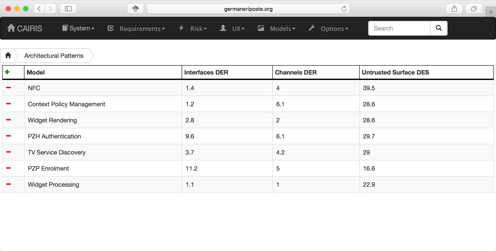
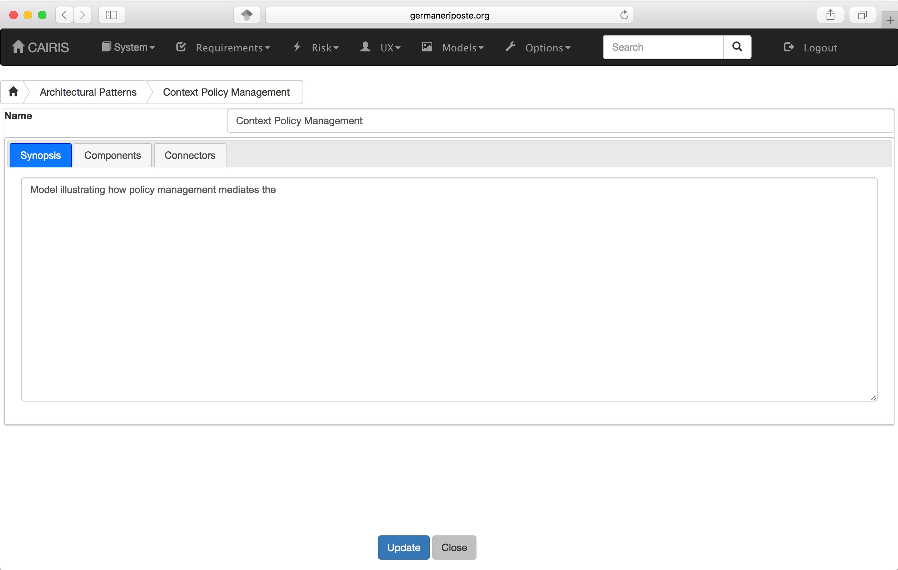
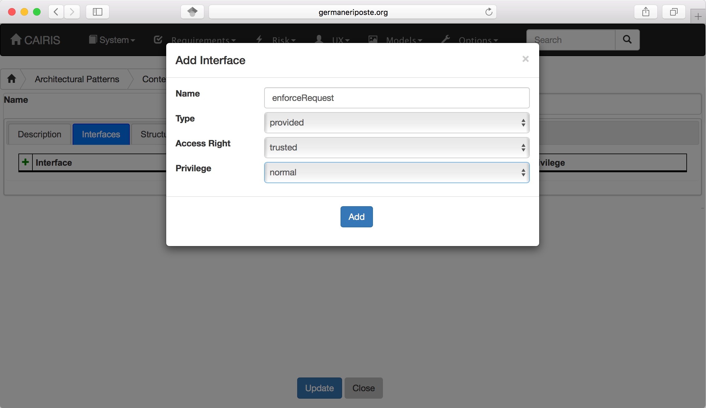
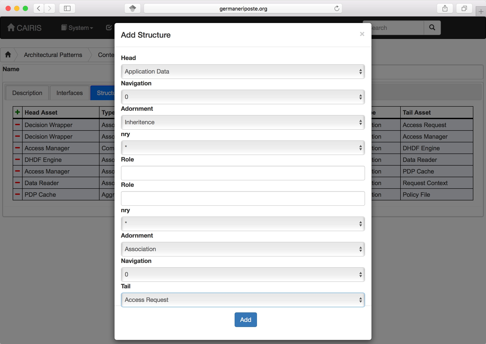
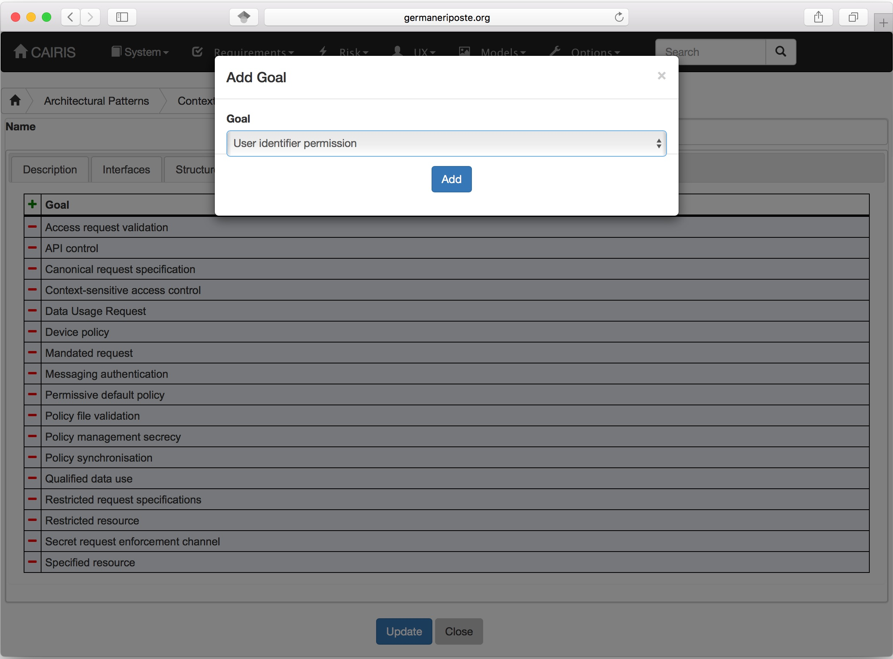
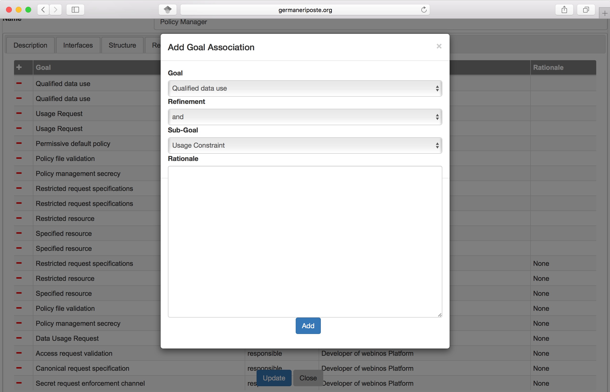
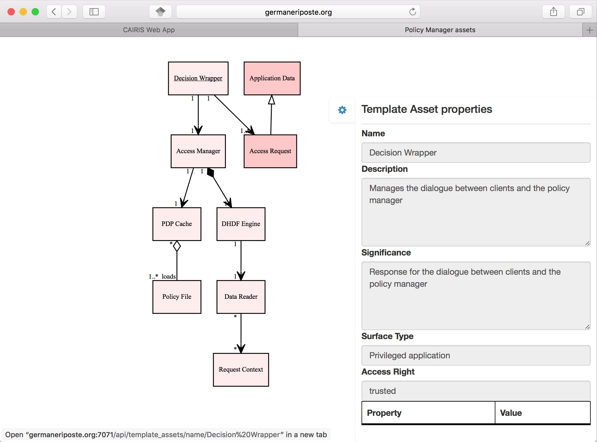
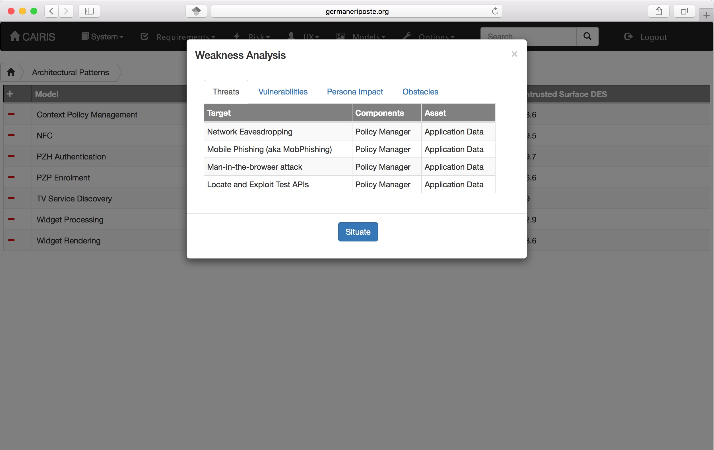

Architectural Patterns
======================

Designing software doesn't start with a blank page, but with a bricolage of different model elements.

*Architectural patterns* model pre-defined components, connectors, responsibilities, and requirements or goals that the model elements satisfy.

Editing Architectural Patterns
------------------------------

-  Select the Requirements / Architectural Patterns table to view the table of Architectural Patterns.  The table provides a summary of the Damage-Effort Ratios for Interfaces, Channels, and Untrusted Surfaces.  These metrics are explained in more detail `here <http://reports-archive.adm.cs.cmu.edu/anon/isr2011/CMU-ISR-11-121.pdf>`_.

-  To create a new Architectural Pattern in CAIRIS, click on the Add button to open the Architectural Pattern form.

-  Enter the name for the architectural pattern and provide a synopsis for the pattern.

-  Select the Component tab, lick on the Add button to add a new Component folder for the component being created.

-  Enter a name for component.

-  Select the Interfaces folder, and click on the Add button to add a new interface.

-  Enter the name of the interface, and select whether the interface is provided or required, the interface access right, and privilege. Click on Add to add the interface to the component.

-  Select the Structure folder, and click on the Add button to add a new template asset association to the component.

-  For both the head and tail end of the template asset association, select the template asset, navigability indicator (0 or 1), adornment (inheritance, association, aggregation, composition, or dependency), cardinality *nry* (1, *, or 1..*), and an optional role.  Click on Add to add the association to the component template asset structure.

-  If there are template requirements associated with the component, click on the Requirements folder and click on the Add button to select a requirement, and click on the Add button to add the template requirement to the component.

-  If there are template goals associated with the component, click on the Goals folder and click on the Add button to select a goal, and click on the Add button to add the template goal to the component.

-  To add relationships between template goals associated with the component, click on the Goal Associations folder and click on the Add button to add a new Goal Association.

-  Select the template goal and sub-goals, the form of refinement (and / or), and enter some rationale for this relationship.  Click on the Add button to add this goal association to the component.

-  Click on the Update button to add the component to the architectural pattern.

-  Select the Connectors folder, and click on the Add button to open the Connector form.

-  Enter a name for the connector.

-  Select the From folder to enter details of the *from* end of the connector.  Enter the role name, and select the component and component interface.

-  Select the To folder to enter details of the *to* end of the connector.  Enter the role name, and select the component and component interface.

-  Select the Details folder to enter information about the connector itself.  Select the asset being carried by the connector, the connector protocol, and the access right needed to interact with the connector.  Available assets are drawn from the asset structure of both components.

-  Click on the Update button to add the connector to the architectural pattern.

-  Click on the Create button to add the architectural pattern.

Viewing Architectural Patterns
------------------------------

Architectural patterns can be viewed by clicking on the Models/Architectural Patterns menu option,
and selecting the architectural pattern to display

.. figure:: ArchitecturalPatternModel.jpg
   :alt: Architectural Pattern Model

Components in this model are shaded red based on the component attack surface,  This value is based on the DER\ :sub:`i` metric.

It is also possible to view asset and goal models associated with a component in an architectural pattern by clicking on the Models/Component Asset and Models/Component Goal respectively.

Situating a pattern
--------------------------

-  To introduce an architectural pattern into the working project.

-  Click on the situate button next to the desired architectural pattern in the architectural patterns table, followed by the environment to situate the pattern in.  A weakness analysis dialog is displayed, which summarises the threats and vulnerabilities that will become associated with the pattern, the impact to persona task scores, and obstacles mitigated by goals introduced by the pattern.  

-  Click on the Ok button introduces the patterns template goals, requirements, and assets as standard goals, requirements, and assets respectively.
