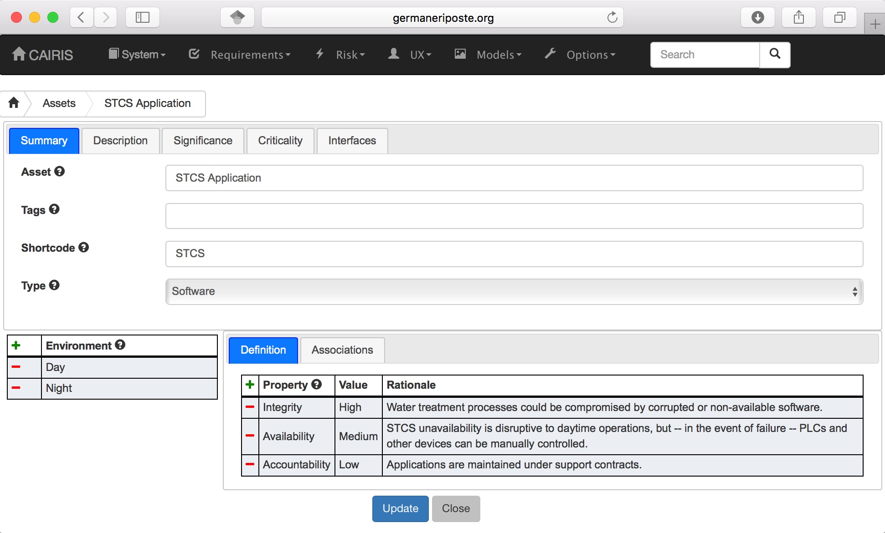
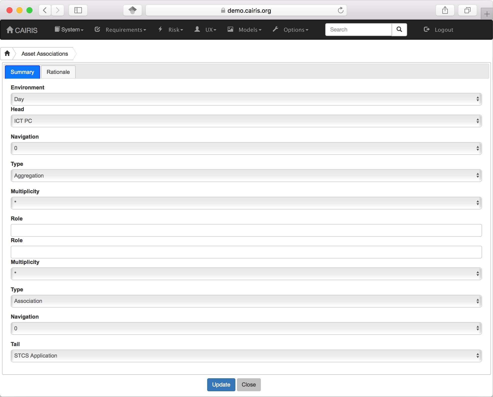
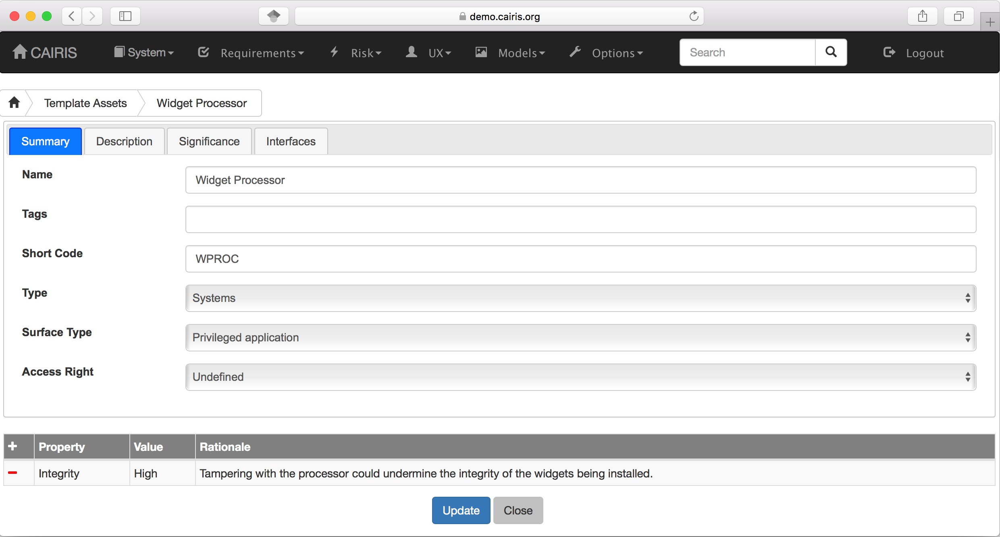

Assets
======

Assets are tangible objects of value to stakeholders. By defining an
asset in CAIRIS, we implicitly state that this needs to be secured in
light of risks which subsequently get defined.

Assets are situated in one or more environments. Security and Privacy properties are
associated with each asset for every environment it can be found in.  These properties are described below:

================= ======================================================================================================================================================================================== ======================================
Property          Description                                                                                                                                                                              Reference
================= ======================================================================================================================================================================================== ======================================
Confidentiality   The property that information is not made available or disclosed to unauthorised individuals, entities, or processes.                                                                    ISO/IEC 27001
Integrity         The property of safeguarding the accuracy or completeness of assets.                                                                                                                     ISO/IEC 27001
Availability      The property of being accessible and usable on demand by an authorised entity.                                                                                                           ISO/IEC 27001
Accountability    The property that ensures the actions of an entity may be traced uniquely to an entity.                                                                                                  ISO 7498-2
Anonymity         The property that other users or subjects are unable to determine the identity of a user bound to a subject or operation.                                                                Common Criteria Privacy Requirements
Pseudonymity      The property that a set of users and/or subjects are unable to determine the identify of a user bound to a subject or operation, but that this user is still accountable for its action. Common Criteria Privacy Requirements
Unlinkability     The property that users and/or subjects are unable to determine whether the same user caused certain operations in the system.                                                           Common Criteria Privacy Requirements
Unobservability   The property that users and/or subjects cannot determine whether an operation is being performed.                                                                                        Common Criteria Privacy Requirements
================= ======================================================================================================================================================================================== ======================================

Each of these properties is associated with the
value of None, Low, Medium, or High. The meaning of each of these values
can be defined in CAIRIS from the Asset Values dialog; this is available
via the Options/Asset values menu.

Adding, updating, and deleting an asset
---------------------------------------

-  Select the Risks/Assets menu button to open the assets table, and
   click on the Add button to open a new asset form.

-  Enter the name of the asset, a short code, description, and
   significance. The short-code is used to prefix requirement ids
   associated with an environment.

-  If this asset is deemed critical, click on the Criticality tab, and
   click on the Critical Asset check-box. A rationale for declaring this
   asset critical should also be added. By declaring an asset critical,
   any risk which either threatens or exploits this asset will be
   maximised until the mitigations render the likelihood of the threat
   or the severity of the vulnerability inert.

-  Click on the Add button in the environment card, and select an environment to situate the asset in. This will add
   the new environment to the environment tab.

-  After ensuring the environment is selected in the environment table,
   add the security properties to this asset for this environment.
   Security properties are added by clicking on the Add button in the properties table
   to open the Choose security property dialog. From this window, a security property, its value
   its value rationale can be added.

-  Click on the Create button to add the new asset.

-  Existing assets can be modified by double clicking on the asset in
   the Risks/Assets table, making the necessary changes, and clicking on
   the Update button.

-  To delete an asset, select the asset to delete in the assets table
   , and select the Delete button. If any artifacts are dependent on
   this asset then a modal dialog stating these dependencies are
   displayed. The user has the option of selecting Yes to remove the
   asset dependencies and the asset itself, or No to cancel the
   deletion.

Asset modelling
---------------

Understanding how assets can be associated with each other is a useful
means of identifying where the weak links in a prospective architecture
might be. CAIRIS supports the association of assets, inconsistency
checking between associated assets, and visualisation of asset models.

The CAIRIS asset model is based on UML class models. Asset models can be
viewed for each defined environment. As well as explicitly defined asset
associations, asset models will also contain associations implicitly
defined. For example, if a task has been defined, and this task concerns
within an environment contain one or more assets, then the participating
persona will be displayed as an actor, and an association between this
actor and the asset will be displayed. Additionally, if concern
associations have been defined between goals and assets and/or
associations then zooming into the model will display these concerns;
the concerns are displayed as blue comment elements.

Adding an asset association
~~~~~~~~~~~~~~~~~~~~~~~~~~~

-  You can add an association between assets by selecting the Risk/Asset Association menu, and
   clicking on the Add button in the association table.

-  In the association form which is opened., set the adornments for the head and tail
   end of the association. Possible adornment options are Inheritence,
   Association, Aggregation, and Composition; the semantics for these
   adornments are based on UML.

-  Set the multiplicity (nry) for the head and tail ends of the
   association. Possible multiplicity options are ``1``, ``*``, and
   ``1..*``.

-  Optional role names can also be set at the head or tail end of the
   association.

-  Select the Create (or Update if modifying an existing association) will
   add the association to the CAIRIS model.

- You can also add associations between other assets from the environment Associations tab within the Asset form.
  You can add a new association by clicking on the Add button in the association table to open the association form.
  From this form, you can add details about the nature of the association between the asset you're working on and another [tail] asset.
  Once you click on Update, the association will be added to your working object, but won't be committed to the model until you click on the Update/Create button.

Although not possible from the UI, it *is* possible to add associations between assets directly in a CAIRIS model file without first defining security or privacy properties for the asset in the model file.  If you do this, all the security and privacy properties for the asset are set to None and the rationale of ``Implicit`` is set for each property.

Viewing Asset models
~~~~~~~~~~~~~~~~~~~~

Asset models can be viewed by selecting the Models/Asset menu, and selecting the environment to view the environment for.

.. figure:: AssetModel.jpg
   :alt: Asset Model

By changing the environment name in the environment combo box, the asset model for a different environment can be viewed.

Each asset node is shaded red based on its *attack surface*.  This is based on the highest severity value of the vulnerabilities associated with the asset; the higher the value, the darker the shade of red.

The model can be filtered by selecting an asset.
This will display on the asset, and the other asset model elements immediately associated with it.
By default, concern associations are hidden.  These are UML comment nodes that indicate elements from other CAIRIS models associated with asset.
These concerns can be shown by changing the Hide Concerns combo box value to Yes.

By clicking on a model element, information about that artifact can be viewed.

For details on how to print asset models as SVG files, see :doc:`Generating Documentation </gendoc>`.

Template Assets
~~~~~~~~~~~~~~~

You can specify libraries of template assets that you might form the basis of security or architectural patterns.

These can be added, updated, and deleted in much the same way as standard assets, but with two differences:

1.  Template assets are not environment specific, so you need to specify the general security properties that need to be protected should this asset be included in a model.

2.  You need to first define Access Rights, Surface Types, and Privileges.
