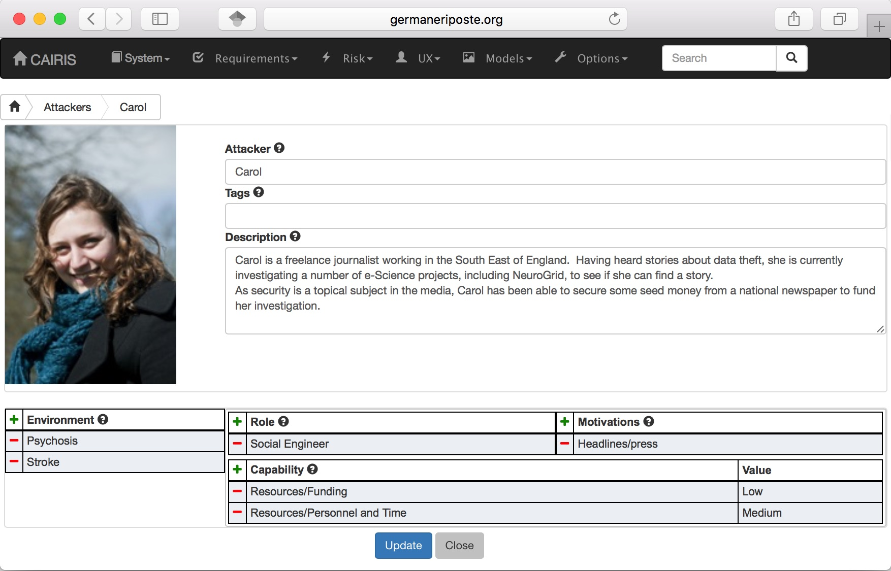

Attackers
=========

Attackers launch attacks in the form of threats. Attackers are similar
to personas in that they fulfill one or more roles, and can be personalised
with additional information.

Certain capabilities and motivations may be associated with attackers.
CAIRIS is pre-loaded with a selection of these, but these can be
modified, or new capabilities and motivations created by selecting the
Options/Capabilities or Options/Motivations menu options.

Adding, updating, and deleting an attacker
------------------------------------------

-  Select the Risk/Attackers toolbar menu to open the Attackers table, and click on the Add button to open the Attacker form.

-  Enter the attacker name, and a description for the attacker.

-  If you have decided to personalise the attacker with a picture, this
   can be added by clicking on avatar silhouette next to the attacker
   description, and selecting a image to represent the attacker. Permitted image types are jpg, png, giff, and bmp.

-  Click on the Add button in the environment card, and select an environment to situate the attacker in. This will add the new environment to the environment list.

-  Click on the Add button on the Roles table to associate one or more roles to the attacker.

-  Click on the Add button on the Motivation and Capability tables to add
   one or more motive and capability values. For the capability, a value
   of Low, Medium, or High also needs to be selected.

-  Click on the Create button to add the new attacker.

-  Existing attackers can be modified by clicking on the attacker
   in the Attackers table, making the necessary changes, and
   clicking on the Update button.

-  To delete an attacker, click on the Delete button next to the attacker to be removed in the Attackers table. If any artifacts are dependent on this attacker then a dialog box stating these dependencies are displayed. The user has the option of selecting Yes to remove the attacker dependencies and the attacker itself, or No to cancel the deletion.
