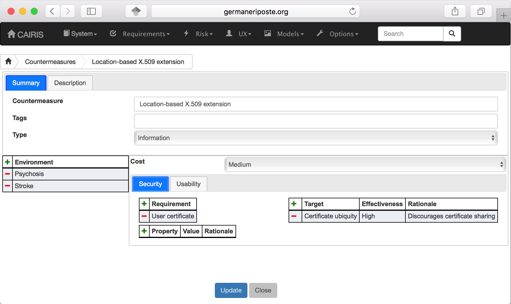
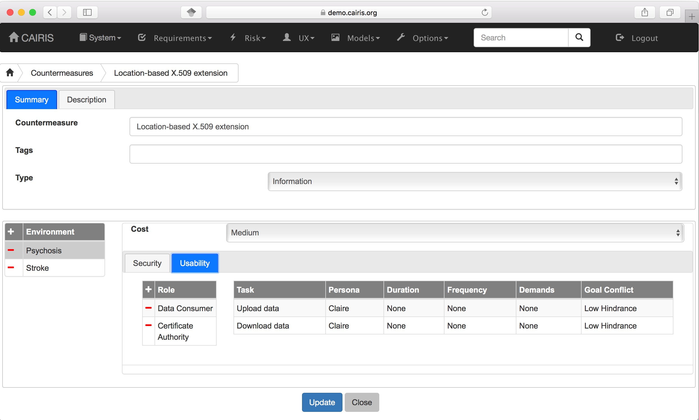

Countermeasures
===============

After a response goal has been generated, goal modelling continues until
one or more countermeasure requirements have been defined and associated
with their parent goals. Following this, a countermeasure can be
defined. Defining a countermeasure also has the effect of satisfying a
response goal and resolving any obstacles associated with the underlying
risk's threat or vulnerability.

Countermeasures target a risk's threat, vulnerability, or both.
Countermeasures also have a level of effectiveness. This effectiveness
level determines how much the countermeasure reduces the likelihood of
the associated threat, or severity of the associated vulnerability.

Countermeasures are associated with roles, who may be responsible for
developing, maintaining or using the countermeasure. Consequently,
countermeasures are also associated with tasks and, when defining a
countermeasure, it is also necessary to indicate how much the
countermeasure helps or hinders the properties of associated tasks.

Adding, updating, and deleting a countermeasure
-----------------------------------------------

-  Select the Risk/Countermeasures menu to open the Countermeasures form, and click on the Add button to open the Countermeasure form.

-  Enter the countermeasure name and description, and select the countermeasure type. A countermeasure may be one of the following type: Information, Systems, Software, Hardware, or People.

-  Click on the Add button in the environment card, and select an environment to situate the countermeasure in. This will add the new environment to the environment list.

-  Select the countermeasure cost to indicate the general cost of implementing the countermeasure within the selected environment.

-  Click on the Security tab to display the security page. Click on the Add button above the Requirements table, and select the requirement (or requirements) this countermeasure refines. Following this, click on the Add button above the Targets table to select the countermeasure's target/s, together with the countermeasure's effectiveness. Finally, add the security properties fostered by this countermeasure via the security properties box at the bottom of the page.

-  Click on the Usability tab to display the usability page. Click on the Add button above the Roles table, and select the roles associated with this countermeasure. Any tasks associated with these roles are automatically populated in the Task box at the bottom of the page, together with the person/s carrying out the task. If the countermeasure helps or hinders a task, double click on the task and modify the task's attributes accordingly.

-  Click on the Create button to add the new countermeasure.

-  Existing countermeasures can be modified by clicking on the countermeasure in the Countermeasures table, making the necessary changes, and clicking on the Update button.

-  To delete a countermeasure, click the Delete button next to the countermeasure to be removed in the Countermeasures table. If any artifacts are dependent on this countermeasure then a dialog box stating these dependencies are displayed. The user has the option of selecting Yes to remove the countermeasure dependencies and the countermeasure itself, or No to cancel the deletion.

Generating countermeasure assets and security patterns
------------------------------------------------------

By clicking on the situate button in the countermeasures list, an
associated asset can be generated. If defined, this will retain the same
security properties associated with the countermeasure. The asset will
be situated in whatever environments the countermeasure was situated in.
In the asset model, a << safeguard >> association is added between the
countermeasure asset and any assets threatened or exposed by the risk
the countermeasure helps mitigate.

Assets can be generated directly based on the countermeasure properties,
or on the basis of a pre-existing template asset. It is also possible to
situate security patterns based on a countermeasure, rather than an
asset. 

Security Patterns can be imported into the tool by selecting the System/Import Model menu option and, when selecting the XML model file to be imported, selecting Security Pattern option. An example catalogue file, schumacher_patterns.xml, which incorporates a number of patterns from the Security Patterns text book by Schumacher et al is included in the cairis/examples/architecture directory.

Associating countermeasures with pre-existing patterns
------------------------------------------------------

In the situate form, you can also associate a countermeasure with a pre-existing security pattern.
However, a list of possible security patterns to choose from
will only be displayed if the components of the security pattern are
present in ALL of the environments the countermeasure is situated for.

Weakening the effectiveness of countermeasures
--------------------------------------------

Countermeasures mitigate risks by targeting its risk elements, i.e. its
threats or vulnerabilities. However, when one or more assets are
generated from these countermeasures, several factors may weaken the
effect of the countermeasure.

First, situating assets may cause you to look at the environments where
the assets are situated in a different light. Changing properties of
assets, or existing threats or vulnerabilities could increase the
potency of the risk, thereby weakening the effect of the countermeasure.

Existing threats or vulnerabilities can also explicitly weaken
countermeasures. If a countermeasure asset is associated with a threat
or vulnerability then, when either artifact is created or modified,
CAIRIS allows users to override the effectiveness of the related
countermeasure. The detail associated with the risk scores in the Risk
Dialog box will indicate cases where countermeasures have been weakened
by threats and/or vulnerabilities.

Mitigating weakening effects
----------------------------

If a countermeasure is weakened, the weakness by removed by generating a
new countermeasure which targets the weakening threat or vulnerability.
If this is carried out, the detail associated with the risk score in the
Risk Dialog box will indicate cases where, although the effectiveness
score for the countermeasure holds, this is by virtue of a
countermeasure targeting the weakening threat or vulnerability.

Countermeasures cannot, however, be simply defined on the fly. They
arise as the result of rational risk analysis, so risks need to be
defined based on the weakening threats or vulnerabilities.
