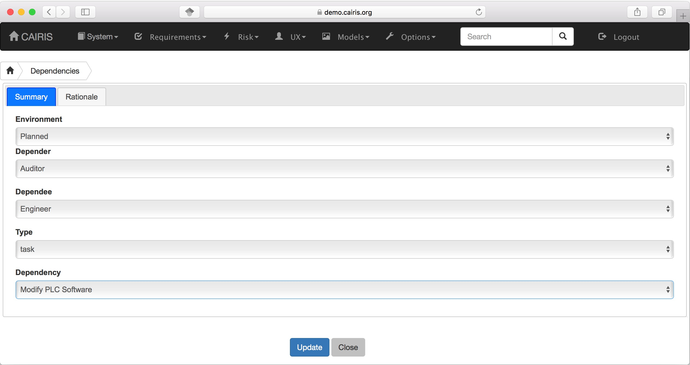
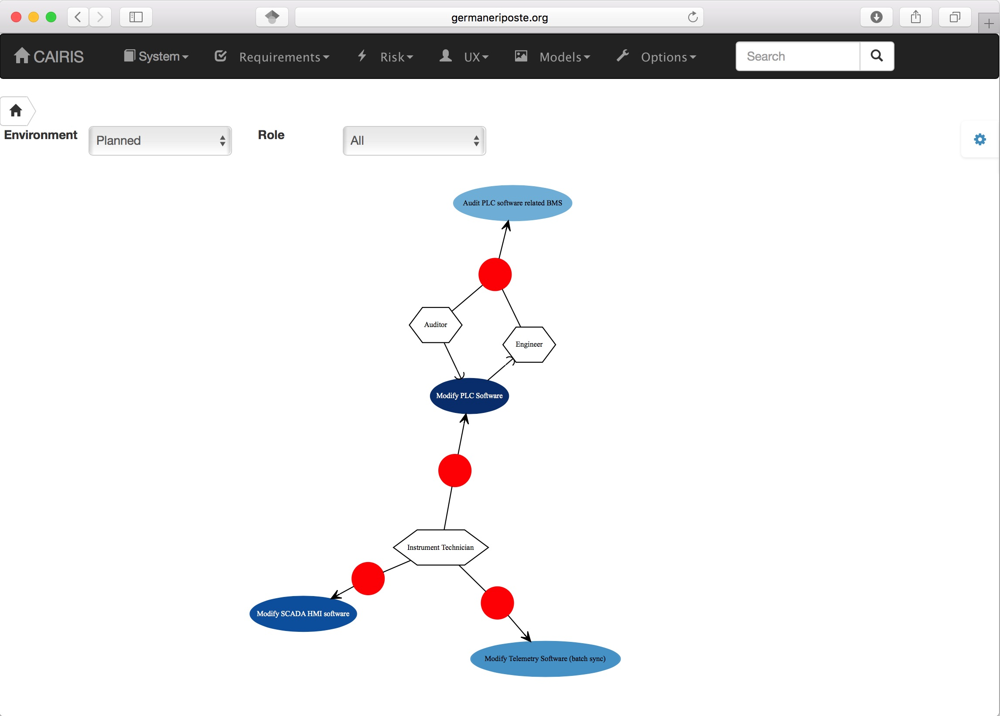

Dependencies
============

CAIRIS supports the modelling of strategic dependencies between roles, where these *dependers* depend on *dependees* for a dependum (goals, assets, or tasks).

Adding, updating, and deleting a dependency
-------------------------------------------

   -  Select the Requirements/Dependencies menu to open the Dependencies table, and click on the Add button to open the Dependency form.

   -  Select the Environment, Depender and Dependee roles, the type of dependency, and the dependency itself.

   -  Click on the Rationale folder, and specify some rationale for the dependency's existence.

   -  Click on the Create button to add the new dependency.

   -  Existing dependency can be modified by clicking on the dependency in the Dependencies table, making the necessary changes, and clicking on the Update button.

   -  To delete a dependency, click the Delete button next to the dependency to be removed in the Dependencies table.

Viewing dependencies
--------------------

Dependencies can be viewed by Responsibility models by clicking on the Models/Responsibility menu, and selecting the environment to view the environment for.

Dependencies are indicated by the rounded arrows that flow from the depender to the dependee through the dependum.

Introducing Personal data into CAIRIS using dependencies
--------------------------------------------------------

Personal data can be recognised in CAIRIS by carrying out the following steps.

1.  Create or edit a *Stakeholder* role, and associate with this with a new persona; this will  represent the external entity that acts as the origin of the PII, and the persona will be useful to capturing any assumptions or expectations that this entity might have.
2.  Create or edit a *Data Controller* role.
3.  Create a dependency between the Stakeholder dependee role and the Data Controller depender, where the dependum is a newly created or existing asset that you wish to designate as personal data.

