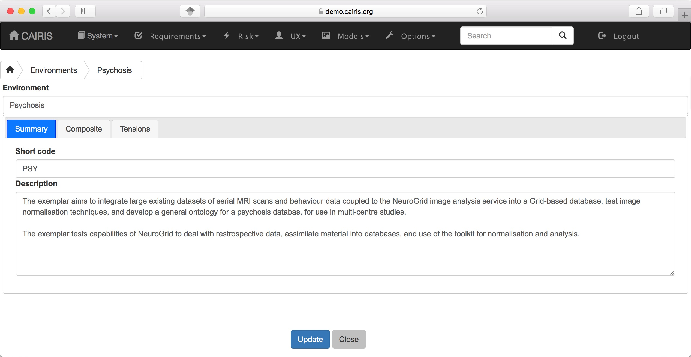
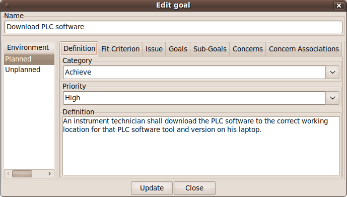
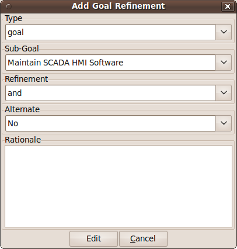
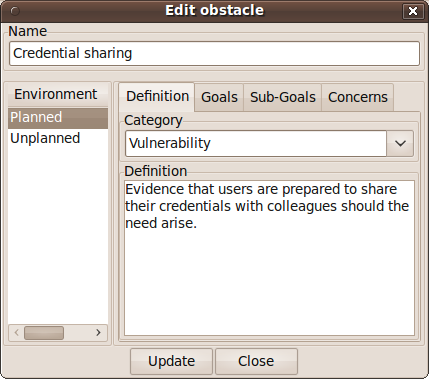
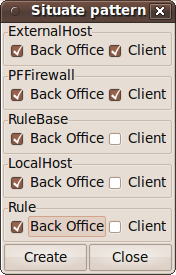
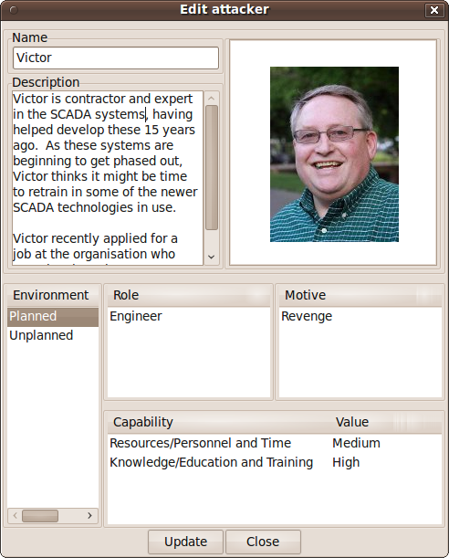
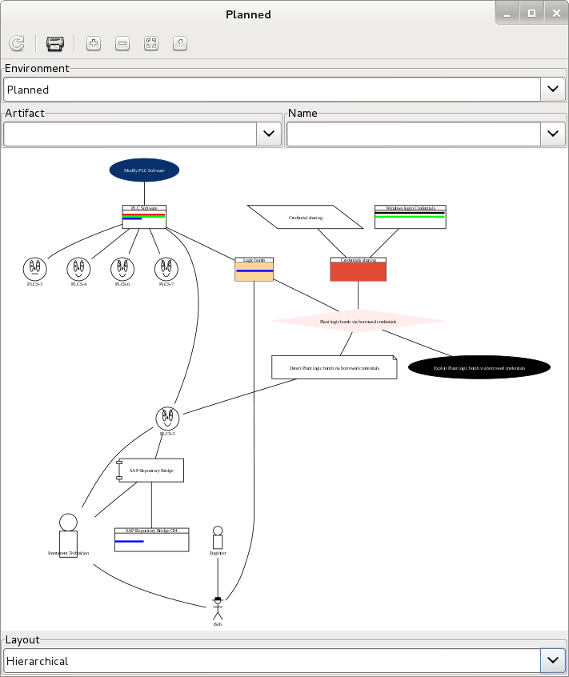
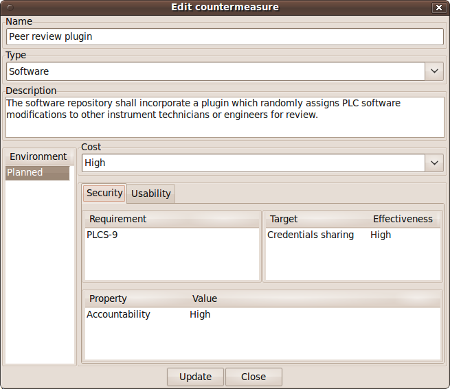

Creating a new project
======================

The first stage of the design process involves establishing the scope of
subsequent analysis. CAIRIS supports this exercise by using the Properties form.

Update project properties
-----------------------

.. figure:: projectSettings.jpg
   :alt: Project Settings form

-  Select the System/Properties menu to open the Project Settings
   notebook. By default, the notebook will open in the Background page.
   Enter the project name and background in this page.

-  Click on the Goals tab and enter the high-level goals of that the
   system being specified needs to satisfy.

-  Click on the Scope tab and enter the scope of the system being
   specified.

-  If a rich picture or context diagram has been agreed, click on the
   Rich Picture tab, and click on the image (or avatar if not not rich picture has been defined) to
   import.

-  Names or terms that the readership of the specification may be
   unfamiliar with can be added to the project on an on-going basis. To
   add a term, click on the Naming Conventions tab, and click on the Add symbol
   This opens a form which allows a name and a definition to be added to the naming
   convention list. To modify an existing entry, double click on the try
   and make the required modifications. Entries can also be deleted from
   the right-click speed menu.

-  Clicking on the Contributors tab opens the Contributors page. To add
   a contributor, click on the Add symbol to open the Add Contributor form.
   Contributors can be either a participant, facilitator, or scribe; these reflect the roles
   that people take in participatory workshops.

Environments
============

An environment might represent a system operating at a particular time
of day, or in a particular physical location. Environments encapsulate
visible phenomena such as assets, tasks, personas, and attackers, as
well as invisible phenomena, such as goals, vulnerabilities, and
threats. Environments may be identified at any time, although these may
not become apparent until carrying out contextual inquiry and observing
how potential users reason about their context of use.

Adding a new environment
------------------------

-  Select the UX/Environments menu to open the Environments
   form, and click on the Add button to open the new Environment
   form.

-  Enter the name of the environment, a short code, and a description.
   The short-code is used to prefix requirement ids associated with an
   environment.

-  If this environment is to be a composite environment, i.e. encompass
   artifacts of other environments, then right click on the environment
   list, select Add from the speed menu, and select the environment/s to
   add.

-  It is possible artifact may appear in multiple environments within a
   composite environment. It is, therefore, necessary to set duplication
   properties for composite environments. If the maximise radio button
   is selected, then the maximal values associated with that artifact
   will be adopted. This may be the highest likelihood value for a
   threat, or the highest security property values for an asset. If the
   override radio button is selected, then CAIRIS will ensure that the
   artifact properties are used for the overriding environment.

Assets
======

Assets are tangible objects of value to stakeholders. By defining an
asset in CAIRIS, we implicitly state that this needs to be secured in
light of risks which subsequently get defined.

Assets are situated in one or more environments. Security properties are
associated with each asset for every environment it can be found in.
These security properties are Confidentiality, Integrity, Availability,
and Accountability. Each of these properties is associated with the
value of None, Low, Medium, or High. The meaning of each of these values
can be defined in CAIRIS from the Asset Values dialog; this is available
via the Options/Asset values menu.

Adding, updating, and deleting an asset
---------------------------------------

.. figure:: AssetForm.jpg
   :alt: Asset form

-  Select the Risks/Assets menu button to open the assets table, and
   click on the Add button to open a new asset form.

-  Enter the name of the environment, a short code, description, and
   significance. The short-code is used to prefix requirement ids
   associated with an environment.

-  If this asset is deemed critical, click on the Criticality tab, and
   click on the Critical Asset check-box. A rationale for declaring this
   asset critical should also be added. By declaring an asset critical,
   any risk which either threatens or exploits this asset will be
   maximised until the mitigations render the likelihood of the threat
   or the severity of the vulnerability inert.

-  Click on the Add button in the asset table, and select an environment to situate the asset in. This will add
   the new environment to the environment list.

-  After ensuring the environment is selected in the environment window,
   add the security properties to this asset for this environment.
   Security properties are added by clicking on the Add button in the properties table
   to open the Choose security property dialog. From this window, a security property, its value
   its value rationale can be added.

-  Click on the Create button to add the new asset.

-  Existing assets can be modified by double clicking on the asset in
   the Assets dialog box, making the necessary changes, and clicking on
   the Update button.

-  To delete an asset, select the asset to delete in the assets table
   box, and select the Delete button. If any artifacts are dependent on
   this asset then a dialog box stating these dependencies are
   displayed. The user has the option of selecting Yes to remove the
   asset dependencies and the asset itself, or No to cancel the
   deletion.

Asset modelling
---------------

Understanding how assets can be associated with each other is a useful
means of identifying where the weak links in a prospective architecture
might be. CAIRIS supports the association of assets, inconsistency
checking between associated assets, and visualisation of asset models.

The CAIRIS asset model is based on UML class models. Asset models can be
viewed for each defined environment. As well as explicitly defined asset
associations, asset models will also contain associations implicitly
defined. For example, if a task has been defined, and this task concerns
within an environment contain one or more assets, then the participating
persona will be displayed as an actor, and an association between this
actor and the asset will be displayed. Additionally, if concern
associations have been defined between goals and assets and/or
associations then zooming into the model will display these concerns;
the concerns are displayed as blue comment elements.

.. figure:: AddAssetAssociation.jpg
   :alt: Add Asset Association form

Adding an asset association
~~~~~~~~~~~~~~~~~~~~~~~~~~~

-  You can add an association between assets by selecting the Risk/Asset Association menu, and
   clicking on the Add button in the association table.

-  In the association form which is opened., set the adornments for the head and tail
   end of the association. Possible adornment options are Inheritence,
   Association, Aggregation, and Composition; the semantics for these
   adornments are based on UML.

-  Set the multiplicity (nry) for the head and tail ends of the
   association. Possible multiplicity options are ``1``, ``*``, and
   ``1..*``.

-  Optional role names can also be set at the head or tail end of the
   association.

-  Select the Create (or Update if modifying an existing association) will
   add the association to the CAIRIS model.

- You can also add associations between other assets from the environment Associations tab within the Asset form.
  You can add a new association by clicking on the Add button in the association table to open the association form.
  From this form, you can add details about the nature of the association between the asset you're working on and another [tail] asset.
  Once you click on Update, the association will be added to your working object, but won't be committed to the model until you click on the Update/Create button.

Viewing Asset models
~~~~~~~~~~~~~~~~~~~~

Asset models can be viewed by selecting the Models/Asset menu, and selecting the environment to view the environment for.

.. figure:: AssetModel.jpg
   :alt: Asset Model

By changing the environment name in the environment combo box, the asset
model for a different environment can be viewed.  The model can be filtered by selecting an asset.
This will display on the asset, and the other asset model elements immediately associated with it.
By default, concern associations are hidden.  These are UML comment nodes that indicate elements from other CAIRIS models associated with asset.
These concerns can be shown by changing the Hide Concerns combo box value to Yes.

By clicking on a model element, information about that artifact can be
viewed.

Roles & Personas
================

Roles
-----

Roles represent the abstract classes representing human agents; these
also encapsulate behaviours and responsibilities. CAIRIS supports 2
types of role: stakeholder and attacker. Stakeholder roles represent
human agents the system needs to be directly, or indirectly designed
for. Attackers are human agents the system should not be designed for.

Adding, updating, and deleting a role
~~~~~~~~~~~~~~~~~~~~~~~~~~~~~~~~~~~~~

.. figure:: RoleForm.jpg
   :alt: Role form

-  Select the Risk/Roles menu to open the Roles table, and click on the Add button to open the Role form.

-  Enter a role name and description, and select the role type.

-  Click on the Create button to Add the new role to the CAIRIS
   database.

-  As responses and countermeasures are assigned to roles, the Role
   form is automatically updated to reflect these new dependencies.
   These dependencies can not be modified from the Role dialog.

-  Existing roles can be modified by clicking on the role in the
   roles table, making the necessary changes, and clicking on the
   Update button.

-  To delete a role, select the role to delete in the roles table,
   If any artifacts are dependent on this role then a dialog box stating these dependencies are displayed.
   The user has the option of selecting Yes to remove the role dependencies and the role itself, or No to cancel the deletion.

Responsibility modelling
~~~~~~~~~~~~~~~~~~~~~~~~

Responsibility models can be viewed by selecting the Models/Responsibility
menu option and selecting the environment to
view the environment for.

.. figure:: ResponsibilityModel.jpg
   :alt: Responsibility Model

By changing the environment name in the environment combo box, the
responsibility model for a different environment can be viewed.
By clicking on a model element, information about that artifact can be viewed.

Personas
--------

Personas are specifications of archetypical users that the system needs
to directly or indirectly cater for. The system needs to be specified
for Primary Personas, but Secondary Personas cannot be ignored as their
thoughts or concerns provide insight into potential usability problems.

Adding, updating, or deleting a persona
~~~~~~~~~~~~~~~~~~~~~~~~~~~~~~~~~~~~~~~

.. figure:: PersonaDialog.png
   :alt: Persona Dialog

-  Click on the Persona toolbar button to open the Personas dialog box,
   and click on the Add button to open the Persona dialog box.

-  Enter a persona name and select the persona type.

-  If the persona is not derived from empirical data, then select the
   Asssumption Persona check-box. Ticking this box has the effect of
   pre-fixing the persona name with the << assumption >> stereotype in
   any models where the persona is present.

-  Click on the Activities tab and enter the activities carried out by
   the personas.

-  Click on the Attitudes tab and enter the attitudes held by the
   persona, with respect to the problem domain the system will be
   situated in.

-  Click on the Aptitudes tab and enter the persona's aptitudes, with
   respect to the problem domain the system will be situated in.

-  Click on the Motivations tab and enter the persona's personal
   motivations.

-  Click on the Skills tab and enter the persona's skill-set, with
   respect to the problem domain the system will be situated in.

-  If you have decided to personalise the persona with a picture, this
   can be added by right clicking on photo box next to the persona
   properties notebook, to bring up the Load Image option from the speed
   menu, and selecting Load Image. Please note that the image itself is
   NOT imported into the database, only the file path to the picture.

-  If you have decided to personalise your persona with a picture, this
   can be added by right clicking on the photo

-  Right click on the environment window to bring up the environment
   speed menu. Select the add option and, from the Add environment
   window, select an environment to situate the persona in. This will
   add the new environment to the environment list.

-  After ensuring the environment is selected in the environment window,
   click on the Summary tab. Select the Direct/Indirect Persona
   check-box if the persona is a direct stakeholder with respect to the
   system being defined, and add roles fulfilled by the persona in the
   Roles list-box. These roles can be added or deleted by right clicking
   on the roles box to bring up the speed menu.

-  Click on the Narrative tab and enter a narrative describing the
   persona's relationship with the problem domain or prospective system
   within the environment, and any environment specific concerns he or
   she might have.

-  Click on the Create button to add the new persona.

-  Existing personas can be modified by double clicking on the persona
   in the Personas dialog box, making the necessary changes, and
   clicking on the Update button.

-  To delete a persona, select the persona to delete in the Personas
   dialog box, and select the Delete button. If any artifacts are
   dependent on this persona then a dialog box stating these
   dependencies are displayed. The user has the option of selecting Yes
   to remove the persona dependencies and the persona itself, or No to
   cancel the deletion.

Recording persona assumptions
~~~~~~~~~~~~~~~~~~~~~~~~~~~~~

.. figure:: APModel.png
   :alt: Assumption Persona model

-  From the Options/External Document directory, click on the Add button
   and add information about the source of any assumptions external to
   CAIRIS. An example of such an *External Document* might be an
   interview transcript. Alternatively, if assumptions are purely based
   on your own thoughts and feelings then an External Document can be
   created to make this explicit.

-  Open up the Persona dialog for the persona you want to add a
   characteristic to, and right click in the behavioural variable folder
   (e.g. Activities) you wish to add a Characteristic to.

-  From the Persona Characteristics dialog box, click on Add to add a
   new characteristic.

-  From the General folder, add a description of the characteristic and
   a *Model Qualifier*; this word describes your confidence in the
   validity of the characteristic. Possible qualifiers might include
   *always*, *usually*, or *perhaps*.

-  Click on the Grounds tab to open the list of Grounds for this
   characteristic. The grounds are evidence which support the validity
   of the characteristic. Right click in the Reference box, and select
   Add to add a Document Reference. Select the concept type for this
   evidence and the name of a pre-exising concept or document reference
   for this grounds. If one doesn't already exist, then select any
   artifact and, from the Reference combo box, select [New artifact
   reference] (for a document reference) or [New concept reference] (for
   a reference to an existing model object. In both cases, a dialogue
   box will appear allowing you to enter a short description of the
   grounds proposition, together with more detailed rationale. Clicking
   on Ok will add the new document or concept reference, and add this to
   the grounds list.

-  Click on the Warrant tab to open the list of Warrants for this
   characteristic. The warrants are inference rules which links the
   grounds to the characteristic. The procedure for adding warrants is
   identical to the process for adding grounds. After adding a warrant,
   however, a Backing entry for the warrant is automatically added.

-  If you wish to add a Rebuttal -- a counterargument for the
   characteristic -- then click on the Rebuttals tab and add a rebuttal
   using the same procedure for Grounds and Warrants.

-  Click on the Create button to create the new characteristic.

-  Existing characteristics can be modified by double clicking on the
   characteristics in the Persona Characteristic dialog box, making the
   necessary changes, and clicking on the Edit button.

Tasks
=====

Tasks model the work carried out by one or more personas. This work is
described in environemnt-specific narrative scenarios, which illustrate
how the system is used to augment the work activity.

Adding, updating, or deleting a task
------------------------------------

.. figure:: TaskDialog.png
   :alt: Task Dialog

-  Click on the Task toolbar button to open the Tasks dialog box, and
   click on the Add button to open the Task dialog box.

-  Enter a task name, and the objective of carrying out the task.

-  If the task is not derived from empirical data, then select the
   Asssumption Task check-box. Ticking this box has the effect of
   pre-fixing the task name with an << assumption >> stereotype in any
   models where the task is present.

-  Right click on the environment window to bring up the environment
   speed menu. Select the add option and, from the Add environment
   window, select an environment to situate the persona in. This will
   add the new environment to the environment list.

-  After ensuring the environment is selected in the environment window,
   click on the Summary tab. In the Summary page, enter any dependencies
   needing to hold before this task can take place.

.. figure:: AddTaskPersona.png
   :alt: Add Task Persona Dialog

-  Right click on the persona list box and select Add from the speed
   menu to associate a persona with this task. In the Add Task Persona
   dialog box, select the person, the task duration (seconds, minutes,
   hours or longer), frequency (hourly or more, daily-weekly, monthly or
   less),demands (none, low, medium, high), and goal conflict (none,
   low, medium, high). The values for low, medium, and high should be
   agreed with participants before hand.

-  If any aspect of the task concerns one or more assets, then these can
   be added to the concern list. Adding an asset concern causes a
   concern comment to be associated to the asset in the asset model. If
   the task concerns an association between assets, the association can
   be added by clicking on the Concern Association tab and adding the
   source and target assets and association multiplicity to the concern
   association list. In the asset model, this association is displayed
   and a concern comment is associated to each asset in the association.

-  Right click on the Narrative tab and enter the task scenario in the
   text box. This narrative should describe how the persona (or
   personas) carry out the task to achieve the pre-defined objective.

-  Click on the Create button to add the new task.

-  Existing tasks can be modified by double clicking on the task in the
   Tasks dialog box, making the necessary changes, and clicking on the
   Update button.

-  To delete a task, select the task to delete in the Tasks dialog box,
   and select the Delete button. If any artifacts are dependent on this
   task then a dialog box stating these dependencies are displayed. The
   user has the option of selecting Yes to remove the task dependencies
   and the task itself, or No to cancel the deletion.

Task traceability
-----------------

.. figure:: TraceabilityEditor.png
   :alt: Traceability Editor

Tasks can be manually traced to certain artifacts via the Tasks dialog.
A task may contribute to an asset or a vulnerability, or be supported by
requirement. To add a traceability link, right click on the task name,
and select Supported By or Contributes to. This opens the Traceability
Editor. From this editor, select the object on the right hand side of
the editor to trace to and click the Add button to add this link.

Manual traceability links can be removed by selecting the
View/Traceability menu option, to open the Traceability Relations
dialog. In this dialog box, manual traceability relations be removed
from specific environments.

Visualising tasks
-----------------

Task models can be viewed by clicking on the Task Model toolbar button,
and selecting the environment to view the environment for.

.. figure:: TaskModel.png
   :alt: Task Model

By changing the environment name in the environment combo box, the task
model for a different environment can be viewed. The layout of the model
can also be replaced by selecting a layout option in the Layout combo
box at the foot of the model viewer window.

By clicking on a model element, information about that artifact can be
viewed.

Domain Properties
=================

Domain Properties are descriptive properties about the statement world.
Domain Properties may be either hypothesis or invariants.

Adding, updating, and deleting a domain property
------------------------------------------------

.. figure:: DomainPropertyDialog.png
   :alt: Domain Property Dialog

-  Click on the Domain Properties toolbar button to open the Domain
   Properties dialog box, and click on the Add button to open the Domain
   Property dialog box.

-  Enter a domain property name, description, and select the type of
   domain property from the type combo box.

-  Click on the Create button to add the new domain property.

-  Existing domain properties can be modified by double clicking on the
   domain property in the Domain Properties dialog box, making the
   necessary changes, and clicking on the Update button.

Goals, Requirements, and Obstacles
==================================

In CAIRIS, a requirements specification is analogous to a safety case.
In a safety case, a system is only considered safe if its safety goals
have been satisfied. In a similar manner, requirements are leaf nodes in
a goal tree and satisfying stakeholder needs is only possible if the
high-level goals -- stipulated by stakeholders -- can be satisfied.

We define goals as prescriptive statements of system intent that are
achievable by one or more agents. Goals can be refined to requirements,
which are achievable by only agent. Goals and requirements may also be
operationalised as tasks. Alternatively, we may decide to specify tasks
and ask what goals or requirements need to hold in order that a given
task can be completed successfully.

To satisfy a goal, one or more sub-goals may need to be satisfied;
satisfaction may require satisfying a conjunction of sub-goals, i.e.
several AND goals, or a disjunction of sub-goals, i.e. several OR goals.

Goals or requirements may be obstructed by obstacles, which are
conditions representing undesired behaviour; these prevent an associated
goal from being achieved. By progressively refining obstacles, we can
obtain the origin of some undesired behaviour; this may be reflected as
a vulnerability or a threat, and contribute to risk analysis.

Adding, updating, and deleting a goal
-------------------------------------

.. figure:: GoalsDialog.png
   :alt: Goals Dialog

-  Click on the Goal toolbar button to open the Goals dialog box. As
   the above figure illustrates, next to goal name is the current
   *status* for the goal. If a goal is defined as OK, then this goal is
   refined by a requirement, or by one or more goals. Goals with the
   status *to refine* have yet to be refined or operationalised. Goals
   with the status *Check* have been refined by one or more obstacle,
   and these should be examined to find a root threat or vulnerability.

-  Click on the Add button to open the Goal dialog box, and enter the
   name of the goal.

-  Right click on the environment window to bring up the environment
   speed menu. Select the add option and, from the Add environment
   window, select an environment to situate the goal in. This will add
   the new environment to the environment list.

-  In the Definition page, enter the goal definition, and select the
   goal category and priority. Possible goal categories are: Achieve,
   Maintain, Avoid, Improve, Increase, Maximise, and Minimise. Possible
   priority values are Low, Medium, and High.

-  Click on the Fit Criterion tab, and enter the criteria which must
   hold for the goal to be satisfied.

-  Click on the Issue tab and enter any issues or comments relating to
   this goal.

-  If this goal refines a parent goal, click on the Goals tab,
   right-click on Goal refinement list, and select Add to open the Add
   Goal Refinement Dialog. In this dialog, select the Goal from the Type
   combo box, and select the Sub-goal, refinement type, and an Alternate
   value. Possible refinement types are: and, or, conflict, responsible,
   obstruct, and resolve. The alternative value (Yes or No) indicates
   whether or not this goal affords a goal-tree for an alternate
   possibility for satisfying the parent goal. It is also possible to
   enter a rationale for this goal refinement in the refinement text
   book. Clicking on Add will add the refinement association to memory,
   but this will not be committed to the database until the goal is
   added or updated.

-  If this goal refines to sub-goals already specified, Click on the
   Sub-Goals tab and add a goal refinement association as described in
   the previous step. A goal may refine to artifacts other than goals,
   specifically tasks, requirements, obstacles, and domain properties.

-  Goal refinements can also be specified independently of goal creation
   or modification via the Goal Associations tool-bar button.

-  If any aspect of the goal concerns one or more assets, then these can
   be added by clicking on the Concerns add and adding the asset/s to
   the concern list. Adding an asset concern causes a concern comment to
   be associated to the asset in the asset model. If the goal concerns
   an association between assets, the association can be added by
   clicking on the Concern Association tab and adding the source and
   target assets and association multiplicity to the concern association
   list. In the asset model, this association is displayed and a concern
   comment is associated to each asset in the association.

-  Click on the Create button to add the new goal.

-  Existing goals can be modified by double clicking on the goal in the
   Goals dialog box, making the necessary changes, and clicking on the
   Update button.

-  To delete a goal, select the goal to delete in the Goals dialog box,
   and select the Delete button. If any artifacts are dependent on this
   goal then a dialog box stating these dependencies are displayed. The
   user has the option of selecting Yes to remove the goal dependencies
   and the goal itself, or No to cancel the deletion.

Goal Modelling
--------------

Goal models can be viewed by clicking on the Goal Model toolbar button,
and selecting the environment to view the environment for.

.. figure:: GoalModel.png
   :alt: Goal Model

By changing the environment name in the environment combo box, the goal
model for a different environment can be viewed. The layout of the model
can also be replaced by selecting a layout option in the Layout combo
box at the foot of the model viewer window.

By clicking on a model element, information about that artifact can be
viewed.

Goal models can also be filtered by goal. Applying a filter causes the
selected goal to be displayed as the root goal. Consequently, goals are
only displayed if they are direct or indirect leafs of the filtered
goal.

Goals can also be refined from the goal model, albeit only for the
environment being modified. To refine a goal, right-click on the goal in
the model viewer, and select And-Goal, or Or-Goal based on the
refinement desired. An simplified version of the Add Goal dialog box is
displayed and, when all the necessary information has been added, a new
goal will be added to the database, complete with the desired
refinement. Please note, the model view needs to be refreshed to view
the goal. Goals may only be refined to other goals in the model viewer;
for anything more elaborate, the usual goal refinement association
procedure needs to be followed.

Adding, updating, and deleting an obstacle
------------------------------------------

-  Click on the Obstacle toolbar button to open the Obstacles dialog
   box, and click on the Add button to open the Obstacle dialog box.

-  Enter the name of the obstacle, and right click on the environment
   window to bring up the environment speed menu. Select the add option
   and, from the Add environment window, select an environment to
   situate the obstacle in. This will add the new environment to the
   environment list.

-  In the Definition page, enter the obstacle definition, and select the
   obstacle category. Possible obstacle categories are: Confidentiality
   Threat, Integrity Threat, Availability Threat, Accountability Threat,
   Vulnerability, Duration, Frequency, Demands, and Goal Support.

-  Like goals, obstacle refinements can be added via the Goals and
   Sub-Goals tabs.

-  If any aspect of the obstacle concerns one or more assets, then these
   can be added by clicking on the Concerns add and adding the asset/s
   to the concern list. Adding an asset concern causes a concern comment
   to be associated to the asset in the asset model.

-  Click on the Create button to add the new obstacle.

-  Existing obstacles can be modified by double clicking on the obstacle
   in the Obstacles dialog box, making the necessary changes, and
   clicking on the Update button.

-  To delete an obstacle , select the obstacle to delete in the
   Obstacles dialog box, and select the Delete button. If any artifacts
   are dependent on this obstacle then a dialog box stating these
   dependencies are displayed. The user has the option of selecting Yes
   to remove the obstacle dependencies and the obstacle itself, or No to
   cancel the deletion.

Obstacle Modelling
------------------

Obstacle models can be viewed by clicking on the Obstacle Model toolbar
button, and selecting the environment to view the environment for.

.. figure:: ObstacleModel.png
   :alt: Obstacle Model

In many ways, the obstacle model is very similar to the goal model. The
main differences are goal filtering is not possible, only the obstacle
tree is displayed, and obstacles refine to obstacles, as opposed to
goals.

Adding, updating, and deleting requirements
-------------------------------------------

Requirements are added and edited using the Requirements Editor in the
main CAIRIS window. Each requirement is associated with an asset, or an
environment. Requirements associated with assets may specify the asset,
constrain the asset, or reference it in some way. Requirements
associated with an environment are considered transient, and remain
associated with an environment only until appropriate assets are
identified.

-  To add a requirement, press enter on an existing requirement, or
   click on the Add Requirement toolbar button. In both cases, a new
   requirement will appear beneath the row where the cursor is currently
   set.

-  Enter the requirement description, rationale, fit criterion, and
   originator in the appropriate cells, select the priority (1,2, 3),
   and the requirement type (Functional, Data, Look and Feel, Usability,
   Performance, Operational, Maintainability, Portability, Security,
   Cultural and Political, and Legal).

-  When the attributes have been entered, click on the Commit latest
   changes toolbar button to commit these requirement additions to the
   database.

-  The order of requirements in the editor can be modified by left
   clicking on the row label and, while holding down the left mouse
   button, moving the row label to the appropriate position. When the
   mouse button is released, the requirement labels are re-ordered
   accordingly.

-  By changing the asset in the Assets combo box, or the Environment in
   the Environments combo box, the editor will be reloaded with the
   requirement associated with the selected asset or environment. Please
   note, the Commit latest changes toolbar button should be clicked
   before changing the selected asset or environment, otherwise any
   in-situ requirement changes will be lost.

-  A requirement can be deleting by moving the cursor to the row to be
   deleted, and clicking the Delete Requirements toolbar button.
   Deleting a requirement also has the effect of re-ordering the
   requirement labels.

Requirement history
-------------------

Every time a requirement is modified, a new version of the requirement
is created. To view the requirement history, right click on the
requirement to view the Requirement History dialog. This dialog contains
the details of each version of the requirement stored in the database.

Searching requirement text
--------------------------

It is possible to search for a requirement with a particular text
string, by selecting the Requirement Management/Find menu option, to
open the Find Requirement dialog. This Find dialog is very similar to
the Find dialog found in many WYSIWYG applications. This search function
only works for requirements which are currently loaded in the
Requirements editor.

Requirements traceability
-------------------------

Normally requirements traceability is synonymous with adding a goal
refinement association but, requirements may also contribute to
vulnerabilities (as well as tasks), or be supported by assets or misuse
cases. Consequently, requirements can be manually traced to these
artifacts in the same manner as tasks.

Requirement association
-----------------------

A requirement associated to an environment can be associated with an
asset, or a requirement associated with an asset can be associated with
another asset. To re-associate a requirement, right click on the
requirement, select Asset re-association, and select the asset to
re-associate the requirement with.

Security Patterns
=================

Security Patterns are solution structures, which prescribe a solution to
a security problem arising in a context. Many components and connectors
in secure system architectures are instances of security patterns but,
in many cases, the reasoning for a given pattern's inclusion is not
always clear. The requirements needed to realise these patterns are also
often omitted, making the job of reasoning about the consequences of
situating the pattern difficult. Moreover, security patterns may be
described in a context, but not all collaborating assets in a security
pattern may be evident in all possible contexts of a system's use. The
following sections describe how CAIRIS treats security patterns and
deals with these weaknesses.

Security Patterns in CAIRIS consist of the following elements:

-  A description of the context a pattern is relevant for.

-  A problem statement motivating the need for the pattern.

-  A solution statement describing the intrinsics of the pattern.

-  The pattern structure, modelled as associations between collaborating
   asset classes.

-  A set of requirements, which need to be fulfilled in order to realise
   the pattern.

Before a security pattern can be defined in CAIRIS, template assets --
which represent the collaborating asset classes -- need to be first
defined.

Before a security pattern can be situated in CAIRIS environments, the
environments themselves need to be first created.

Create a template asset
-----------------------

.. figure:: TemplateAssetDialog.png
   :alt: Template Pattern Dialog

Template assets can be best described as context-free assets. When they
are created, template assets do not form part of analysis unless they
are implicitly introduced. This 'implicit introduction' occurs when a
security pattern is situated.

The Template Patterns dialog can be opened by selecting the
Options/Template Assets menu option.

The process for creating, updating, and deleting a template asset is
almost identical to the processes uses for normal assets. The only
difference is the lack of environment-specific properties. Security
properties are only defined once for the asset.

To situate an asset in an environment, right click on the template asset
name in the Template Assets dialog box, select the Situate option, and
specify the environments to situate the template asset in. After a
template asset is situated within an environment, these properties
should be revised in the assets generated on the basis of these. This is
because the values associated with the template asset properties may not
be inline with assumptions held about Low, Medium, and High assets in
the specification being developed.

Create a security pattern
-------------------------

.. figure:: SecurityPatternDialog.png
   :alt: Security Pattern Dialog

-  Select the Options/Security Patterns menu option to open the Security
   Patterns dialog box, and click on the Add button to open the Security
   Pattern dialog box.

-  Enter the security pattern name, and, in the Context page, type in a
   description the security pattern is relevant for.

-  Click on the Problem page, and type in a problem description
   motivating the security pattern.

-  Click on the solution page, and type in the intrinsics of how the
   security pattern solves the pre-defined problem.

-  Click on the Structure page, and right-click on the association list
   control to add associations between template assets; these
   associations form the collaborative structure for the pattern. The
   procedure for entering associations is based on that used for
   associating assets.

-  Click on the Requirements page, and right-click on the requirements
   list control to add requirements needing to be satisfied to realise
   the pattern. The cells in the Add Pattern Requirement dialog are a
   sub-set of those found in the CAIRIS requirements editor.

-  Click on the Create button to add the new security pattern.

-  Existing security patterns can be modified by double clicking on the
   security pattern in the Security Patterns dialog box, making the
   necessary changes, and clicking on the Update button.

-  To delete a security pattern, select the pattern to delete in the
   Security Patterns dialog box, and select the Delete button.

Situate a security pattern
--------------------------

-  To introduce a security pattern into the working project, open the
   Security Patterns dialog box, right-click on the pattern, and select
   the Situate Pattern option from the speed menu. This opens the
   Situate Pattern Dialog box.

-  For each collaborating asset, click on the check boxes that you wish
   to situate each asset in. It may be that not all assets in the
   pattern are relevant for all contexts of use. Therefore, all the
   pattern structure is retained in the project, the pattern structure
   displayed in each environment is based only on the assets situated.
   For example, for the Packet Filter Pattern, an end-user context of
   use may only be concerned with the client workstation asset and the
   firewall. A system administrator may be concerned about most of the
   pattern structure, but may be less concerned about interactions with
   external hosts.

-  Click on the Create button to situate the pattern.

Template assets will be instantiated as assets, and situate in the
stipulated assets. Requirements associated with the pattern, will be
introduce and associated with the stipulated assets in the pattern
definition. These assets will be ordered based on the order of
definition in the pattern structure.

Vulnerabilities
===============

Vulnerabilities are weaknesses of a system, which are liable to
exploitation.

Create a vulnerability
----------------------

.. figure:: VulnerabilityDialog.png
   :alt: Vulnerability Dialog

-  Click on the Vulnerability toolbar button to open the Vulnerabilities
   dialog box.

-  Click on the Add button to open the Create Vulnerability dialog box.

-  Enter the vulnerability name and description, and select the
   vulnerability type from the combo box.

-  Right click on the environment window to bring up the environment
   speed menu. Select the add option and, from the Add environment
   window, select an environment to situate the vulnerability in. This
   will add the new environment to the environment list.

-  After ensuring the environment is selected in the environment window,
   select the vulnerability's severity for this environment, and add
   exposed assets by right clicking on the asset box and selecting one
   or more assets from the selected environment.

-  Click on the Create button to add the new vulnerability.

-  Existing vulnerabilities can be modified by double clicking on the
   vulnerability in the Vulnerabilities dialog box, making the necessary
   changes, and clicking on the Update button.

-  To delete an vulnerability, select the vulnerability to delete in the
   Vulnerabilities dialog box, and select the Delete button. If any
   artifacts are dependent on this vulnerability then a dialog box
   stating these dependencies are displayed. The user has the option of
   selecting Yes to remove the vulnerability dependencies and the
   vulnerability itself, or No to cancel the deletion.

Importing a vulnerability
-------------------------

.. figure:: ImportVulnerabilityDialog.png
   :alt: Import Vulnerability

The CAIRIS database is pre-loaded with a database of template
vulnerabilities based on the Common Criteria. To import one of these,
select Import from the Vulnerabilities dialog to open the Import
Vulnerability dialog. When a vulnerability is selected, the
Vulnerability dialog is opened, and pre-populated with information from
the template.

.. figure:: ImportedVulnerabilityDialog.png
   :alt: Imported Vulnerability

Attackers
=========

Attackers launch attacks in the form of threats. Attackers are similar
to personas in that fulfil one or more roles, and can be personalised
with additional information.

Certain capabilities and motivations may be associated with attackers.
CAIRIS is pre-loaded with a selection of these, but these can be
modified, or new capabilities and motivations created by selecting the
Options/Capabilities or Options/Motivations menu options.

Adding, updating, and deleting an attacker
------------------------------------------

-  Click on the Attacker toolbar button to open the Attackers dialog
   box, and click on the Add button to open the Attacker dialog box.

-  Enter the attacker name, and a description for the attacker.

-  If you have decided to personalise the attacker with a picture, this
   can be added by right clicking on photo box next to the attacker
   description, to bring up the Load Image option from the speed menu,
   and selecting Load Image. Please note that the image itself is NOT
   imported into the database, only the file path to the picture.

-  Right click on the environment window to bring up the environment
   speed menu. Select the add option and, from the Add environment
   window, select an environment to situate the attacker in. This will
   add the new environment to the environment list.

-  After ensuring the environment is selected in the environment window,
   right-click on the Roles list, and select Add from the speed menu to
   associate one or more roles to the attacker.

-  Right-click on the Motive and Capability boxes and select Add to add
   one or more motive and capability values. For the capabilty, a value
   of Low, Medium, or High also needs to be selected.

-  Click on the Create button to add the new attacker.

-  Existing attackers can be modified by double clicking on the attacker
   in the Attackers dialog box, making the necessary changes, and
   clicking on the Update button.

-  To delete an attacker, select the attacker to delete in the Attackers
   dialog box, and select the Delete button. If any artifacts are
   dependent on this attacker then a dialog box stating these
   dependencies are displayed. The user has the option of selecting Yes
   to remove the attacker dependencies and the attacker itself, or No to
   cancel the deletion.

Threats
=======

Threats are synonymous with attacks, and can therefore only be defined
if an associated attacker has also been defined. Like vulnerabilities,
threats are associated with one or more assets. However, threats may
also target certain security properties as well, in line with security
values that an attacker wishes to exploit.

A threat is also of a certain type. CAIRIS is pre-loaded with a
selection of these, but these can be modified, or new threat types
created by selecting the Options/Threat Types menu option.

Adding, updating, and deleting a threat
---------------------------------------

.. figure:: ThreatDialog.png
   :alt: Threat Dialog

-  Click on the Threat toolbar button to open the Threats dialog box,
   and click on the Add button to open the Threat dialog box.

-  Enter the threat name, the method taken by an attacker to release the
   threat, and select the threat type.

-  Right click on the environment window to bring up the environment
   speed menu. Select the add option and, from the Add environment
   window, select an environment to situate the threat in. This will add
   the new environment to the environment list.

-  After ensuring the environment is selected in the environment window,
   select the threat's likelihood for this environment

-  Associate attackers with this threat by right clicking on the
   attacker box, selecting Add from the speed menu, and selecting one or
   more attackers associated with the environment.

-  Add threatened assets by right clicking on the asset box, selecting
   Add from the speed menu, and selecting one or more assets from the
   selected environment.

-  Add the security properties to this threat by right clicking on the
   properties list, and selecting Add from the speed menu to open the
   Add Security Properties window. From this window, a security property
   and its value can be added.

-  Click on the Create button to add the new threat.

-  Existing threats can be modified by double clicking on the threat in
   the Threats dialog box, making the necessary changes, and clicking on
   the Update button.

-  To delete a threat, select the threat to delete in the Threats dialog
   box, and select the Delete button. If any artifacts are dependent on
   this attacker then a dialog box stating these dependencies are
   displayed. The user has the option of selecting Yes to remove the
   threat dependencies and the threat itself, or No to cancel the
   deletion.

Importing threats
-----------------

.. figure:: ImportThreatDialog.png
   :alt: Import Threat

The CAIRIS database is pre-loaded with a database of template threats
based on the Common Criteria. To import one of these, select Import from
the Threats dialog to open the Import Threat dialog. When a threat is
selected, the Threat dialog is opened, and pre-populated with
information from the template.

Risks
=====

Risks are defined as the detriment arising from an attacker launching an
attack, in the form of a threat, exploiting a system weakness, in the
form of a vulnerability. Associated with each risk is a Misuse Case. A
Misuse Case describes how the attacker (or attackers) behind the risk's
threat exploits the risk's vulnerability to realise the risk.

The current status of Risk Analysis can be quickly ascertained by
viewing the Risk Analysis model. This displays the current risks, the
artifacts contributing to the risk, and the artifacts which potentially
mitigate it.

Adding, updating, and deleting a risk
-------------------------------------

.. figure:: RiskDialog.png
   :alt: Risk Dialog

-  Click on the Risk toolbar button to open the Risks dialog box, and
   click on the Add button to open the Risk dialog box.

-  Enter a risk name and select a threat and vulnerability from the
   respective combo boxes. A risk is valid only if the threat and
   vulnerability exist within the same environment (or environments).

-  Highlighting the environment name in the environment box displays a
   qualitative risk rating, and the mitigated and un-mitigated risk
   score associated with each risk response. To see how this score is
   calculated, click on the Show Details button.

-  Before a risk can be created, an associated Misuse Case needs to be
   defined. To do this, click on the Create Misuse Case button to open
   the Misuse Case Dialog.

.. figure:: MisuseCaseDialog.png
   :alt: Misuse Case Dialog

-  Most of the fields in the Misuse Case dialog have already been
   completed based on the risk analysis carried out up to this point.
   Click on the Narrative tab and enter a scenario which describes how
   the attacker realises the associated risk, i.e. carries out the
   threat by exploiting the vulnerability. The scenario written should
   be written in line with the attributes and values displayed in the
   Summary tab.

-  Click on the Create button to create the Misuse Case and close the
   Misuse Case Dialog. Following this, click Create add the new risk.

-  Existing risks can be modified by double clicking on the risk in the
   Risks dialog box, making the necessary changes, and clicking on the
   Update button.

-  To delete a risk, select the risk to delete in the Risks dialog box,
   and select the Delete button. If any artifacts are dependent on this
   risk then a dialog box stating these dependencies are displayed. The
   user has the option of selecting Yes to remove the risk dependencies
   and the risk itself, or No to cancel the deletion.

Risk Analysis model
-------------------

Risk Analysis models can be viewed by clicking on the Risk Analysis
Model toolbar button, and selecting the environment to view the
environment for.

By changing the environment name in the environment combo box, the risk
analysis model for a different environment can be viewed. The layout of
the model can also be replaced by selecting a layout option in the
Layout combo box at the foot of the model viewer window.

By clicking on a model element, information about that artifact can be
viewed.

The risk analysis model can also be filtered by artifact type and
artifact type. Filtering by type displays only the artifacts of the
filtered type, and its directly associated assets. Filtering by artifact
name displays only the filtered artifact, and its directly associated
artifacts.

Risk Responses
==============

A risk can be treated in several ways.

By choosing to *Accept* a risk, we indicate that we are prepared to
accept the consequences of the risk being realised. Accepting the risk
comes with a cost, and responsibility for accepting a risk must fall on
one or more roles.

By choosing to *Transfer* a risk, we acknowledge that dealing with a
risk is out of scope for this project. It may still, however, have a
cost associated with it and, by accepting the risk, the risk must become
the responsibility of one or more roles.

By choosing to *Mitigate* a risk, we may either Prevent, Deter, Detect,
or React to a risk. For detective responses, the response must detect
the risk before, during, or after the risk's realisation. For reactive
responses, the response must be associated with an countermeasure asset
derived from a detective response.

Adding, updating, and deleting a response
-----------------------------------------

.. figure:: ResponseDialog.png
   :alt: Response Dialog

-  Click on the Response toolbar button to open the Responses dialog
   box, and click on the Add button. Select the response to take from
   the available options presented.

-  Select the risk to associate this response with.

-  Right click on the environment window to bring up the environment
   speed menu. Select the add option and, from the Add environment
   window, select an environment to situate the response in. This will
   add the new environment to the environment list.

-  After ensuring the environment is selected in the environment window,
   select the response type.

-  When the risk name and response type is selected, the response name
   is automatically generated.

-  If an accept or transfer response was selected, a cost and rationale
   needs to be entered. For transfer responses, one or more roles also
   need to be associated with the response.

-  If a Detect response is selected, select the Detection Point (Before,
   Medium, or After).

-  If a React response is selected, right click on Detection Mechanism
   box, select Add from the speed menu, and select a detection mechanism
   asset.

-  Click on the Create button to add the new response.

-  Existing responses can be modified by double clicking on the response
   in the Responses dialog box, making the necessary changes, and
   clicking on the Update button.

-  To delete a response, select the response to delete in the Responses
   dialog box, and select the Delete button. If any artifacts are
   dependent on this response then a dialog box stating these
   dependencies are displayed. The user has the option of selecting Yes
   to remove the response dependencies and the response itself, or No to
   cancel the deletion.

Generating goals
----------------

A goal can be generated from a response by right clicking on the
response name in the Responses dialog box, and selecting Generate Goal
from the speed menu. This causes a goal to be generated in each of the
environments the response is situated in. The goal name corresponds to
the name of the response.

Countermeasures
===============

After a response goal has been generated, goal modelling continues until
one or more countermeasure requirements have been defined and associated
with their parent goals. Following this, a countermeasure can be
defined. Defining a countermeasure also has the effect of satisfying a
response goal and resolving any obstacles associated with the underlying
risk's threat or vulnerability.

Countermeasures target a risk's threat, vulnerability, or both.
Countermeasures also have a level of effectiveness. This effectiveness
level determines how much the countermeasure reduces the likelihood of
the associated threat, or severity of the associated vulnerability.

Countermeasures are associated with roles, who may be responsible for
developing, maintaining or using the countermeasure. Consequently,
countermeasures are also associated with tasks and, when defining a
countermeasure, it is also necessary to indicate how much the
countermeasure helps or hinders the properties of associated tasks.

Adding, updating, and deleting a countermeasure
-----------------------------------------------

.. figure:: CountermeasureDialogUsability.png
   :alt: Countermeasure Dialog: Usability Page

-  Click on the Countermeasure toolbar button to open the
   Countermeasures dialog box, and click on the Add button to open the
   Countermeasure dialog box.

-  Enter the countermeasure name and description, and select the
   countermeasure type. A countermeasure may be one of the following
   type: Information, Systems, Software, Hardware, or People.

-  Right click on the environment window to bring up the environment
   speed menu. Select the add option and, from the Add environment
   window, select an environment to situate the countermeasure in. This
   will add the new environment to the environment list.

-  After ensuring the environment is selected in the environment window,
   select the countermeasure cost

-  Click on the Security tab to display the security page. Right click
   in the Requirements box, and select add from the speed menu to add
   the requirement (or requirements) this countermeasure refines.
   Following this, right click on the Target list and select add to
   select the countermeasure's target/s, together with the
   countermeasure's effectiveness. Finally, add the security properties
   fostered by this countermeasure via the security properties box at
   the bottom of the page.

-  Click on the Usability tab to display the usability page. Right click
   on the Roles box, and select add from the speed menu to add the roles
   associated with this countermeasure. Any tasks associated with these
   roles are automatically populated in the Task box at the bottom of
   the page, together with the person/s carrying out the task. If the
   countermeasure helps or hinders a task, double click on the task and
   modify the task's attributes accordingly.

-  Click on the Create button to add the new countermeasure.

-  Existing countermeasures can be modified by double clicking on the
   countermeasure in the Countermeasures dialog box, making the
   necessary changes, and clicking on the Update button.

-  To delete a countermeasure, select the countermeasure to delete in
   the Countermeasures dialog box, and select the Delete button. If any
   artifacts are dependent on this countermeasure then a dialog box
   stating these dependencies are displayed. The user has the option of
   selecting Yes to remove the countermeasure dependencies and the
   countermeasure itself, or No to cancel the deletion.

Generating countermeasure assets and security patterns
------------------------------------------------------

By right clicking on a countermeasure in the Countermeasures window, an
associated asset can be generated. If defined, this will retain the same
security properties associated with the countermeasure. The asset will
be situated in whatever environments the countermeasure was situated in.
In the asset model, a << safeguard >> association is added between the
countermeasure asset and any assets threatened or exposed by the risk
the countermeasure helps mitigate.

Assets can be generated directly based on the countermeasure properties,
or on the basis of a pre-existing template asset. It is also possible to
situate security patterns based on a countermeasure, rather than an
asset. To do this, select Situate Pattern from the speed menu, select
the security patten, followed by the countermeasure environments to
situate the pattern assets in.

Security Patterns can be imported into the tool by using the
Import/Import Security Patterns option, and selecting the XML based
patterns catalogue to import. An example catalogue file, schumacher.xml,
which incorporates a number of patterns from the Security Patterns text
book by Schumacher et al is included in the cairis/sql directory.

Associating countermeasures with pre-existing patterns
------------------------------------------------------

By right clicking on a countermeasure in the Countermeasures window, you
can also associate a countermeasure with a pre-existing security pattern
by selecting the 'Associate with situated Countermeasure Pattern'
option. However, a list of possible security patterns to choose from
will only be displayed if the components of the security pattern are
present in ALL of the environments the countermeasure is situated for.

Weaking the effectiveness of countermeasures
--------------------------------------------

Countermeasures mitigate risks by targetting its risk elements, i.e. its
threats or vulnerabilities. However, when one or more assets are
generated from these countermeasures, several factors may weaken the
effect of the countermeasure.

First, situating assets may cause you to look at the environments where
the assets are situated in a different light. Changing properties of
assets, or existing threats or vulnerabilities could increase the
potency of the risk, thereby weakening the effect of the countermeasure.

Existing threats or vulnerabilities can also explicitly weaken
countermeasures. If a countermeasure asset is associated with a threat
or vulnerability then, when either artifact is created or modified,
CAIRIS allows users to override the effectiveness of the related
countermeasure. The detail associated with the risk scores in the Risk
Dialog box will indicate cases where countermeasures have been weakened
by threats and/or vulnerabilities.

Mitigating weakening effects
----------------------------

If a countermeasure is weakened, the weakness by removed by generating a
new countermeasure which targets the weakening threat or vulnerability.
If this is carried out, the detail associated with the risk score in the
Risk Dialog box will indicate cases where, although the effectiveness
score for the countermeasure holds, this is by virtue of a
countermeasure targetting the weakening threat or vulnerability.

Countermeasures cannot, however, be simply defined on the fly. They
arise as the result of rational risk analysis, so risks need to be
defined based on the weakening threats or vulnerabilities.

Generating Documentation
========================

The current contents of the CAIRIS database can be generated as a
requirements specification by selecting the Generate Documentation
toolbar button. After the sections to be included are selected in the
Generate Documentation dialog box, the target directory is prompted,
following which the specification is generated as HTML, RTF, or PDF,
based on the output options selected.

.. figure:: GenerateDocumentationDialog.png
   :alt: Generate Documentation Dialog
