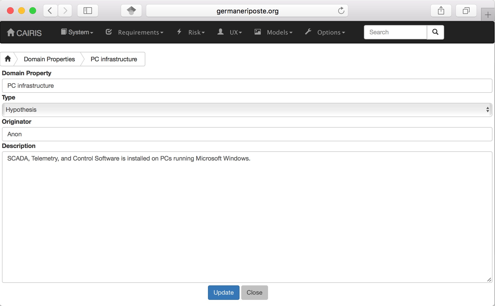

Domain Properties
=================

Domain Properties are descriptive properties about the statement world.
Domain Properties may be either hypothesis or invariants.

Adding, updating, and deleting a domain property
------------------------------------------------

-  Click on the Requirements/Domain Properties menu to open the Domain
   Properties table, and click on the Add button to open the Domain
   Property form.

-  Enter a domain property name, description, and select the type of
   domain property from the type combo box.

-  Click on the Create button to add the new domain property.

-  Existing domain properties can be modified by clicking on the
   domain property name in the Domain Properties table, making the
   necessary changes, and clicking on the Update button.
