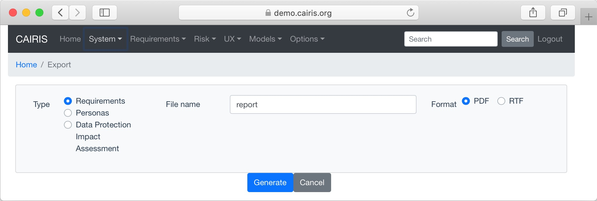

Generating Documentation
========================

The current contents of the CAIRIS database can be rendered as a
requirements specification by selecting the System/Documentation
menu.  After choosing the type of specification, the output file name, and the output type -- PDF, Word Document (.docx), OpenDocument Text (.odt), Rich Text Format (.rtf) -- clicking on Generate will generate and download the specification document.

CAIRIS currently supports the generation of 3 types of specification:

================================= =====================================================================================================================================================================================================================
Template                          Description
================================= =====================================================================================================================================================================================================================
Requirements                      A requirements specification that conforms to the `Volere Requirements Specification Template <http://www.volere.co.uk/template.htm>`_
Personas                          A specification document for personas.
Data Protection Impact Assessment A DPIA specification that conforms with the `ICO Data Protection Impact Assessments draft template <https://ico.org.uk/media/about-the-ico/consultations/2258461/dpia-template-v04-post-comms-review-20180308.pdf>`_.
================================= =====================================================================================================================================================================================================================

Problems with wide models
-------------------------

Very wide goal or obstacle models can cause problems when generating PDFs, e.g. the webinos sample model.  The workaround to such problems is to generate the documentation in Word, and export the model from Word to PDF.

Customsing model files
----------------------
Models in CAIRIS are rendered as SVG, and it can be useful to edit these models for improved readability.  You can extract these models directly from the web app by installing the `SVG Crowbar <http://nytimes.github.io/svg-crowbar>`_ bookmarklet in your browser.
The resulting SVG file can then be tweaked using an SVG editor like `Inkscape <https://inkscape.org>`_ , exported to the graphics format of your choice, and then added to your specification document.
