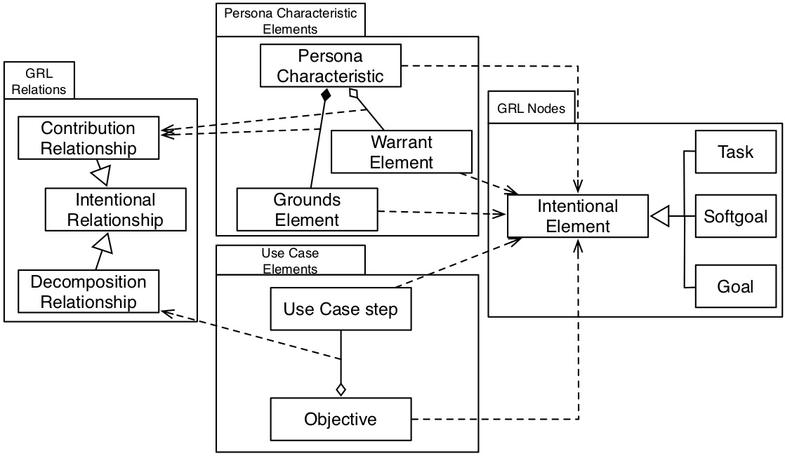
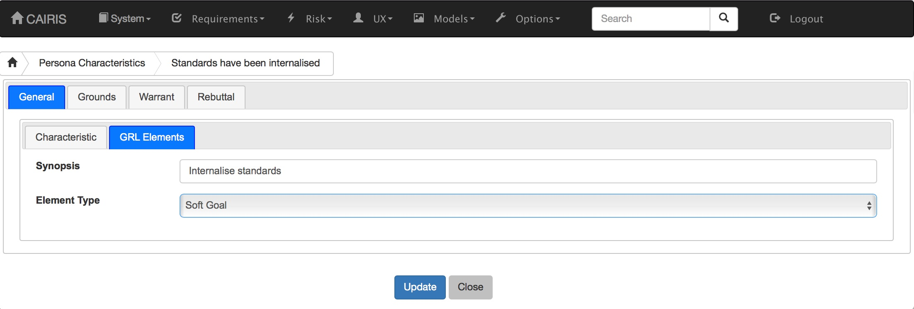

Generating Goal-oriented Requirements Language models
=====================================================

`The Goal-oriented Requirements Language (GRL) <https://en.wikipedia.org/wiki/Goal-oriented_Requirements_Language>`_ is a language for modelling intentional relationships between goals.  In addition to generating user goal models, CAIRIS supports the visualisation of GRL models, but it is possible to generate GRL models from CAIRIS that are compatible with `jUCMNav <http://jucmnav.softwareengineering.ca/foswiki/ProjetSEG>`_.  There are several reasons why generating GRL models from a CAIRIS model might be useful:

* Expressing persona data using GRL can help elicit intentional relationships that support or refute aspects of a persona’s behaviour.
* Agent-oriented goal modelling language like GRL are popular in Requirements Engineering, making a GRL model a potential vehicle for interchange between RE methods, techniques, and tools.
* GRL models provide an alternative way of contextualising personas, tasks, and use cases. This might make it possible to identify new requirements, threats, or vulnerabilities that results from cross-cutting concepts.

`This paper <https://www.researchgate.net/publication/221215412_Bridging_User-Centered_Design_and_Requirements_Engineering_with_GRL_and_Persona_Cases>`_ explains the alignment between GRL and CAIRIS concepts, which are summarised in the figure below:
 

Pre-requisite activities
------------------------

To generate a GRL model, you need to create the CAIRIS model elements synonymous with the GRL model elements.  Typically, these will be persona characteristics and use cases.  You will also need to create a traceability association between a task that the personas of interest participate in, and the use cases. For details on how to add traceability links, see :doc:`Traceability </traceability>`.

Adding GRL elements to persona characteristics
----------------------------------------------

GRL goals, soft goals, or tasks can be associated with persona characteristics, and their supporting grounds, warrants, or rebuttals.

- To add these GRL elements, open the persona characteristic you want to update, and click on the GRL Elements folder.

- Enter an intention that persona characteristic that expresses the characteristic in intentional terms.

- Select the GRL element type for this synopsis; this can be either a goal, soft goal, or task.

- For each appropriate grounds, warrant, and rebuttal reference, click on the reference to open the characteristic reference dialog.

.. figure:: crGrl.jpg
   :alt: Associating GRL with characteristic reference

- Expresses the ground, warrrant, or rebuttal reference in intentional terms.

- Select the GRL element type for this synopsis this can be either a goal or soft goal.

- Given the intentional relationship between this GRL element and the GRL goal, softgoal, or task associated with the persona characteristic, indicate whether this element is a means for achieving the characteristic element's end by selecting *Means* in the Means/End combo box.  Alternatively, if the characteristic's element is a means for achieving this GRL elements end then select *End*.

- Use the Contribution box to indicate how much this reference contributes to achieving its means or end.  Possible values are Make, SomePositive, Help, Hurt, SomeNegative, Break.

- Click on the Save button to update the persona characteristic, and close the dialog.

- Click on the Update button on the persona characteristic form to save the persona characteristic.

Adding GRL elements to use cases
--------------------------------

Use cases can make a contribution to GRL elements associated with persona characteristics.  These use cases are associated with GRL goals, and the use case steps are refined as GRL tasks.  These are associated with either asset, component, or role actors.

- To add these GRL elements and contribution relationships, open the use case to be updated, and select the Contribution folder.

- Select the goal or soft goal the use case contributes to, indicate whether the use case is a means or an end in the intention relationships, and -- using the Contribution box -- indicate how much the use case contributes to achieving its means or ends.

.. figure:: ucGrl.jpg
   :alt: Associating GRL with a use case

- Click on the Flow folder, and double click on the step you want to associate the GRL task with.

.. figure:: ucsGrl.jpg
   :alt: Associating GRL with a use case step

- Enter a synopsis that expresses the use case step in intentional terms.

- Select the GRL actor type and actor to associate the GRL task with.  Permissable actor types are assets, components, and roles.

- Click on the Update button to update the use case step, and close the dialog.

- Click on the Update button on the use case form to save the use case.

Generating a GRL model
----------------------

.. figure:: exportGrl.jpg
   :alt: Exporting a GRL model

- To generate a GRL model, select the System/Export GRL menu to open the Export GRL modal dialog.

- Select the Environment, Task, and Persona to create the GRL model for, together with the name of the output GRL file.  Persona GRL elements will be present in the exported model only GRL elements have been associated with persona cases.  Task GRL elements will be present only if (i) a traceability link has been added between the use cases where GRL elements are elements.

- Click on the Export button to generate a GRL file.

- Assuming you have a project open in jUCMNav, you can import this GRL file by selecting the File/Import menu in Eclipse to open the Import wizard, selecting the Other | Import UCM / GRL / URN option, and then selecting the generated GRL file.

.. figure:: jucmnav.jpg
   :alt: GRL model in jUCMNav
