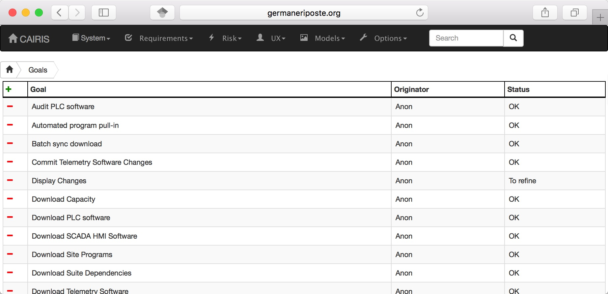
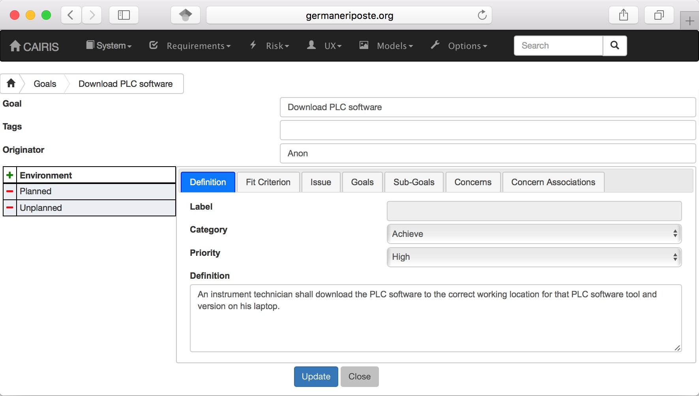
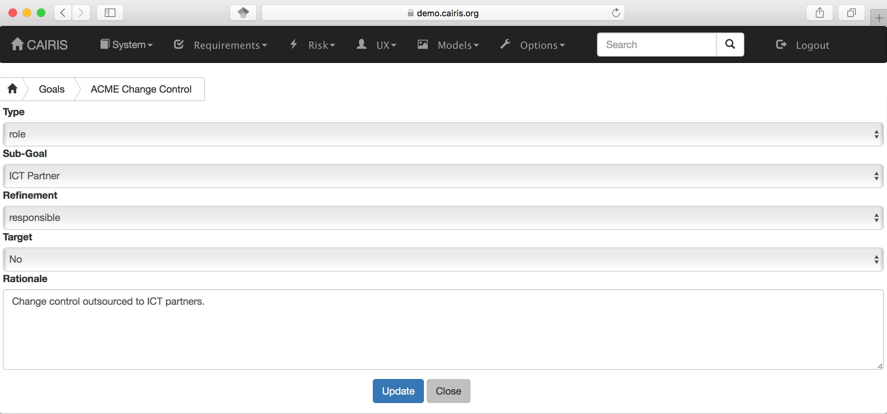
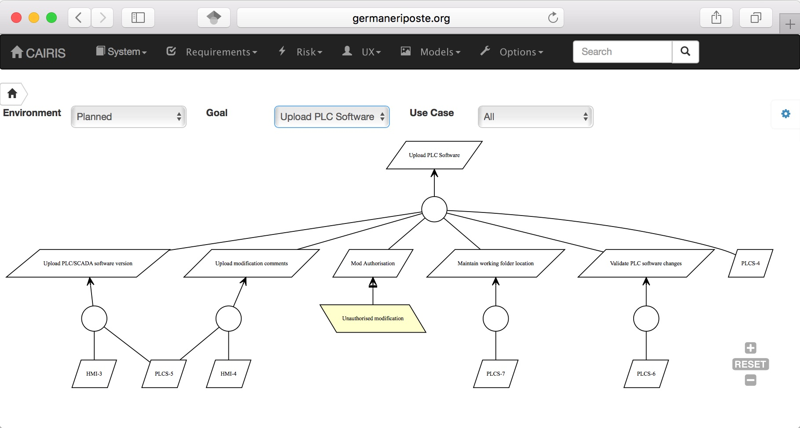
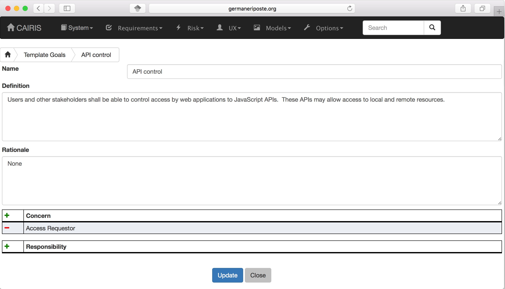
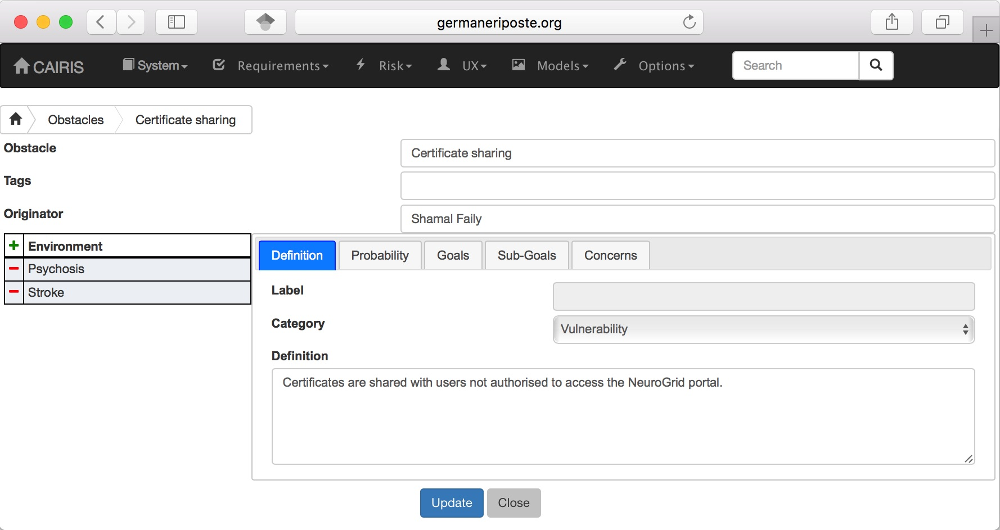
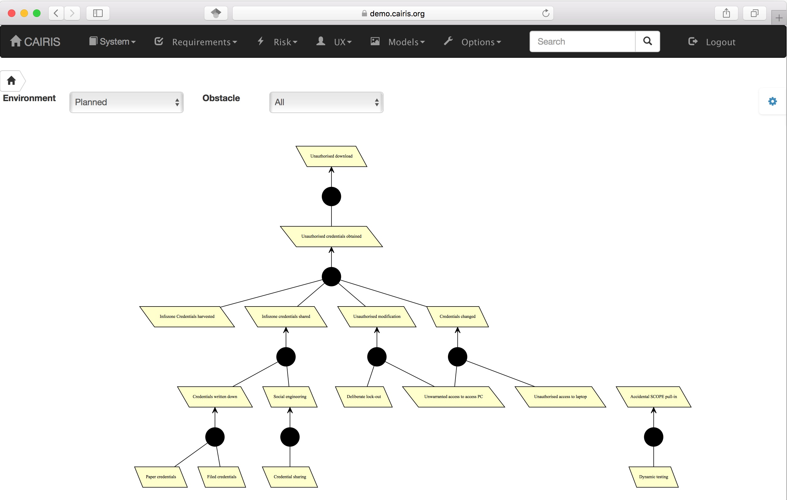
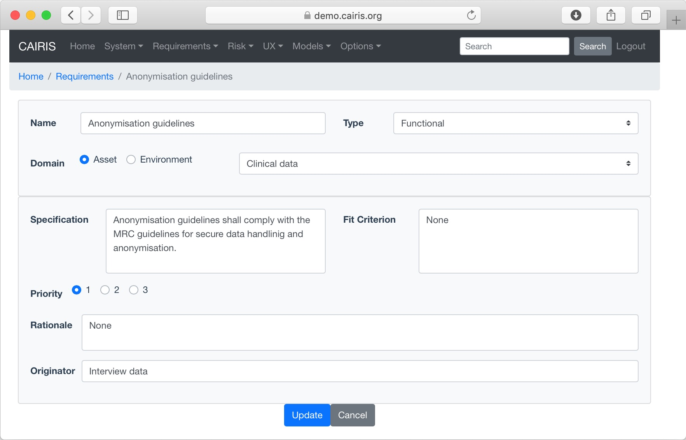
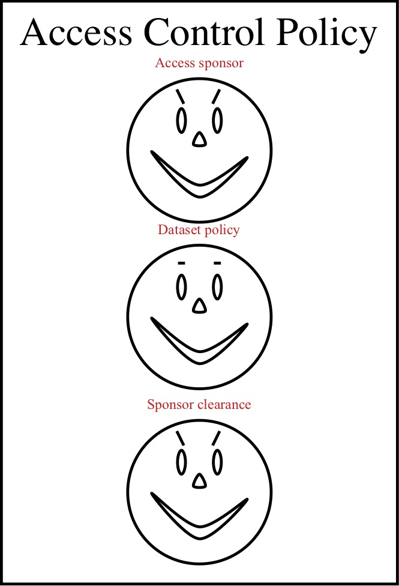
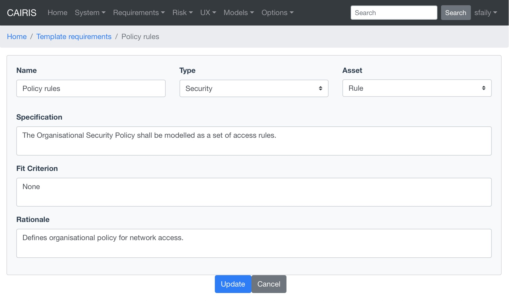

Goals, Requirements, and Obstacles
==================================

In CAIRIS, a requirements specification is analogous to a safety case.
In a safety case, a system is only considered safe if its safety goals
have been satisfied. In a similar manner, requirements are leaf nodes in
a goal tree and satisfying stakeholder needs is only possible if the
high-level goals -- stipulated by stakeholders -- can be satisfied.

We define goals as prescriptive statements of system intent that are
achievable by one or more agents. Goals can be refined to requirements,
which are achievable by only agent. Goals and requirements may also be
operationalised as tasks. Alternatively, we may decide to specify tasks
and ask what goals or requirements need to hold in order that a given
task can be completed successfully.

To satisfy a goal, one or more sub-goals may need to be satisfied;
satisfaction may require satisfying a conjunction of sub-goals, i.e.
several AND goals, or a disjunction of sub-goals, i.e. several OR goals.

Goals or requirements may be *obstructed* by obstacles, which are
conditions representing undesired behaviour; these prevent an associated
goal from being achieved. By progressively refining obstacles, we can
obtain the origin of some undesired behaviour; this may be reflected as
a vulnerability or a threat, and contribute to risk analysis.

Adding, updating, and deleting a goal
-------------------------------------

-  Click on the Requirements/Goals button to open the Goals table. As
   the above figure illustrates, next to goal name is the current
   *status* for the goal. If a goal is defined as OK, then this goal is
   refined by a requirement, or by one or more goals. Goals with the
   status *to refine* have yet to be refined or operationalised. Goals
   with the status *Check* have been refined by one or more obstacle,
   and these should be examined to find a root threat or vulnerability.

-  Click on the Add button to open the Goal form, and enter the
   name of the goal.

-  Click on the Add button in the environment card, and select an environment to situate the goal in. This will add the new environment to the environment tab.

-  In the Definition folder, enter the goal definition, and select the
   goal category and priority. Possible goal categories are: Achieve,
   Maintain, Avoid, Improve, Increase, Maximise, and Minimise. Possible
   priority values are Low, Medium, and High.  Enter the fit criteria which must hold
   for this goal to be satisfied, and any issues or comments relating to this goal.

-  If this goal refines a parent goal, click on the Goals tab,
   click on Add button in the goals table to to open the Add
   Goal Refinement form. In this form, select the Goal from the Type
   combo box, and select the Sub-goal, refinement type, and an Alternate
   value. Possible refinement types are: and, or, conflict, responsible,
   obstruct, and resolve. The alternative value (Yes or No) indicates
   whether or not this goal affords a goal-tree for an alternate
   possibility for satisfying the parent goal. It is also possible to
   enter a rationale for this goal refinement in the refinement text
   book. Clicking on Update will add the refinement association to memory,
   but this will not be committed to the database until the goal is
   added or updated.

-  If this goal refines to sub-goals already specified, Click on the
   Sub-Goals tab and add a goal refinement association as described in
   the previous step. A goal may refine to artifacts other than goals,
   specifically tasks, requirements, obstacles, and domain properties.

-  Goal refinements can also be specified independently of goal creation
   or modification via the Requirements / KAOS Associations menu.

-  If any aspect of the goal concerns one or more assets, then these can
   be added by clicking on the Concerns folder and adding the asset/s to
   the concern list. Adding an asset concern causes a concern comment to
   be associated to the asset in the asset model. If the goal concerns
   an association between assets, the association can be added by
   clicking on the Concern Association tab and adding the source and
   target assets and association multiplicity to the concern association
   list. In the asset model, this association is displayed and a concern
   comment is associated to each asset in the association.

-  Click on the Create button to add the new goal.

-  Existing goals can be modified by clicking on the goal name in the
   Goals table, making the necessary changes, and clicking on the
   Update button.

-  To delete a goal, select the goal to delete in the Goals table,
   and select the Delete button. If any artifacts are dependent on this
   goal then a dialog box stating these dependencies are displayed. The
   user has the option of selecting Yes to remove the goal dependencies
   and the goal itself, or No to cancel the deletion.

Goal Modelling
--------------

Goal models can be viewed by clicking on the Models/Goal menu option,
and selecting the environment to view the environment for.

By changing the environment name in the environment combo box, the goal
model for a different environment can be viewed.

By clicking on a model element, information about that artifact can be
viewed.

Goal models can also be filtered by goal. Applying a filter causes the
selected goal to be displayed as the root goal. Consequently, goals are
only displayed if they are direct or indirect leafs of the filtered
goal.

For details on how to print goal models as SVG files, see :doc:`Generating Documentation </gendoc>`.

Template Goals
~~~~~~~~~~~~~~~

You can specify libraries of template goals that you might form the basis of architectural patterns.

These can be added, updated, and deleted in much the same way as standard goals.

Adding, updating, and deleting an obstacle
------------------------------------------

-  Click on the Requirements/Obstacle menu to open the Obstacles table
   box, and click on the Add button to open the Obstacle dform.

-  Enter the name of the obstacle, and click on the Add button in the environment card, and select an environment to situate the obstacle in. This will add the new environment to the environment list.

-  In the Definition page, enter the obstacle definition, and select the
   obstacle category. Possible obstacle categories are: Confidentiality
   Threat, Integrity Threat, Availability Threat, Accountability Threat,
   Vulnerability, Duration, Frequency, Demands, and Goal Support.

-  Enter a probability value (if known), together with a rationale statement justifying the value.  When set, probability values need to be between 0 and 1, e.g. 0.2.

-  Like goals, obstacle refinements can be added via the Goals and
   Sub-Goals tabs.

-  If any aspect of the obstacle concerns one or more assets, then these
   can be added by clicking on the Concerns add and adding the asset/s
   to the concern list. Adding an asset concern causes a concern comment
   to be associated to the asset in the asset model.

-  Click on the Create button to add the new obstacle.

-  Existing obstacles can be modified by selecting the obstacle
   in the Obstacles table, making the necessary changes, and
   clicking on the Update button.

-  To delete an obstacle , select the obstacle to delete in the
   Obstacles table, and select the Delete button. If any artifacts
   are dependent on this obstacle then a dialog box stating these
   dependencies are displayed. The user has the option of selecting Yes
   to remove the obstacle dependencies and the obstacle itself, or No to
   cancel the deletion.

Obstacle Modelling
------------------

Obstacle models can be viewed by clicking on the Models/Obstacle menu
button, and selecting the environment to view the environment for.

In many ways, the obstacle model is very similar to the goal model. The
main differences are goal filtering is not possible, only the obstacle
tree is displayed, and obstacles refine to obstacles, as opposed to
goals.

A KAOS obstacle model can be seen as a goal-driven form of a *Fault Tree*. However, unlike fault trees, obstacle modelling is closely tied to other artifacts such as previous knowledge about attacks and information about the attackers that might carry these out.

Where useful statistical data about possible attacks exists, this information can help us predict the likelihood of particular obstacles being satisfied. When a probability value is specified in obstacles for this likelihood then a rationale statement also needs to be provided to justify it. This is necessary because, when attack patterns are imported into a CAIRIS model, it may not be immediately obvious that the obstacle or the obstacle model arose from them.
By proving this justification, we have some way of understanding the thinking that motivated this value. Based on these values, we can evaluate the probability of a particular cut of an obstacle tree based on the same equations used to evaluate the faults in a fault tree. For example, for an obstacle *O* with leaf goals *O1* and *O2*, the probability of *O1*  where *O1* and *O2* are AND-refinements is *O1* x *O2*; where *O1* and *O2* are OR-refinements then the probability is *O1* + *O2*.

Obstacles are coloured with a shade of red based on the probability set when defining the obstacle.  The probability can be a real number between 0 and 1, where the default value is 0.

For details on how to print obstacle models as SVG files, see :doc:`Generating Documentation </gendoc>`.

Adding, updating, and deleting requirements
-------------------------------------------

Requirements are accessible by selecting the Requirements/Requirements menu option. Each requirement is associated with an asset, or an
environment. Requirements associated with assets may specify the asset,
constrain the asset, or reference it in some way. Requirements
associated with an environment are considered transient, and remain
associated with an environment only until appropriate assets are
identified.

-  To add a requirement, click on the Add button in the requirements table.

-  Enter the requirement description, rationale, fit criterion, and
   originator in the appropriate cells, select the priority (1,2, 3),
   and the requirement type (Functional, Data, Look and Feel, Usability,
   Performance, Operational, Maintainability, Portability, Security,
   Cultural and Political, and Legal).

-  When the attributes have been entered, click on the Create button to add the requirement.

-  When a requirement has been added or update, the asset/environment filter will be updated based on the asset or environment the new/updated requirement is associated with.

-  In the requirements table, a requirement can be deleting by clicking on the delete button.

Visualising Requirements Quality using Chernoff Faces
-----------------------------------------------------

Requirements quality is automatically scored based on requirements completeness, the presence of an imperative phrase, and ambiguity.

These are displayed using cartoon *Chernoff Faces*.  Eye-brow shape indicates the completeness of a given requirement.  If no text is found in certain fields, or phrases like *TBC*, *none*, or *not defined* are present, the completeness score is marked down accordingly, and the eye-brows convey a negative mood.

The eye shape indicates whether or not an imperative phrase exists in the requirement description.  If such a phrase exists then the eyes become vertically elongated. The mouth indicates the presence of weak or fuzzy phrases, such as *mostly*, *appropriate*, *normal*, or *adequate*; the presence of these phrases turn the smile into a frown.

Chernoff Faces can be seen by viewing the Requirements model (accessible via the Models/Requirements menu) or the Risk model (accessible via the Models/Risk menu).

Template Requirements
~~~~~~~~~~~~~~~~~~~~~

:alt: TemplateRequirementDialog

You can specify libraries of template requirements that you might form the basis of security and architectural patterns.

These can be added, updated, and deleted in much the same way as other CAIRIS objects.

Attack tree modelling with obstacles
------------------------------------

Attack trees are a formal methodological way of describing the security of systems.  Together with Data Flow Diagrams (DFDs) these are a standard for visualising threat models.

Because obstacle models are represented using the same top-down notation as attack trees, they are a good candidate for representing attack.

You can import attack trees represented as Dot files directly into a CAIRIS model.  See the `Importing and Exporting models`_ section for more details on how to import models into CAIRIS.
