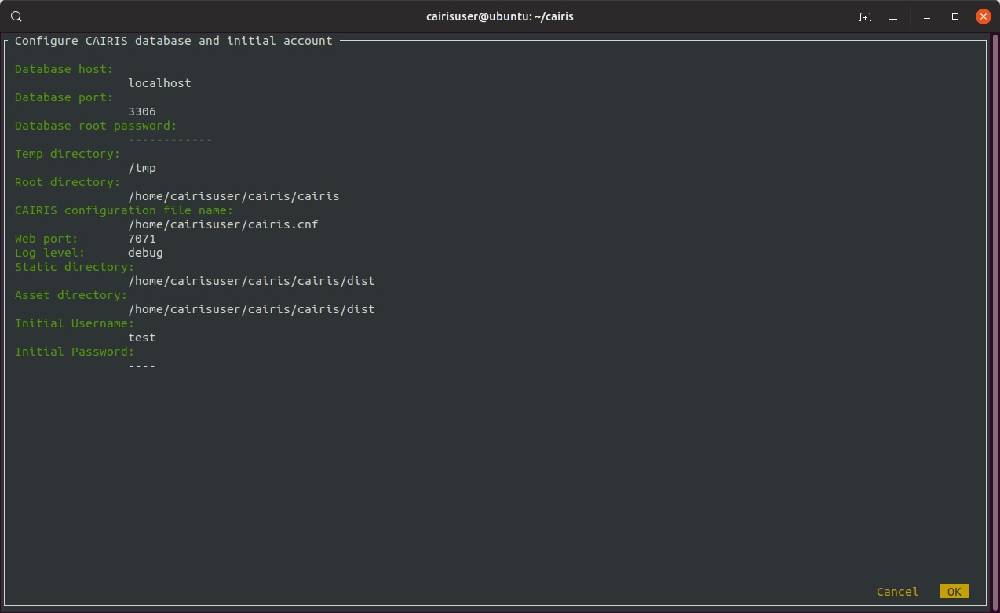

Installing CAIRIS
=================

Installation via Vagrant
~~~~~~~~~~~~~~~~~~~~~~~~

If you have `Vagrant <https://www.vagrantup.com/downloads.html>`_ and `VirtualBox <https://virtualbox.org>`_ installed, you can build your CAIRIS VM in minutes.  To start, you need to clone the cairis server repository:

.. code-block:: bash

   git clone https://github.com/cairis-platform/cairis

Once in the root directory of the repository type:

.. code-block:: bash

   vagrant up

This will create and start a CAIRIS virtual machine in VirtualBox and, once complete, this is accessbile via your web browser at http://localhost:7071. 
The default username and password is *test@test.com* and *test*, but you can change this by editing *vagrant_conf.yaml*.  

To shutdown the virtual machine:

.. code-block:: bash

   vagrant halt

To restart the virtual machine:

.. code-block:: bash

   vagrant up

If you need to login to the virtual machine, i.e. to check the log files, use the *vagrant* account (password: *vagrant*).

.. note:: 
   The Vagrantfile is a simplified version of Ben Coleman's `Cairis_vagrant <https://github.com/nebloc/Cairis-vagrant>`_ repository.

Installation via Docker
~~~~~~~~~~~~~~~~~~~~~~~

If you have Docker installed on your laptop or an available machine, you can download the CAIRIS container from `Docker hub <https://hub.docker.com/r/shamalfaily/cairis/>`_.  Like the live demo, this is built from the latest version of CAIRIS in GitHub, and uses `mod_wsgi-express <https://pypi.python.org/pypi/mod_wsgi>`_ to deliver the CAIRIS web services.

There are two options for running the container, a full install of everything or a smaller install which doesn't provide pdf export functionality:

For the full install (with pdf export functionality) download and run the container, the documentation container, and its linked mysql container:

.. code-block:: bash
 
   sudo docker run --name cairis-mysql -e MYSQL_ROOT_PASSWORD=my-secret-pw -d mysql:latest --thread_stack=256K --max_sp_recursion_depth=255 --log_bin_trust_function_creators=1
   sudo docker run --name cairis-docs -d -v cairisDocumentation:/tmpDocker -v cairisImage:/images -t shamalfaily/cairis-docs
   sudo docker run --name CAIRIS -d --link cairis-mysql:mysql --link cairis-docs:docs -P -p 80:8000 --net=bridge -v cairisDocumentation:/tmpDocker -v cairisImage:/images shamalfaily/cairis

For the smaller install (without pdf export functionality) download and run the container, and its linked mysql container:

.. code-block:: bash
 
   sudo docker run --name cairis-mysql -e MYSQL_ROOT_PASSWORD=my-secret-pw -d mysql:latest --thread_stack=256K --max_sp_recursion_depth=255 --log_bin_trust_function_creators=1
   sudo docker run --name CAIRIS --link cairis-mysql:mysql -d -P -p 80:8000 --net=bridge shamalfaily/cairis

If you run the above commands on macOS (and possibly other non-Linux platformns), you might get the error *links are only supported for user-defined networks*.  If so, you should instead run the below commands to download and run your containers:

.. code-block:: bash
   
   NET=cairisnet
   docker network create -d bridge $NET
   docker run --name cairis-mysql -e MYSQL_ROOT_PASSWORD=my-secret-pw -d mysql:latest --thread_stack=256K --max_sp_recursion_depth=255 --log_bin_trust_function_creators=1
   docker network connect $NET cairis-mysql
   docker run --name CAIRIS -d -P -p 80:8000 --net=$NET shamalfaily/cairis

If you want to use the containers to support account self-registration and revocation then you can set MAIL_SERVER, MAIL_PORT, MAIL_USER, and MAIL_PASSWD environment variables to correspond with the SSL outgiong mail server, mail server port, mail account username, and password for the mail account, i.e.

.. code-block:: bash

   docker run --name CAIRIS --env MAIL_SERVER=mymailserver.com --env MAIL_PORT=465 --env MAIL_USER=admin@mymailserver.com --env MAIL_PASSWD=mypassword -d -P -p 80:8000 --net=$NET shamalfaily/cairis

The *docker run* commands will create and start-up CAIRIS.  If you haven't setup account self-registration then you will need to create an account before you can use it.  To do this, run the below command - replacing test@test.com and test with your desired username and password. 

.. code-block:: bash

   docker exec -t `docker ps | grep shamalfaily/cairis | head -1 | cut -d ' ' -f 1` /addAccount.sh test@test.com test TestUser

If you are using PowerSheell on Windows to run the above command then this might fail because *grep* is not installed.  To work around this, you need to use *docker ps* to get the Container ID and run the below modified command:

.. code-block:: bash

   docker exec -t CONTAINER_ID /addAccount.sh test@test.com test TestUser

Once the containers have been installed then, in the future, you should use *docker start* rather than *docker run* to start up the already downloaded containers.

.. code-block:: bash
 
   sudo docker start cairis-mysql 
   sudo docker start CAIRIS

The containers can be stopped using *docker stop*, i.e.

.. code-block:: bash

   sudo docker stop CAIRIS
   sudo docker stop cairis-mysql

To update your docker containers, stop the docker containers and run the below commands to remove any old containers and volume files. Following that, you can re-run the above *docker run* commands to install and run the container.  Don't forget to re-add your user account!

.. code-block:: bash

   sudo docker rm $(sudo docker ps -aq)
   sudo docker rmi --force $(sudo docker images -q)
   sudo docker volume rm $(docker volume ls)

Installation and configuration via GitHub (automated)
~~~~~~~~~~~~~~~~~~~~~~~~~~~~~~~~~~~~~~~~~~~~~~~~~~~~~

If you have a clean Ubuntu VM, you can quickly install and configure CAIRIS and its dependencies with the command below, replacing my-secret-pw with your desired root password for MySQL.

.. code-block:: bash

   sudo apt-get update && sudo apt-get upgrade -y && sudo apt-get dist-upgrade -y && sudo apt install curl -y && sudo apt install net-tools -y && curl -s https://cairis.org/quickInstall.sh | bash -s my-secret-pw

In addition to configuring and installing CAIRIS, the script creates an initial user account (username: test@test.com, password: test), starts the Flask development server as a service, and restarts the VM.  You can use *journalctl* to check the CAIRIS log file.

.. code-block:: bash

   journalctl -u cairis.service -f

This script also adds an alias so, in future, you can update CAIRIS by running the below command:

.. code-block:: bash

   update_cairis

Installation and configuration of server with account registration via GitHub (automated)
~~~~~~~~~~~~~~~~~~~~~~~~~~~~~~~~~~~~~~~~~~~~~~~~~~~~~~~~~~~~~~~~~~~~~~~~~~~~~~~~~~~~~~~~~

If you have a clean Ubuntu VM, want to quickly install CAIRIS for multiple users, but don't want to use the defaults associated with the quickInstall.sh script, then you can run the more bespoke serverInstall.sh script as below, replacing (i) my-secret-pw with your desired MySQL root password, (ii) mymailserver.com with the name of your private (with SSL) outgoing mail server, (iii) 465 with this mail server's port, (iv) admin@mymailserver.com with your mail server username, and (v) mypassword with this account's password.

.. code-block:: bash

   sudo apt-get update && sudo apt-get upgrade -y && sudo apt-get dist-upgrade -y && sudo apt install curl -y && sudo apt install net-tools -y && curl -s https://cairis.org/serverInstall.sh | bash -s my-secret-pw mymailserver.com 465 admin@mymailserver.com mypassword

When working with very large models, you may get memory errors when viewing goal models or carrying out model validation checks.  If you do, you could consider increasing the thread_stack size in /etc/mysql/conf.d/mysql.cnf.  For example, increasing the size to 1024K made it possible to valid even really big system-of-system models, but you can increase or decrease this size based on your server's performance and the number of users you expect the server to support.

If you follow these instructions then, once you've restarted your server, CAIRIS should be accessible via http://SERVER:8000, where SERVER is the name or IP address of your machine.  If you wish to route your http traffic accordingly (e.g. via DNS) then the CAIRIS service supports acccess via https too.  This is the approach currently taken by the CAIRIS live demo on https://demo.cairis.org.

Although no update_cairis alias is created, we provide a `rebuildServer.sh <https://cairis.org/rebuildServer.sh>`_ script which, if run from cron each night, will rebuild and reconfigure CAIRIS while still retaining the user accounts and their default databases created on the server.  This script takes the same command line arguments as the serverInstall.sh script, with the addition of additional arguments for the name of the account running CAIRIS, and the accounts home directly.  For example, if the account running CAIRIS is *sfaily* and the home directory in */home/sfaily* then, to rebuild the server at 0200 each morning you should run *sudo crontab -e* and add the following line to your crontab::

   0 2 * * * /home/sfaily/rebuildServer.sh my-secret-pw mymailserver.com 465 admin@mymailserver.com mypassword sfaily /home/sfaily > /home/sfaily/rebuild.log 2>&1

This rebuild.log file should be useful for troubleshooting any problems with the rebuild.

Once the server is running, users can register for accounts using the Register link on the login page.  The account name should be a valid email address.  When an account is created, an email is sent to the user and the user is logged in.  If the Reset link is clicked and the acccount name is provided, CAIRIS will email instructions for resetting the password to the user.

Installation and configuration via GitHub (manual)
~~~~~~~~~~~~~~~~~~~~~~~~~~~~~~~~~~~~~~~~~~~~~~~~~~

If you're happy to use the command line, you may like to install CAIRIS from the latest source code in GitHub.  CAIRIS can be installed on any platform that its open-source dependencies are available for.  The most tested platform is `Ubuntu <http://www.ubuntu.com>`_ .  Assuming you are using Ubuntu, just follow the steps below:

Begin by installing the required applications and dependencies:

.. code-block:: bash

   sudo apt-get install python3-dev build-essential mysql-server mysql-client graphviz docbook dblatex python3-pip python3-mysqldb python3-numpy git libmysqlclient-dev --no-install-recommends texlive-latex-extra docbook-utils inkscape libxml2-dev libxslt1-dev poppler-utils python3-setuptools pandoc

If you are installing Ubuntu 18.04 LTS or later, or have not been prompted to set a root database password, you will need to set this manually.  This entails starting mysqld with the --skip-grant-tables option, logging into mysql as root, and setting the root password by hand.  You can find instructions on how to do that `here <https://linuxconfig.org/how-to-reset-root-mysql-password-on-ubuntu-18-04-bionic-beaver-linux>`_.

In addition to the above, you also need to update my MySQL server system variables. You can do this by adding or updating the below values to your mysqld.cnf file. In Ubuntu 19.04, you can find this in /etc/mysql/mysql.conf.d, but the file location might differ depending on your OS and MySQL version:

.. code-block:: bash

   thread_stack = 256K
   max_sp_recursion_depth = 255
   log_bin_trust_function_creators = 1

Clone the latest version of the CAIRIS github repository, and use pip to install the dependencies in the root directory, i.e.

.. code-block:: bash

   git clone https://github.com/cairis-platform/cairis
   cd cairis
   sudo pip3 install -r requirements.txt

Run the CAIRIS quick setup initialisation script (which can be found in cairis/).  When you run this script, you should get the below form.

.. code-block:: bash

   ./quick_setup.py

You can accept many of these defaults, except for the database root password, an initial username and password which need to be supplied.  Please note that the username *root* is reserved, so you should not use this.  

Details for the mail server only need to be set if you intend to provide self-service registration and reset of accounts.  This is typically only necessary if you plan to install CAIRIS to a server for multiple users.  When these settings are set, the mail server and port should be for out-going SSL traffic.

If you want more diagnostic information logged, you find it useful to change the Log Level from *warning* to *debug*.  

The static and directory and asset directory will point to the location of UI code, but these directories will not be created during this step. If you don't plan to customise your web server setup, you should retain these default values.

When you select `Ok`, the script will create a new CAIRIS database, and accompanying CAIRIS configuration file; this file will ensure that CAIRIS knows what database it needs to refer to when you start up the tool and setup the necessary environment variables.

Logout of your current account or, alternatively, reload your .bashrc file i.e.

.. code-block:: bash

   source .bashrc

The final step entails installing the UI code by running the below script in cairis/cairis/bin

.. code-block:: bash

   sudo -E ./installUI.sh

The CAIRIS UI code is managed in the `cairis-ui github repository <https://github.com/cairis-platform/cairis-ui>`_.  Running this script will setup `node <https://nodejs.org>`_ and `yarn <https://yarnpkg>`_, download the github repo, create a production version of the latest UI code and deploy to cairis/cairis/dist.
The -E flag is required, as the CAIRIS_SRC environment variable needs to be visible to root.

You should now start up your CAIRIS server.  If you plan to develop with CAIRIS, you should skip this step as you'll find it more useful to manually start the Flask development server.  For everyone else, create the following *cairis.service* file, substituting *cairisuser* for the name of your account.  Using sudo or root, copy this file to /etc/systemd/system.

.. code-block:: bash

   [Unit]
   Description=cairisd

   [Service]
   User=cairisuser
   WorkingDirectory=/home/cairisuser/cairis
   Environment="FLASK_APP=/home/cairisuser/cairis/cairis/daemon:create_app"
   Environment="FLASK_ENV=development"
   Environment="CAIRIS_CFG=/home/cairisuser/cairis.cnf"
   Environment="PYTHONPATH=${PYTHONPATH}:/home/cairisuser/cairis"
   ExecStart=flask run --host 0.0.0.0 --port 7071
   Restart=on-failure

   [Install]
   WantedBy=multi-user.target

You can now launch cairisd as a system service:

.. code-block:: bash

   sudo systemctl enable --now /etc/systemd/system/cairis.service

[Optional] Multiple users using CAIRIS

cairisd relies on the Flask development server, which is fine for a single user, or development and troubleshooting.  However, if multiple users will use the same CAIRIS service at once, or you want to run CAIRIS in a production environment then it may be sensible to use mod_wsgi-express instead.
To do this, you will need to install the requisite Apache2 packages.

.. code-block:: bash

   sudo apt-get install apache2 apache2-dev

You will then need to use pip to install the requisite dependencies.

.. code-block:: bash

   sudo pip3 install -r wsgi_requirements.txt

You should then use mod_wsgi-express to run cairis.wsgi (also in cairis/cairis/bin):

.. code-block:: bash

   mod_wsgi-express start-server cairis.wsgi

Don't forget to modify *cairis.service* accordingly!

[Optional] Additional steps for developers

If you plan to customise CAIRIS, development extensions or fixes, you should install the requisite packages for running the tests in cairis/cairis/test.

.. code-block:: bash

   sudo pip3 install -r test_requirements.txt

To start the CAIRIS development server, set the FLASK_APP environment variable to cairis/cairis/daemon:create_app, the FLASK_ENV environment variable to development, then run:

.. code-block:: bash

   flask run --port 7071

All logged output is sent to the console where you started the development server, which is useful when it come to diagnosing any problems.  Also, if you plan to use pytest to debug any CAIRIS server code (i.e. by adding import pytest and pytest.set_trace() before any code you want to debug), the debug prompt will appear in the console.
