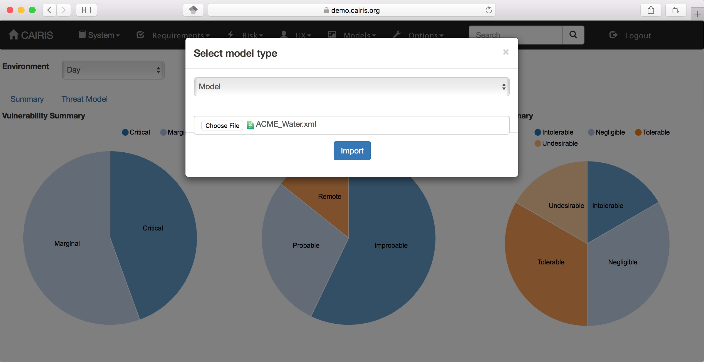
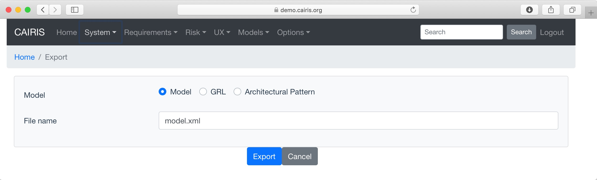

Importing and Exporting models
==============================

Importing models
----------------

You can import models by selecting the System / Import Model menu, selecting the model type to import, and the model file itself.

You will usually want to stick with the Model Package option to import .cairis files.  .cairis files are zip archives with a model file, any supplemental locations and architectural pattern models, and all the image files associated with the model.  

You can, alternatively, select the Model option, which imports a standard CAIRIS XML model file (as defined by the DTD in https://cairis.org/dtd/cairis_model.dtd).  If you select this option, you can choose to overwrite an existing model (the default option) or you can incrementally import the contents of a model file into a pre-existing model.  

You can also import other types of model into your current working project.

============================================= =============================== ============================================================================================================================
Model type                                    DTD (in https://cairis.org/dtd) Model elements
============================================= =============================== ============================================================================================================================
Project data                                  cairis.dtd                      Project background, goal, scope, rich picture, naming conventions, contributors, revisions
Requirements                                  goals.dtd                       domain properties, goals, obstacles, requirements, use cases, and countermeasures
Risk analysis                                 riskanalysis.dtd                roles, assets, vulnerabilities, attackers, threats, risks, responses, asset associations
Usability                                     usability.dtd                   personas, external documents, document references, concept references, persona characteristics, task characteristics, tasks
Misusability                                  misusability.dtd                concept references, task characteristics
Associations                                  associations.dtd                manual associations, goal associations, dependencies
Threat and Vulnerability Types                tvtypes.dtd                     vulnerability types, threat types
Domain Values                                 domainvalues.dtd                threat values, risk values, countermeasure values, security values, likelihood values, motivation values, capability values
Threat and Vulnerability Directory            directory.dtd                   vulnerability directory entries, threat directory entries
Security Pattern                              securitypattern.dtd             security patterns
Architectural Pattern                         architectural_pattern.dtd       architectural patterns
Attack Pattern                                attack_pattern.dtd              attack patterns
Synopsis                                      synopsis.dtd                    characteristic synopses, reference synopses, step synopses, reference contributions, usecase contributions
Assets                                        template_assets.dtd             template assets
Processes                                     processes.dtd                   CSP process elements (used by desktop application only)
Locations                                     locations.dtd                   locations
Dataflows                                     dataflow.dtd                    dataflows and trust boundaries 
Attack Tree (Dot)                             N/A                             Graphviz (Dot) representation of an attack tree
============================================= =============================== ============================================================================================================================

If you have command line access to the server running the CAIRIS server then a quicker way of importing a model is to use the cimport.py script, which can be found in cairis/cairis/bin.  The below command, which is run from cairis/cairis/bin, imports the ACME Water sample model into the default database of the test user. 

.. code-block:: bash

   ./cimport.py --user=test --database=test_default --type all --overwrite 1 ../../examples/exemplars/ACME_Water/ACME_Water.xml

If you run cimport.py with the --help argument, you will see more detailed import options.

Exporting models
----------------

To export a model, select the System / Export Model option.  Exporting the current model renders the current CAIRIS database you are working with as a CAIRIS XML model (conforming to cairis_model.dtd).
You can also export a selected architectural pattern, the security patterns currently loaded into CAIRIS, or a GRL model for a selected environment and task; this GRL can be imported into jUCMNav.

Like cimport.py, there is also a command line export script - cexport.py
 
.. code-block:: bash

   ./cexport.py --user=test --database=test_default --type all /tmp/model.xml
   
