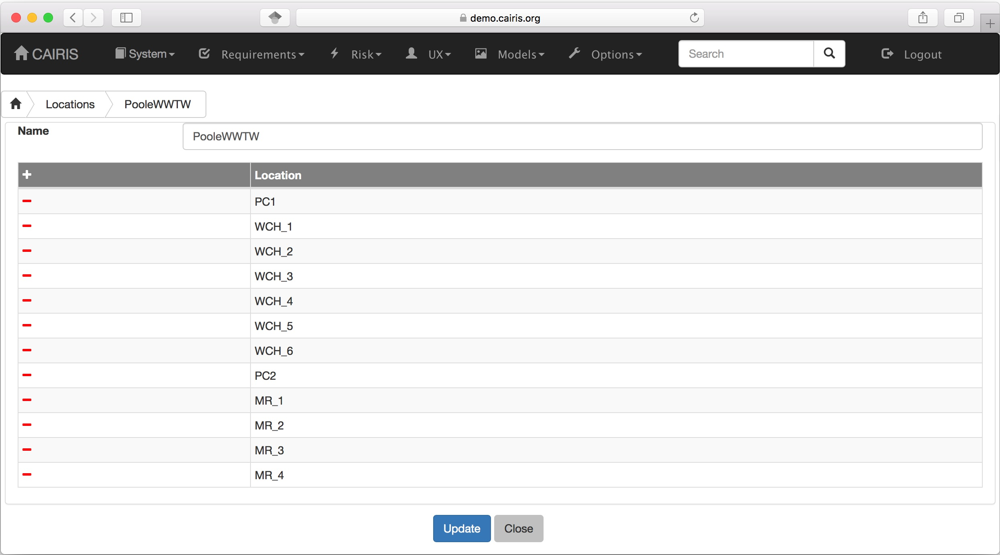
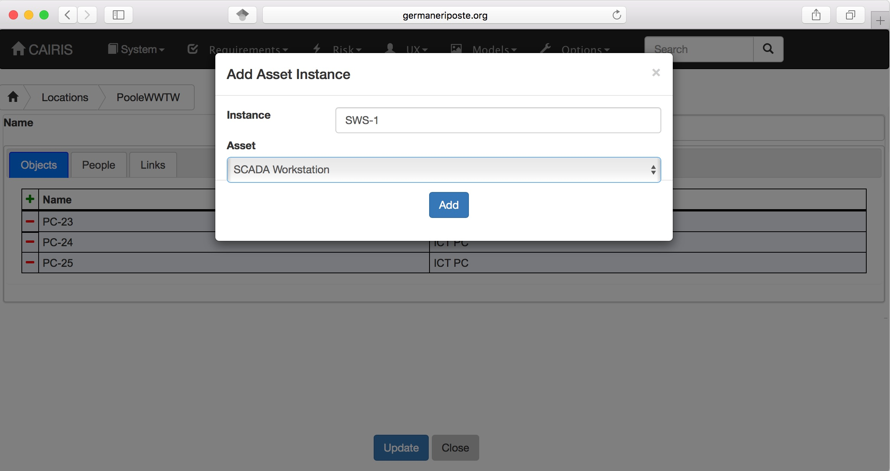
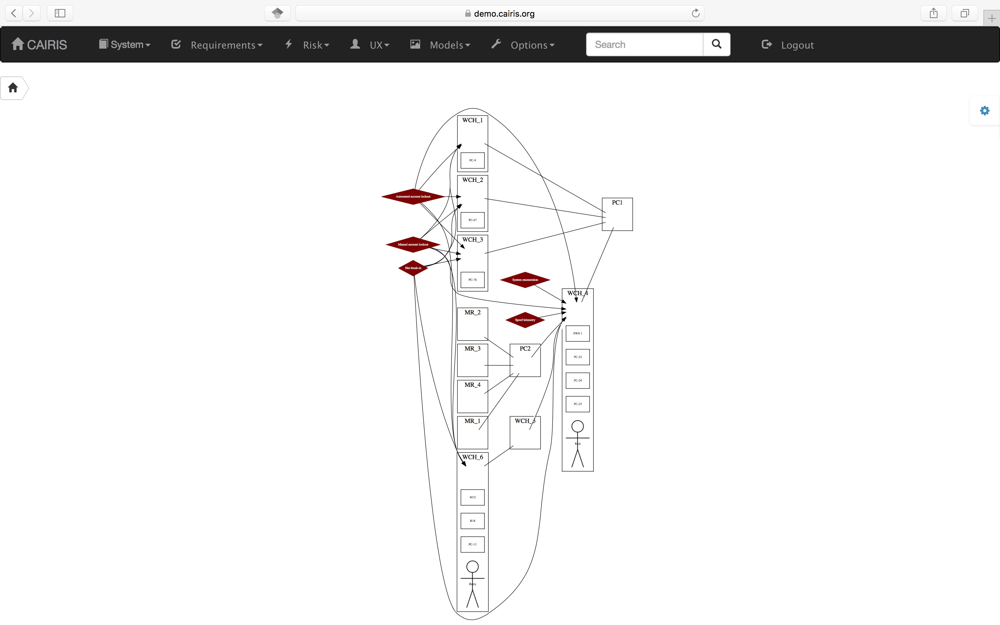

Locations
=========

A Locations object is a collection of *location* objects connected by *links*.  A location could be anything ranging from a room, corridor, or even a building.
Within a *location* it is possible to specify instances of assets or personas.
CAIRIS makes it possible to overlay risks onto location models, to explore the impact security might have on a physical location.

Adding, updating, and deleting a locations object
-------------------------------------------------

-  Select the UX / Locations menu to view the list of Locations objects.

-  Click on the Add button to open the Locations form, and enter the
   name of the Locations object.

-  To add a location to this object, click on the Add button in the locations card.

-  In the Objects folder, click on the Add button to open the Asset Instance dialog.  Enter the name of the asset instance, select the asset name, and click on Add to add the instance object.

-  In the Peopler folder, click on the Add button to open the Persona Instance dialog.  Enter the name of the persona instance, select the persona name, and click on the Add button to add the instance object.

-  In the Links folder, click on the Add button to open the Location Link dialog.  Select the location you wish to link this location to, and click on the Add button to add the link between locations. When a link is added, a corresponding is added to the linked location.

-  Click on the Update button to add this location to the Locations object.

-  Existing Locations objects can be modified by clicking on the Locations name in the
   Locations table, clicking on individual location rows in the table of locations, and adding or deleting asset instances, persona instances, or links, before clicking on the Update button.

Viewing location models
-----------------------

Location models can be viewed by clicking on the Models/Locations menu option, selecting the Locations object and a specific environment.
