Personas
========

Personas are specifications of archetypical users that the system needs
to directly or indirectly cater for. The system needs to be specified
for Primary Personas, but Secondary Personas cannot be ignored as their
thoughts or concerns provide insight into potential usability problems.

Adding, updating, or deleting a persona
---------------------------------------

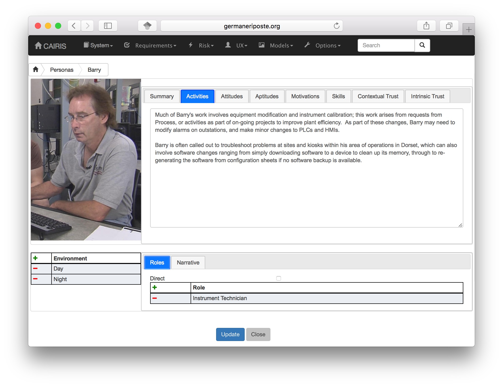

-  Select the UX/Personas menu to open the table of personas,
   and click on the Add button to open the new Persona form.

-  Enter a persona name and select the persona type.

-  If the persona is grounded in assumption-based data, click on the Assumption-based checkbox.

-  If you have decided to personalise the persona with a picture, this
   can be added by clicking on avatar silhouette next to the persona
   description, and selecting a image to represent the persona. Permitted image types are jpg, png, giff, and bmp.

-  Click on the Activities tab and enter the activities carried out by
   the personas.

-  Click on the Attitudes tab and enter the attitudes held by the
   persona, with respect to the problem domain the system will be
   situated in.

-  Click on the Aptitudes tab and enter the persona's aptitudes, with
   respect to the problem domain the system will be situated in.

-  Click on the Motivations tab and enter the persona's personal
   motivations.

-  Click on the Skills tab and enter the persona's skill-set, with
   respect to the problem domain the system will be situated in.

-  Click on the Contextual Trust tab, and enter information about aspects of this
   persona with an impact on contextual trust warranting properties.

-  Click on the Contextual Trust tab, and enter information about aspects of this
   persona with an impact on intrinsic trust warranting properties.

-  If you have decided to personalise the persona with a picture, this
   can be added by clicking on avatar box next to the persona
   properties notebook, to select an image to associated with the persona.

-  Click on the Environment card, and click on the Add button to situate the persona in an environment.
   Selecting an environment from the modal will open up a new folder for
   information about persona roles, and an environment specific narrative.

-  After ensuring the environment is selected in the environment window,
   click on the Roles tab. Select the Direct User 
   checkbox if the persona is a direct stakeholder with respect to the
   system being defined, and add roles fulfilled by the persona in the
   Roles list-box. These roles can be added by clicking on the add button in the role table,
   or deleted by clicking on the button next to the role to be removed.

-  Click on the Narrative tab and enter a narrative describing the
   persona's relationship with the problem domain or prospective system
   within the environment, and any environment specific concerns he or
   she might have.

-  Click on the Create button to add the new persona.

-  Existing personas can be modified by clicking on the persona
   in the UX/Personas table, making the necessary changes, and
   clicking on the Update button.

-  To delete a persona, click on the delete button next to persona to be removed
   in the personas table. If any artifacts are
   dependent on this persona then a dialog box stating these
   dependencies are displayed. The user has the option of selecting Yes
   to remove the persona dependencies and the persona itself, or No to
   cancel the deletion.

Assured personas with persona characteristics
---------------------------------------------

Overview
~~~~~~~~

Persona specifications are necessary, but not sufficient for indicating the validity of a persona; you should also describe the basis for each part of the persona specification too.
Personas might be created on the basis of some user research.  The results of this user research might be coded as a collection of factoids -- statements about the data that might be true or false -- before the user research makes sense of this data using an activity like affinity diagramming.  Clusters of factoids resulting from this exercise form the basis of each aspect of the persona.  Normally, however, this data and the results of the analysis are discarded once the persona is created, which means there is no rationale to justify the persona should questions of clarification of legitimacy be asked about them.

To overcome this problem, CAIRIS supports the creation of *persona characteristics*.  These are argumentation models where the *argument* is an individual persona characteristic.   

Justifying each characteristic is a one or more *grounds* that provide evidence to support the persona's validity, *warrants* that act as inference rules connecting the grounds to the characteristic, and *rebuttals* that act as counterarguments for the characteristic.  A *model qualifier* is also used to describe the confidence in the validity of the persona characteristic.

This approach for structuring persona characteristic elements is based on Toulmin's model of argumentation [#]_ and can be visualised in CAIRIS using the persona model, accessible from the Models/Persona menu.  As shown in the persona model below, a link can be seen between grounds element and their *backing*, the originating source of the grounds. 

.. [#] Toulmin, S. The uses of argument, updated ed. Cambridge University Press, 2003.

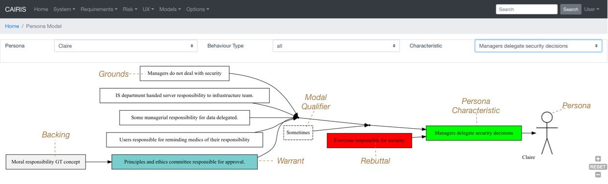

Creating persona characteristics
~~~~~~~~~~~~~~~~~~~~~~~~~~~~~~~~

-  Select the UX/External Documents menu, and click on the Add button
   to add information about the source of any assumptions external to
   CAIRIS. An example of such an *External Document* might be an
   interview transcript. Alternatively, if assumptions are purely based
   on your own thoughts and feelings then an External Document can be
   created to make this explicit.  External documents are shown as backing elements in persona models.

-  Select the UX/Document References menu, and click on the Add button.
   Enter a name that summarises the *factoid* that acts as evidence for the persona characteristic.
   Select the external document from the Document combobox box to indicate the document that the factoid is taken from, and enter details of the person who elicited the assumption in the Contributor text box.  Finally, in the Excerpt box, enter the extract of text from the external document from which the factoid is based.

-  Select the UX/Persona Characteristics menu, and click on the Add button.

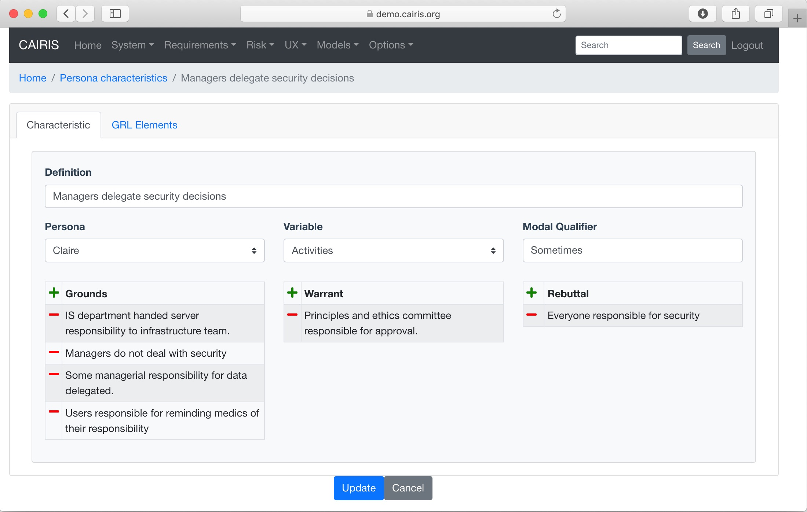

-  From the Characteristic folder, enter a definition that summarises the characteristic, and select the Persona and behavioural variable that this characteristic will be associated with.  Possible Enter a *Model Qualifier*; this word describes your confidence in the validity of the characteristic. Possible qualifiers might include *always*, *usually*, or *perhaps*.

-  In the Grounds table, click on the Add button to add a grounds for the characteristic.
   Click on the Add button to add a new document reference that acts as grounds. When a document reference is selected, a read-only description of this document reference will also be shown. Clicking Ok will add the new document reference to the grounds list.

-  Repeat the above procedure for *Warrants* as appropriate.

-  If you wish to add a Rebuttal -- a counterargument for the
   characteristic -- then click on the Rebuttals tab and add a rebuttal
   using the same procedure for Grounds and Warrants.

-  Click on the Create button to create the new characteristic.

-  Existing characteristics can be modified by double clicking on the
   characteristics in the persona characteristics table, making the
   necessary changes, and clicking on the Update button.

Automating persona characteristic creation
------------------------------------------

In the ideal world, personas will be created by dedicated teams of research collecting empirical data, working collectively in one place to affinity diagram factoids, and persona characteristics that structure them.  In reality, team members might be working individually, remotely, and using open source intelligence or online sources of data.  To provide some automation for this activity, we have created some features for offline and collaborative creation of persona characteristics.

Working with persona characteristic workbooks
~~~~~~~~~~~~~~~~~~~~~~~~~~~~~~~~~~~~~~~~~~~~~

CAIRIS can generate an Excel workbook that makes it possible to add or update persona characteristic elements.  

To export a workbook, select the System/Export menu, click on the *Persona characteristics (Workbook)* radio button, enter the name of the workbook to be created, and click on the Export button.  The workbook name should be postfixed with .xlsx.  

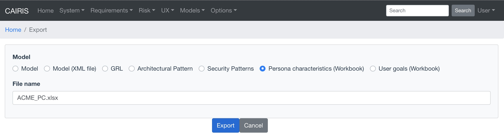

The generated spreadsheet contains three spreadsheets: External Documents, Document References, and Persona Characteristics.

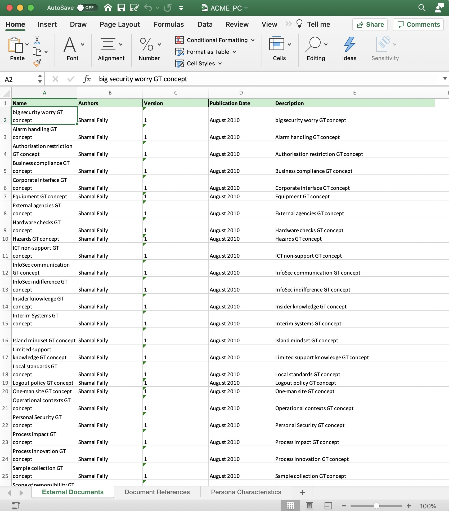

Pre-existing external documents will be added to the External Documents sheet.  Updating existing values will update the corresponding object when the spreadsheet is uploaded, but changing the name will create a new external document.  To add a new external document, add a row to the spreadsheet and complete the name, author, version, publication date, and description fields.  

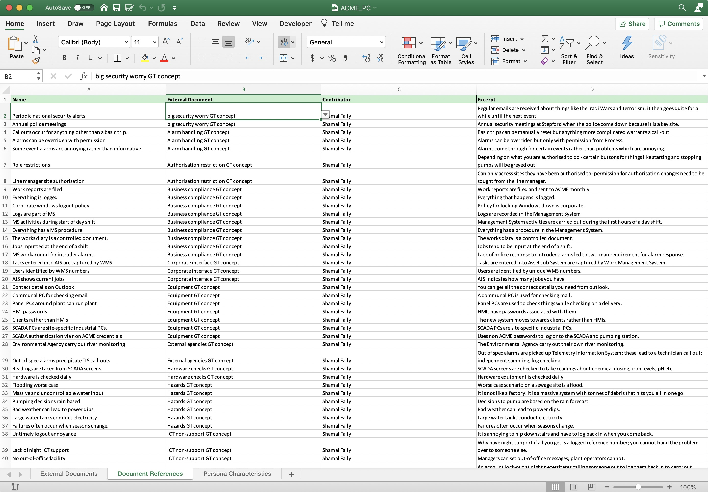

Pre-existing document references will be added to the Document References sheet.  Updating existing values will update the corresponding object when the spreadsheet is uploaded, but changing the name will create a new document reference.  To add a new document reference, add a row to the spreadsheet and enter the name, select the document (external document), and enter the contributor and excerpt. If external documents are changed, ensure the document fields in the sheet correspond with an external document - either in the spreadsheet or in the upstream CAIRIS model.

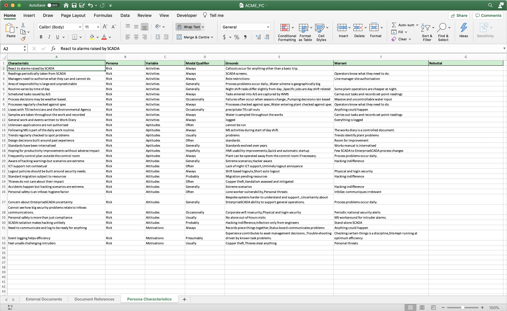

Pre-existing persona characteristics will be added to the Persona Characteristics sheet.  Updating existing values will update the corresponding object when the spreadsheet is uploaded, but changing the name will create a new persona characteristic.  To add a new persona characteristic, add a row to the spreadsheet and enter the characteristic name, corresponding persona name, select the behavioural variable, enter the modal qualifier, and grounds, warrant, and rebuttal.  The grounds, warrant, and rebuttal cells take a comma separated list of document reference names.  You should ensure the named persona exists in the upstream CAIRIS model, and the names of grounds, warrants, and rebuttals correspond with document reference values in the Document References spreadsheet or the upstream CAIRIS model.

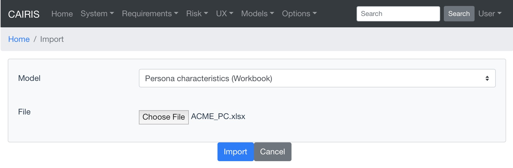

To import a workbook, select the System/Import menu, select the *Persona characteristics (Workbook)* radio button, choose the name of the workbook to be uploaded, and click on the Import button.

Please note that removing rows from any of the spreadsheets does not remove the corresponding object in the CAIRIS model; these should be removed directly in CAIRIS.

Persona Helper
~~~~~~~~~~~~~~

The `Persona Helper <https://chrome.google.com/webstore/detail/persona-helper/mhojpjjecjmdbbooonpglohcedhnjkho>`_ is a Chrome Extension that can be used to automatically create document references from highlighted text on a web page open in Chrome.  This might be useful when eliciting factoids from website.

Once the extension has been installed, you need to connect to your CAIRIS server before use.  You can do this right clicking on the CAIRIS extension icon in Chrome and selecting 'Connect to CAIRIS'.  A dialog will open that will ask for the CAIRIS server URL, before a pop-up appears that allows you to login to your CAIRIS server.

By default, any document references created will be added to the CAIRIS default database, but you can change this using the 'Change CAIRIS database' menu option.  

From the extension menu, it also possible to set the *Author* and *Contributor* values.  Author is the author of the data source; this will become the author of the external document from which factoids from a website can be drawn.  Contributor is the person eliciting the factoid itself.  It is ok to set both author and contributor as the same person, but -- if different people are responsible for different data sources -- you might want to change the author value each time you draw from factoids from a different webpage.  If these values have not been previously defined, you will be prompted to provide them the first time you elicit a factoid.

To elicit a factoid, you need to highlight text on a website and click on the CAIRIS extension icon.  This will open a dialog that will allow a factoid to be created for the associated text.  For example, let's consider we want to build a persona for a water treatment plant operator, and we find a `day in the life of a plant operator <https://kyocp.wordpress.com/2012/08/14/a-day-in-the-life-of-an-operator>`_ from which we want to elicit factoids.

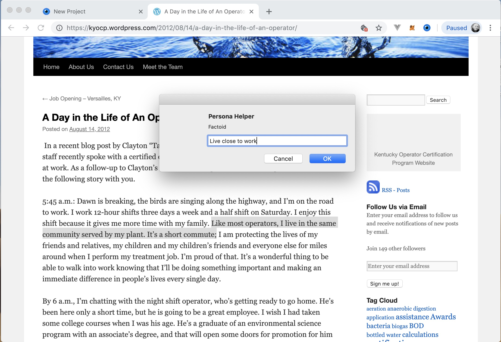

We find some text that indicates that operators live close to work, so we highlight the relevant text, create some text that describes the factoid (because just because one person in a blog post indicates that plant operators live close to work doesn't mean that most plant operators actually *do* live close to work), and click on Ok to add the factoid.

.. figure:: DRExample.jpg
   :alt: Generated document reference

If we look in CAIRIS, we will see the corresponding document reference as indicated above.  

Please remember that CAIRIS is sensitive to reserved characters so, when naming factoids, these should avoided.  Colons in factoid names or names of external documents is known to cause particular problems when generating persona models.

Online affinity diagramming with Trello
~~~~~~~~~~~~~~~~~~~~~~~~~~~~~~~~~~~~~~~

`Trello <https://trello.com>`_ is a collaborative, web-based list manager.  It is a popular tool for sharing and collaboratative working on lists, where lists contain cards.  Because the relationship between cards and lists is analogous to the relationship between factoids and affinity groups, we can use Trello for online affinity diagramming too.  Moreover, becase factoids and affinity groups are also analogous with document referencs and persona characteristics then, using some simple annotations, we can also use lists and cards to represent persona characteristics and their grounds/warrants/rebuttals too.

We can export all the document references in a currently open CAIRIS model by selecting the System/Export to Trello menu.  From here, you should enter a Trello board name.  This will be created for you once you click on Export, and the document references will be exported as cards to an *Uncategorised Factoids* list in your Trello account as indicated below.  If you have not already logged into Trello, you will also be prompted to do this on clicking Export.

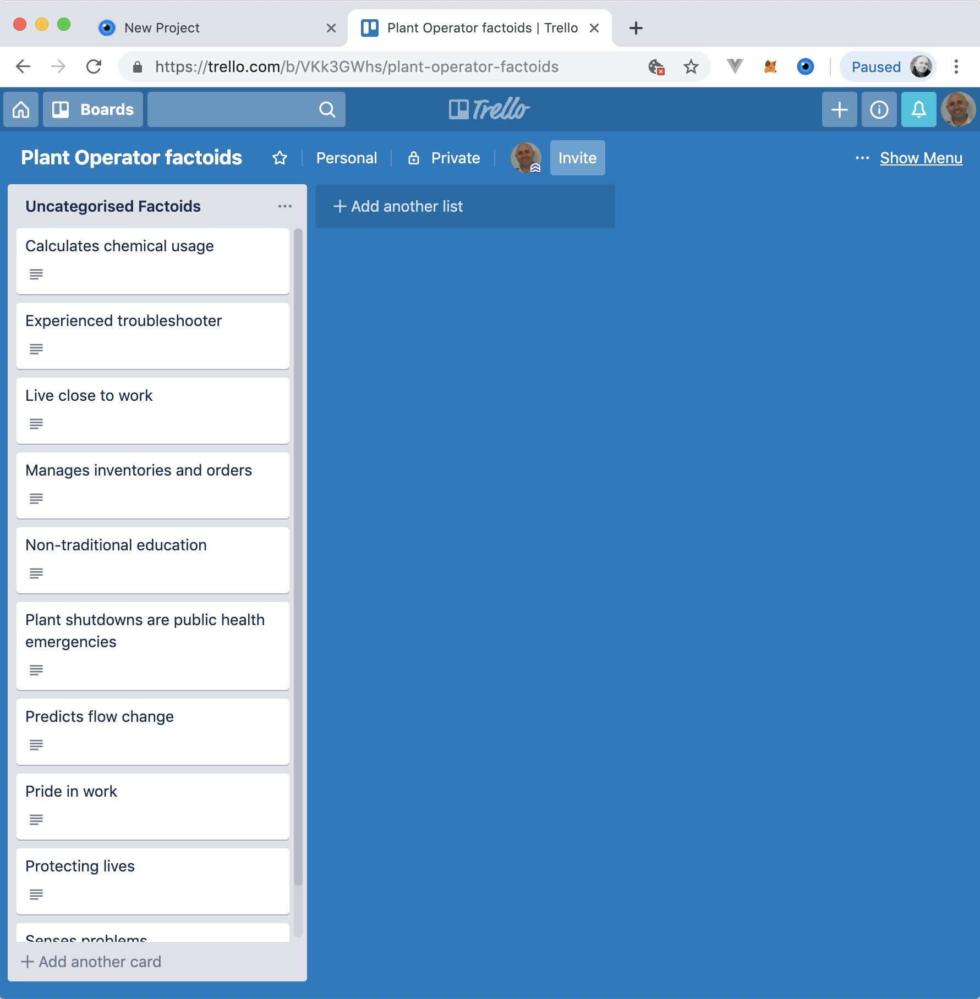

As you affinity diagram, each list will represent an affinity group.  From the sample of factoids elicited, there seems to be an affinity group around factoids indicating that the plant operator is protective of his community.  There is also another group indicating that the operators relies on cues and experience rather than traditional education and theory.

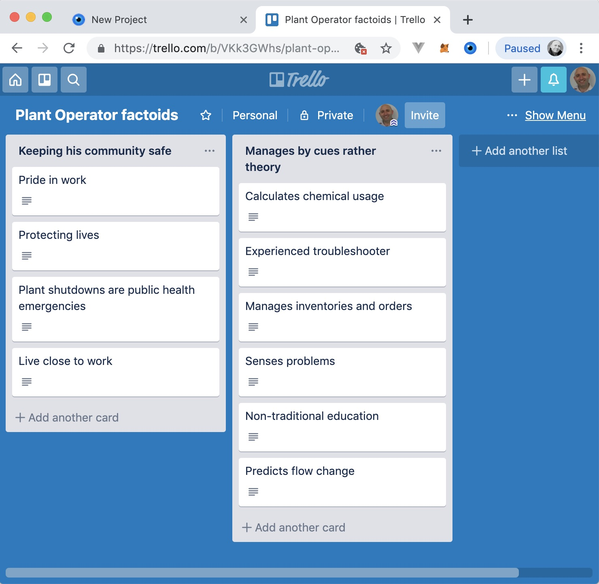

To turn each of these affinity groups into persona characteristics, we first need to indicate whether each factoid represents a groups, warrant or rebuttal.  To do this, we click on each card, click on the Label and select either a *grounds* , *warrant* or *rebuttal* label.  If you have not imported document references from CAIRIS, these labels won't be automatically created, but you can add them manually.

The final step entails indicating the behavioural variable associated with the persona characteristic.  You can do this by postfixing the list name with a colon and the name of the variable.  Permissible variable names are: activities, aptitudes, attitudes, motivations, skills, intrinsic and contextual.  Please note, you can only associate a persona characteristic with a single behavioural variable.

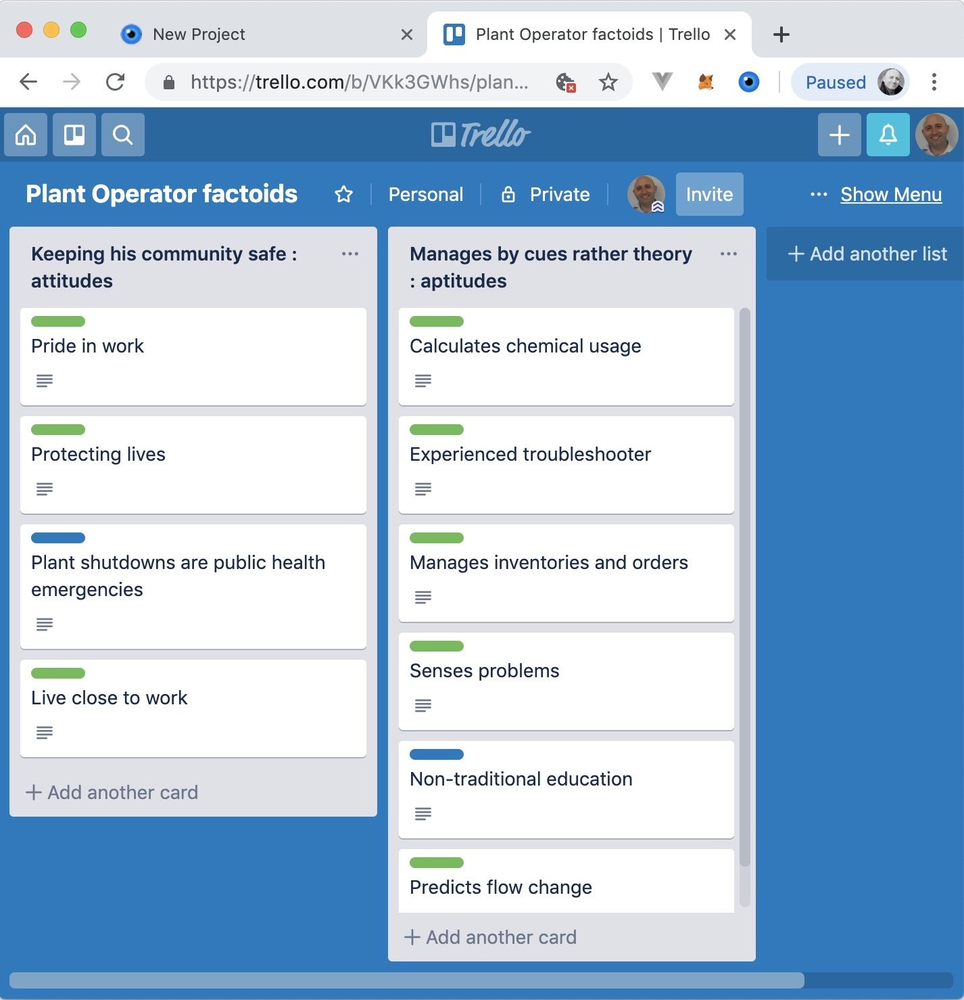

When you're ready, you can import this Trello board back into CAIRIS.  However, before you can do you need to create a persona object for each board you import.  For example, an empty persona called Bob will be created to represent a water treatment plant operator.  

To import the board, return to CAIRIS and select the System / Import from Trello menu.  From this form, you should select the Trello board you are exporting, select the persona associated with the persona characteristics that will be generated, and click on Import.

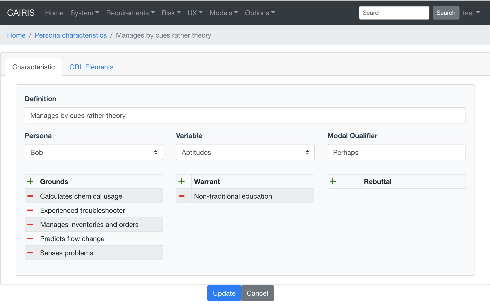

The persona characteristic generated will, as shown above, have a modal qualifier set to *Perhaps*.  This should be updated based on your confidence in the characteristic.

If you have exported your document references from CAIRIS then each ground/warrant/rebuttal document reference will be associated with its apopriate external document.  However, if you have created the cards manually in Trello then CAIRIS will create new document references for each card, and an *Unknown* external document to indicates that, at the time of import, the factoids were of uncertin origin. If you know the origin of the factoids, you can create external documents to represent these origins, and re-associate the document references accordingly.

Armed with your persona characteristics, you can now write narrative text in your persona corresponding with these characteristics.  In doing so, you may surface possible assumptions or ambiguity.  For example, the above persona characteristic seems to suggest a non-traditional education is the basis for managing by cues but this assumption might not be warranted, particularly as all the factoids come from a single source.  As such, this could trigger a return to the affinity diagrams or the weakening of the modal qualifier to indicate reduced confidence.

.. note::
   Due to how Trello's client.js file works, you may get errors connecting to Trello during Trello exports and imports.  You can get around this by raising an issue in CAIRIS to get your CAIRIS server's URL recognized as an allowable origin   You can also get around this by running the CAIRIS UI in debug mode.  To do this by (i) clone the `CAIRIS UI GitHub repository <https://github.com/cairis-platform/cairis-ui>`_, (ii) Follow the instructions in the README to setup the CAIRIS UI project by running *yarn install* in the root directory, (iii) setup the indicated .env.development file as indicated, (iv) running *yarn run serve* to locally run the CAIRIS UI, (v) point your web browser to http://localhost:8080 .
