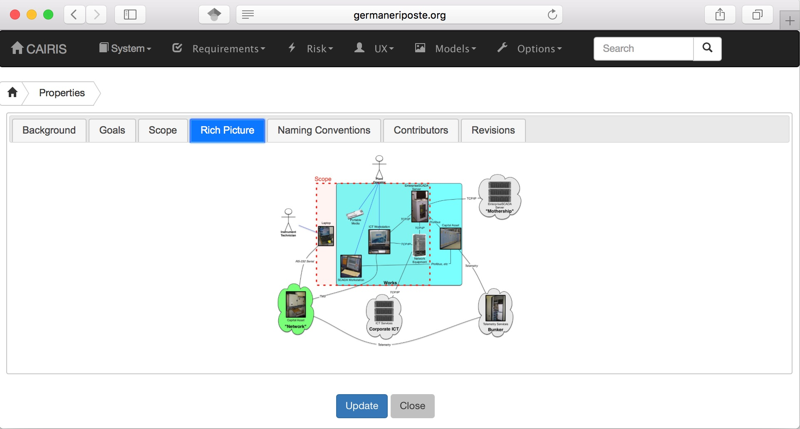

Creating a new project
======================

The first stage of any design process involves establishing the scope of
subsequent analysis. CAIRIS supports this exercise by using the Properties form.

-  Select the System/Properties menu to open the Project Settings
   notebook. By default, the notebook will open in the Background page.
   Enter the project name and background in this page.

-  Click on the Goals tab and enter the high-level goals of that the
   system being specified needs to satisfy.

-  Click on the Scope tab and enter the scope of the system being
   specified.

-  If a rich picture or context diagram has been agreed, click on the
   Rich Picture tab, and click on the image (or avatar if no rich picture has been defined) to
   import. Permitted image types are jpg, png, giff, and bmp.

-  Names or terms that the readership of the specification may be
   unfamiliar with can be added to the project on an on-going basis. To
   add a term, click on the Naming Conventions tab, and click on the Add symbol
   This opens a form which allows a name and a definition to be added to the naming
   convention list. To modify an existing entry, double click on the try
   and make the required modifications. Entries can also be deleted from
   the right-click speed menu.

-  Clicking on the Contributors tab opens the Contributors page. To add
   a contributor, click on the Add symbol to open the Add Contributor form.
   Contributors can be either a participant, facilitator, or scribe; these reflect the roles
   that people take in participatory workshops.
