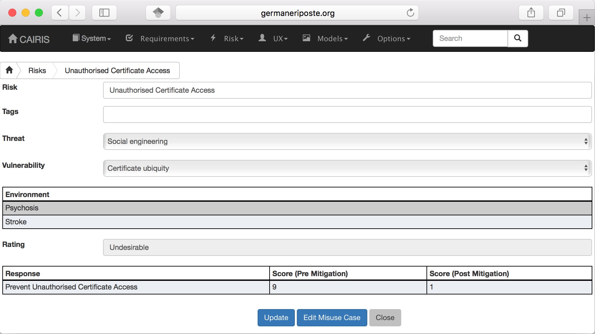
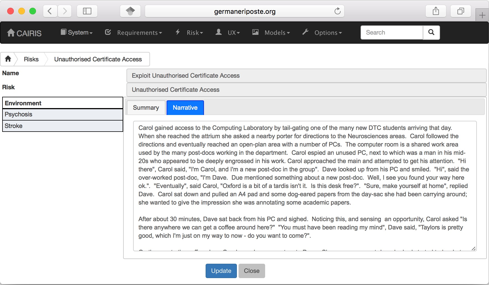
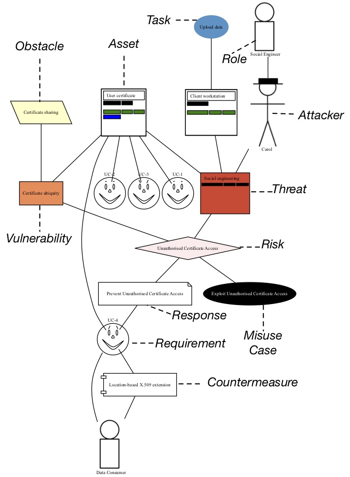
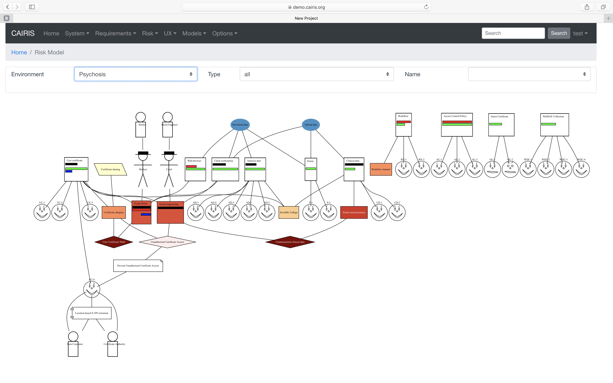

Risks
=====

A risk is the detriment arising from an attacker launching an
attack, in the form of a threat, exploiting a system weakness, in the
form of a vulnerability. Associated with each risk is a misuse case.
This describes how the attacker (or attackers) behind the risk's
threat exploits the risk's vulnerability to realise the risk.

The current status of Risk Analysis can be quickly ascertained by
viewing the Risk Analysis model. This displays the current risks, the
artifacts contributing to the risk, and the artifacts which potentially
mitigate it.

Adding, updating, and deleting a risk
-------------------------------------

-  Select the Risk/Risks menu to open the Risks table, and
   click on the Add button to open the Risk dialog form.

-  Enter a risk name and select a threat and vulnerability from the
   respective combo boxes. A risk is valid only if the threat and
   vulnerability exist within the same environment (or environments).

-  Clicking on the environment name in the environment card populates the risk details card.
   The impact folder shows qualitative risk rating, and the mitigated and un-mitigated risk
   score associated with each risk response. 

-  Before a risk can be created, an associated Misuse Case needs to be
   defined. To do this, click on the Misuse Case folder.

-  Most of the fields in the Misuse Case form have already been
   completed based on the risk analysis carried out up to this point.
   Enter a scenario which describes how
   the attacker realises the associated risk, i.e. carries out the
   threat by exploiting the vulnerability. The scenario written should
   be written in line with the attributes and values displayed.

-  Click on the Create button to add the new risk.

-  Existing risks can be modified by clicking on the risk in the
   Risks table, making the necessary changes, and clicking on the
   Update button.

-  To delete a risk, click the Delete button next to the risk to be removed in the Risks table. If any artifacts are dependent on this risk then a dialog box stating these dependencies are displayed. The user has the option of selecting Yes to remove the risk dependencies and the risk itself, or No to cancel the deletion.

Risk Analysis model
-------------------

Risk Analysis models show the contribution different design elements make to a risk, as shown below:

Risk Analysis models can be viewed by clicking on the Model/Risks
Model menu, and selecting the environment to view the
environment for.

By changing the environment name in the environment combo box, the risk analysis model for a different environment can be viewed.

The orientation of the model can be changed by layout radio button.  By default, the orientation is set to Vertical but, if you are creating a kill chain that connects risk to threats or vulnerabilities, you might find a Horizontal layout helpful.

By clicking on a model element, information about that artifact can be viewed.

The risk analysis model can also be filtered by artifact type and
artifact type. Filtering by type displays only the artifacts of the
filtered type, and its directly associated assets. Filtering by artifact
name displays only the filtered artifact, and its directly associated
artifacts.

For details on how to print risk analysis models as SVG files, see :doc:`Generating Documentation </gendoc>`.
