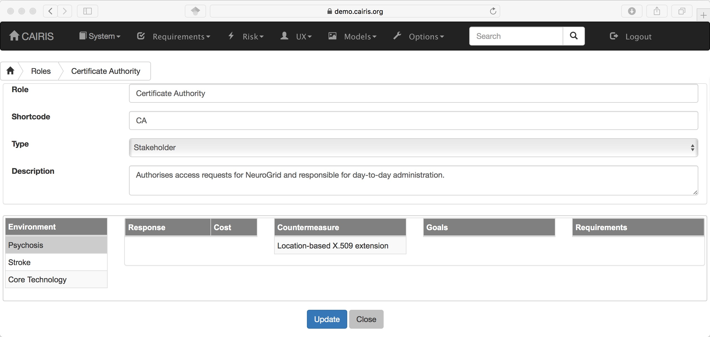
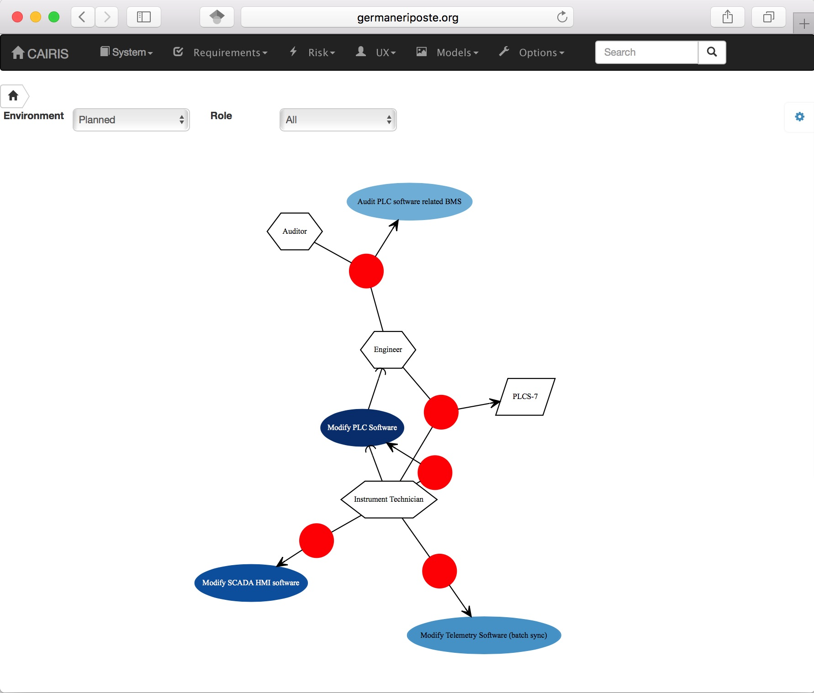

Roles
=====

Roles are abstract classes representing human agents; these also encapsulate behaviours and responsibilities.

CAIRIS supports 6 types of role:

=============== ================================================================================================= ===============
Role            Description
=============== ================================================================================================= ===============
Stakeholder     Human agents the system needs to be directly or indirectly designed for.                          IRIS Meta-model
Attacker        Human agents behaving maliciously.                                                                IRIS Meta-model
Data Controller The entity that determines the purposes, conditions and means of the processing of personal data. GDPR
Data Processor  The entity that processes data on behalf of the Data Controller.                                  GDPR
Data Subject    A natural person whose personal data is processed by a controller or processor.                   GDPR
Machine         Software agents that behave with some level of autonomy.
=============== ================================================================================================= ===============

Adding, updating, and deleting a role
~~~~~~~~~~~~~~~~~~~~~~~~~~~~~~~~~~~~~

-  Select the Risk/Roles menu to open the Roles table, and click on the Add button to open the Role form.

-  Enter a role name and description, and select the role type.

-  Click on the Create button to Add the new role to the CAIRIS
   database.

-  Existing roles can be modified by clicking on the role in the
   roles table, making the necessary changes, and clicking on the
   Update button.

-  To delete a role, select the role to delete in the roles table,
   If any artifacts are dependent on this role then a dialog box stating these dependencies are displayed.
   The user has the option of selecting Yes to remove the role dependencies and the role itself, or No to cancel the deletion.

Responsibility modelling
~~~~~~~~~~~~~~~~~~~~~~~~

Responsibility models can be viewed by selecting the Models/Responsibility
menu option and selecting the environment to
view the environment for.

By changing the environment name in the environment combo box, the
responsibility model for a different environment can be viewed.
By clicking on a model element, information about that artifact can be viewed.

For details on how to print responsibility models as SVG files, see :doc:`Generating Documentation </gendoc>`.
