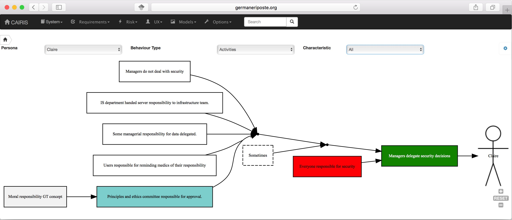

Roles & Personas
================

Roles
-----

Roles represent the abstract classes representing human agents; these also encapsulate behaviours and responsibilities.

CAIRIS supports 5 types of role:

=============== ================================================================================================= ===============
Role            Description
=============== ================================================================================================= ===============
Stakeholder     Human agents the system needs to be directly or indirectly designed for.                          IRIS Meta-model
Attacker        Human agents behaving maliciously.                                                                IRIS Meta-model
Data Controller The entity that determines the purposes, conditions and means of the processing of personal data. GDPR
Data Processor  The entity that processes data on behalf of the Data Controller.                                  GDPR
Data Subject    A natural person whose personal data is processed by a controller or processor.                   GDPR
=============== ================================================================================================= ===============

Adding, updating, and deleting a role
~~~~~~~~~~~~~~~~~~~~~~~~~~~~~~~~~~~~~

.. figure:: RoleForm.jpg
   :alt: Role form

-  Select the Risk/Roles menu to open the Roles table, and click on the Add button to open the Role form.

-  Enter a role name and description, and select the role type.

-  Click on the Create button to Add the new role to the CAIRIS
   database.

-  Existing roles can be modified by clicking on the role in the
   roles table, making the necessary changes, and clicking on the
   Update button.

-  To delete a role, select the role to delete in the roles table,
   If any artifacts are dependent on this role then a dialog box stating these dependencies are displayed.
   The user has the option of selecting Yes to remove the role dependencies and the role itself, or No to cancel the deletion.

Responsibility modelling
~~~~~~~~~~~~~~~~~~~~~~~~

Responsibility models can be viewed by selecting the Models/Responsibility
menu option and selecting the environment to
view the environment for.

.. figure:: ResponsibilityModel.jpg
   :alt: Responsibility Model

By changing the environment name in the environment combo box, the
responsibility model for a different environment can be viewed.
By clicking on a model element, information about that artifact can be viewed.

For details on how to print responsibility models as SVG files, see :doc:`Generating Documentation </gendoc>`.

Personas
--------

Personas are specifications of archetypical users that the system needs
to directly or indirectly cater for. The system needs to be specified
for Primary Personas, but Secondary Personas cannot be ignored as their
thoughts or concerns provide insight into potential usability problems.

Adding, updating, or deleting a persona
~~~~~~~~~~~~~~~~~~~~~~~~~~~~~~~~~~~~~~~

.. figure:: PersonaForm.jpg
   :alt: Persona form

-  Select the UX/Personas menu to open the table of personas,
   and click on the Add button to open the new Persona form.

-  Enter a persona name and select the persona type.

-  If you have decided to personalise the persona with a picture, this
   can be added by clicking on avatar silhouette next to the persona
   description, and selecting a image to represent the persona. Please note that the image itself is NOT
   imported into the database, only the file path to the picture.  The image will be uploaded to the directory corresponding with the upload_dir value in cairis.cnf.  Persona images are loaded from the directory stipulated by the default_image_dir value in cairis.cnf.

-  Click on the Activities tab and enter the activities carried out by
   the personas.

-  Click on the Attitudes tab and enter the attitudes held by the
   persona, with respect to the problem domain the system will be
   situated in.

-  Click on the Aptitudes tab and enter the persona's aptitudes, with
   respect to the problem domain the system will be situated in.

-  Click on the Motivations tab and enter the persona's personal
   motivations.

-  Click on the Skills tab and enter the persona's skill-set, with
   respect to the problem domain the system will be situated in.

-  Click on the Contextual Trust tab, and enter information about aspects of this
   persona with an impact on contextual trust warranting properties.

-  Click on the Contextual Trust tab, and enter information about aspects of this
   persona with an impact on intrinsic trust warranting properties.

-  If you have decided to personalise the persona with a picture, this
   can be added by clicking on avatar box next to the persona
   properties notebook, to select an image to associated with the persona.

-  Click on the Environment card, and click on the Add button to situate the persona in an environment.
   Selecting an environment from the modal will open up a new folder for
   information about persona roles, and an environment specific narrative.

-  After ensuring the environment is selected in the environment window,
   click on the Roles tab. Select the Direct User 
   check-box if the persona is a direct stakeholder with respect to the
   system being defined, and add roles fulfilled by the persona in the
   Roles list-box. These roles can be added by clicking on the add button in the role table,
   or deleted by clicking on the button next to the role to be removed.

-  Click on the Narrative tab and enter a narrative describing the
   persona's relationship with the problem domain or prospective system
   within the environment, and any environment specific concerns he or
   she might have.

-  Click on the Create button to add the new persona.

-  Existing personas can be modified by clicking on the persona
   in the UX/Personas table, making the necessary changes, and
   clicking on the Update button.

-  To delete a persona, click on the delete button next to persona to be removed
   in the personas table. If any artifacts are
   dependent on this persona then a dialog box stating these
   dependencies are displayed. The user has the option of selecting Yes
   to remove the persona dependencies and the persona itself, or No to
   cancel the deletion.

Recording persona assumptions
~~~~~~~~~~~~~~~~~~~~~~~~~~~~~

-  Select the UX/External Documents menu, and click on the Add button
   to add information about the source of any assumptions external to
   CAIRIS. An example of such an *External Document* might be an
   interview transcript. Alternatively, if assumptions are purely based
   on your own thoughts and feelings then an External Document can be
   created to make this explicit.

-  Select the UX/Document References menu, and click on the Add button.
   Enter a name that summarises the assumption made, and select
   Select the external document from the Document combobox box to indicate the document that the assumption is taken from, and enter details of the person who elicited the assumption in the Contributor text box.  Finally, in the Excerpt box, enter the extract of text from the external document from which the assumption is based.

-  Select the UX/Persona Characteristics menu, and click on the Add button.

.. figure:: PersonaCharacteristicForm.jpg
   :alt: Persona characteristic form

-  From the Characteristic folder, enter a definition that summarises the characteristic, and select the Persona and behavioural variable that this characteristic will be associated with.  Enter a *Model Qualifier*; this word describes your confidence in the validity of the characteristic. Possible qualifiers might include *always*, *usually*, or *perhaps*.

-  In the Grounds table, click on the Add button to add a grounds for the characteristic.
   The grounds are evidence which support the validity
   of the characteristic. Click on the Add button to add a new Document Reference. Select the document reference; a read-only description of this document reference will also be shown. Clicking Ok will add the new document reference to the grounds list.

-  Repeat the above procedure for *Warrants* and * Rebuttals*.
   Warrants are inference rules which link the grounds to the characteristic.
   Rebuttals are counterarguments for the characteristic.

-  If you wish to add a Rebuttal -- a counterargument for the
   characteristic -- then click on the Rebuttals tab and add a rebuttal
   using the same procedure for Grounds and Warrants.

-  Click on the Create button to create the new characteristic.

-  Existing characteristics can be modified by double clicking on the
   characteristics in the persona characteristics table, making the
   necessary changes, and clicking on the Update button.

Automating persona creation
~~~~~~~~~~~~~~~~~~~~~~~~~~~

The `Persona Helper <https://chrome.google.com/webstore/detail/persona-helper/mhojpjjecjmdbbooonpglohcedhnjkho>`_ Chrome Extension can be used to automatically create document references from highlighted text on a web page open in Chrome.  This might be useful when eliciting factoids from website.

CAIRIS also supports the ability to export document references to Trello for online affinity diagramming, and import affinity diagrams from Trello into CAIRIS as argumentation models.

Both the Persona Helper and the Trello import/export facilities are illustrated in this `video <https://vimeo.com/208162116>`_.
