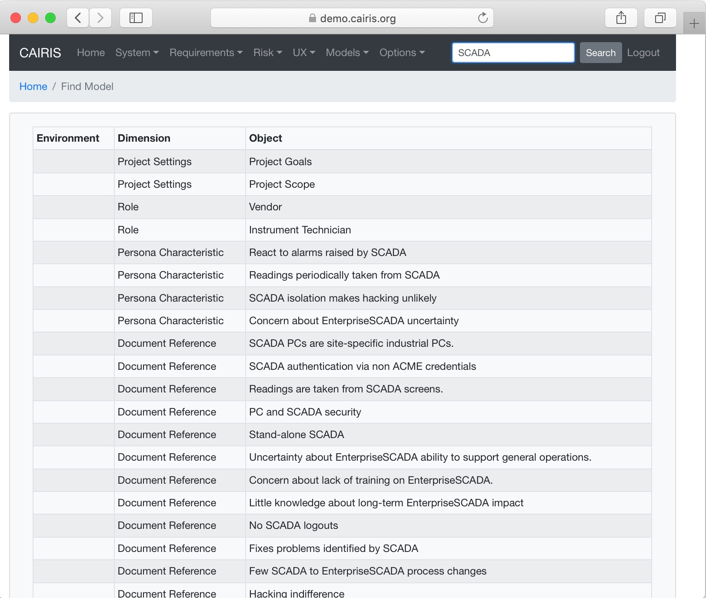

Searching model objects
========================

It is possible to search for a requirement or any other model object with a particular text
string from the Search box in the menu bar.  Entering text will search the CAIRIS database and return a table of model elements where the text is present.  Clicking on the selected row in this table will open the associated model object.

