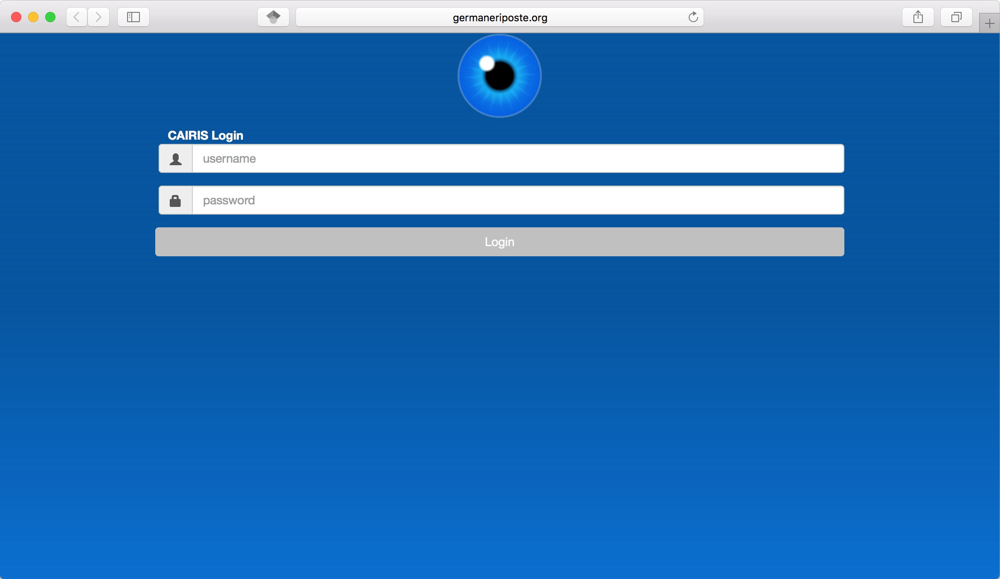
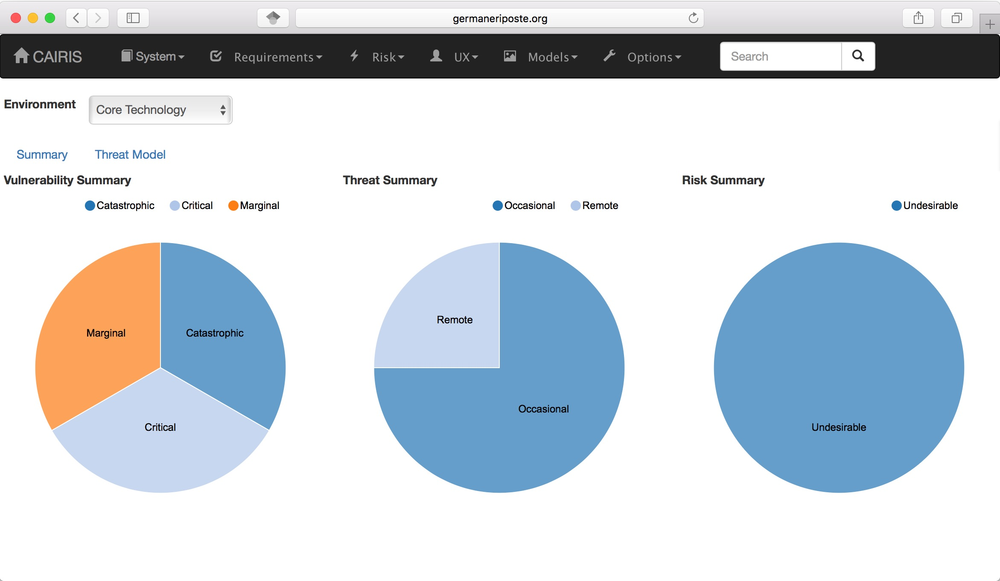

Starting CAIRIS
===============

Starting the CAIRIS server
~~~~~~~~~~~~~~~~~~~~~~~~~~

If you are using Docker then the command used to install the container also starts the CAIRIS server on port 80.

If you are the only person that plans to use CAIRIS, using the Flask development server should be sufficient.  Once the FLASK_APP and FLASK_ENV environment variables have been set, you can run:

.. code-block:: bash

   flask run --port 7071

If you plan to use mod_wsgi-express then you need to use cairis.wsgi (also in cairis/cairis/bin):

.. code-block:: bash

   mod_wsgi-express start-server cairis.wsgi

Starting the web application
~~~~~~~~~~~~~~~~~~~~~~~~~~~~

You can use CAIRIS on any modern web browser except Microsoft Internet Explorer (although you can use Microsoft Edge).

In your browser, visit the site hosting the CAIRIS server, and authenticate using credentials you have, or setup if you ran the quick_setup.py script.  If you are not using the live demo, or have not mapped mod_wsgi-express to port 80, you will need to also specify the port the CAIRIS server is listening on.  If you don't specify otherwise, cairisd will listen on port 7071, and mod_wsgi-express will listen on port 8000.  For example, if you are using cairisd on germaneriposte.org then you should connect to http://germaneriposte.org:7071

Once you login in you should see the home page, which provides a summary of threats, vulnerabilities and risks, and the threat model for different environments.

Once you have finished working with CAIRIS, click on the Logout button.
