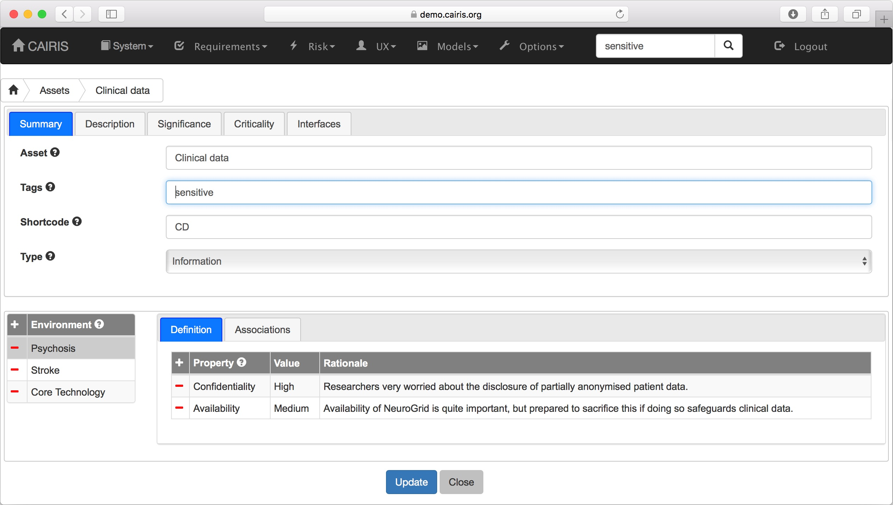
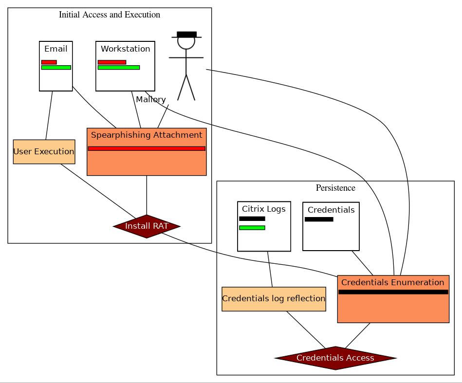
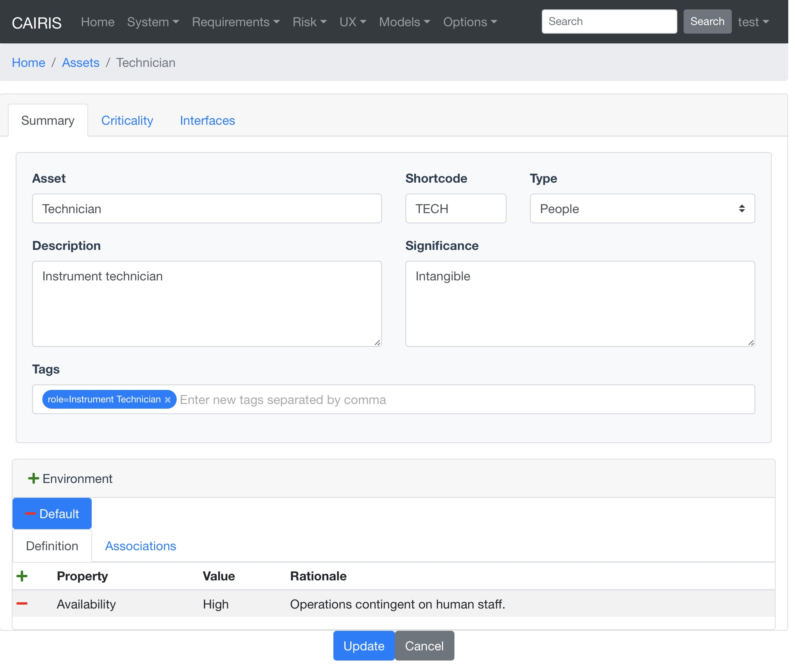
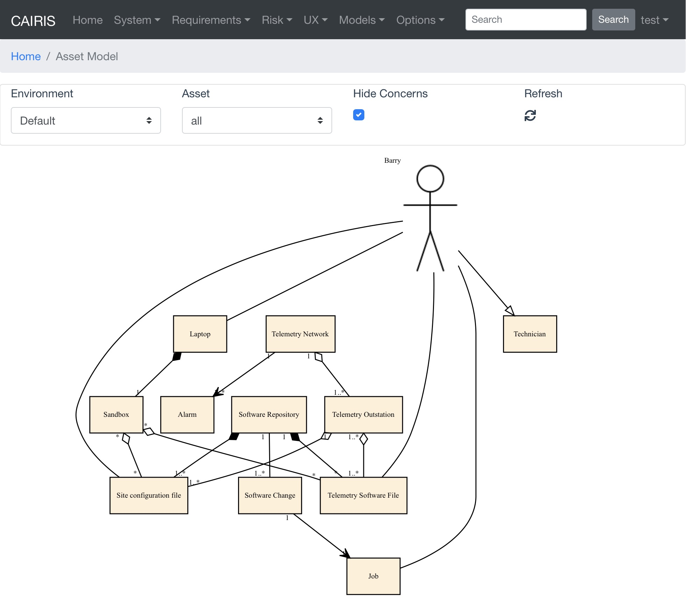

Tags
====

Most objects in CAIRIS can be assigned one or more *tags* to categorise them.  Tags can aid searching, i.e. by searching for objects where the tag has been set.

These tags can be entered in the Tags field in the appropriate form.  Multiple tags can be added by separate individual tags with commas.

Tags can also be used to group objects in risk models.  The example below shows a risk model with a *kill chain*  categorised by `ATT&CK <https://attack.mitre.org>`_ tactic.

Some assets might represent entities in DFDs and, when it does and where appropriate, we can use asset tags to indicate roles that are synonymous with assets.  For example, if the people asset of *Technician* is synonymous with the role *Instrument Technician*, you can indicate this by setting the asset tag as *role=Instrument Technician* .  

If, in the asset model, the persona fulfils a role linked to a suitably tagged asset, a persona-asset inheritance relationship will be shown.

