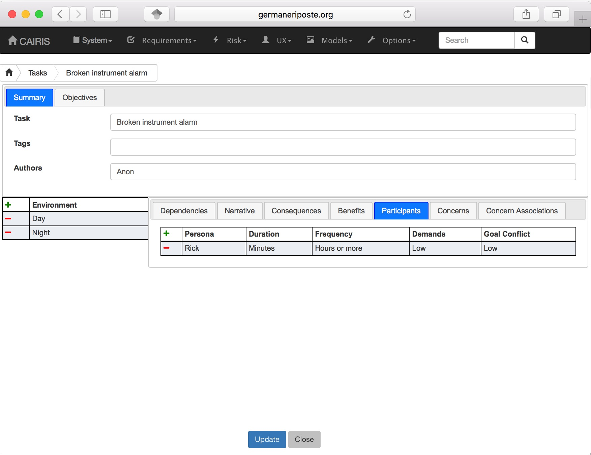
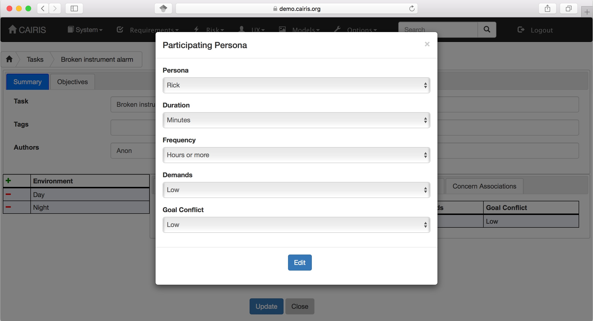
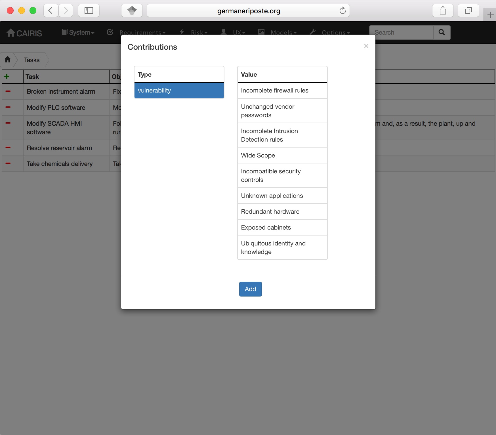
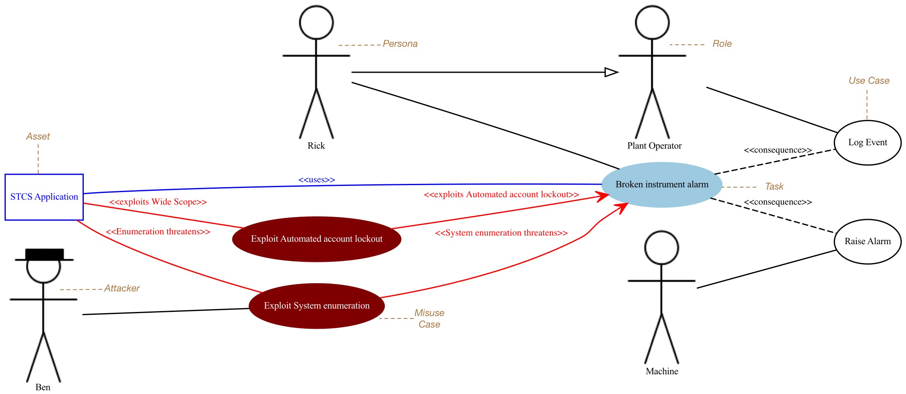
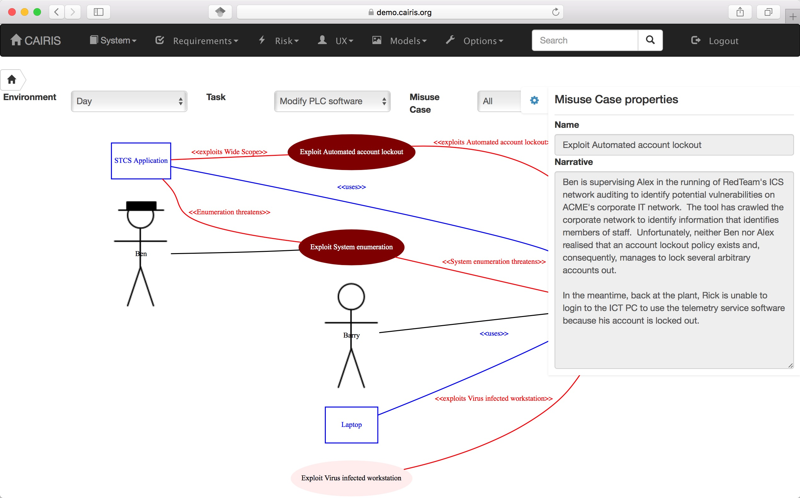

Tasks
=====

Tasks model the work carried out by one or more personas. This work is
described in environment-specific narrative scenarios, which illustrate
how the system is used to augment the work activity.

Adding, updating, or deleting a task
------------------------------------

-  Click on the UX/Tasks menu to open the Tasks table, and click on the Add button to open the Task form.

-  Enter a task name, short code, author, and the objective of carrying out the task.

-  Click on the Add button in the environment card, and select an environment to situate the task in. This will add the new environment to the environment list.

-  In the Narrative folder, enter the task scenario. This narrative should describe how the persona (or personas) carry out the task to achieve the pre-defined objective.

-  In the Dependencies folder, enter any dependencies needing to hold before this task can take place.

-  In the Consequences folder, enter any consequences (positive or negative) associated with this task.

-  In the Benefits folder, enter the value that completing this task will bring.

-  In the Participants folder, click on the Add button to associate a persona with this task. In the Participating Persona form, select the person, the task duration (seconds, minutes, hours or longer), frequency (hourly or more, daily-weekly, monthly or less),demands (none, low, medium, high), and goal conflict (none, low, medium, high). The values for low, medium, and high should be agreed with participants before hand.

-  If any aspect of the task concerns one or more assets, then these can be added to the concern list. Adding an asset concern causes a concern comment to be associated to the asset in the asset model. If the task concerns an association between assets, the association can be added by clicking on the Concern Association tab and adding the source and target assets and association multiplicity to the concern association list. In the asset model, this association is displayed and a concern comment is associated to each asset in the association.

-  Click on the Create button to add the new task.

-  Existing tasks can be modified by clicking on the task in the Tasks table, making the necessary changes, and clicking on the Update button.

-  To delete a task, select the task to delete in the Tasks dialog box, and click the Delete button. If any artifacts are dependent on this task then a dialog box stating these dependencies are displayed. The user has the option of selecting Yes to remove the task dependencies and the task itself, or No to cancel the deletion.

Task traceability
-----------------

Tasks can be manually traced to certain artifacts via the Tasks table.
A task may contribute to a vulnerability, or be supported by a requirement or use case. To add a traceability link, right click on the task name, click on the left or right arrows next to the task name to open a Support or Contribution traceability modal respectively. From this editor, select the object on the right hand side of the editor to trace to and click the Add button to add this link.

Manual traceability links can be removed by selecting the Options/Traceability menu option, to open the Traceability Relations form. In this form, manual traceability relations be removed from specific environments.

Visualising tasks
-----------------

Task models show the contribution that behavioural concepts in security and usability can have on each other.  These models are centred around tasks, show the personas that interact with them, and indicate how threats or vulnerabilities might impact them.
These models also show the assets used in the tasks or threatened/exploited by misuse cases.  If traceability associations have been added between tasks and use cases, then these links are also shown.  Finally, if use case actors are also roles associated with personas in visible tasks, then the relationship between the roles and personas is also shown.  This is useful when putting use cases and their actors in context in tasks.

Task models can be viewed by selecting the Models/Task menu, and selecting the environment to view the model for.

By changing the environment name in the environment combo box, the task
model for a different environment can be viewed. The model can also be filtered by task or misuse case name.

By clicking on a model element, information about that artifact can be
viewed.

For details on how to print task models as SVG files, see :doc:`Generating Documentation </gendoc>`.
