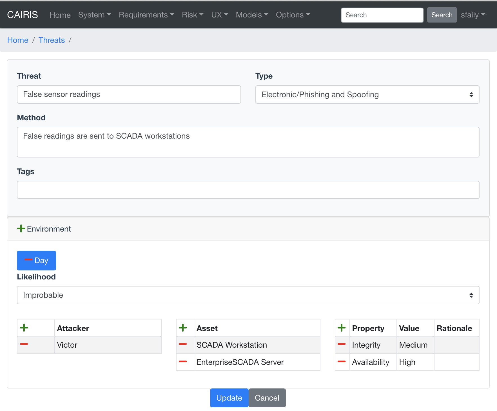
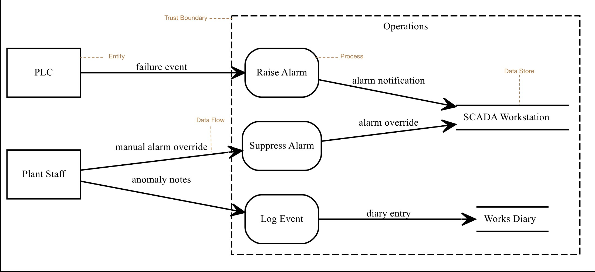
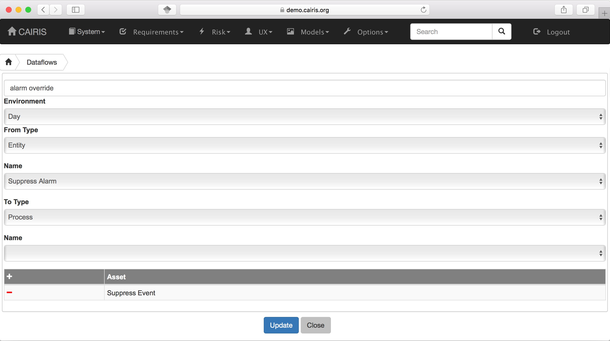
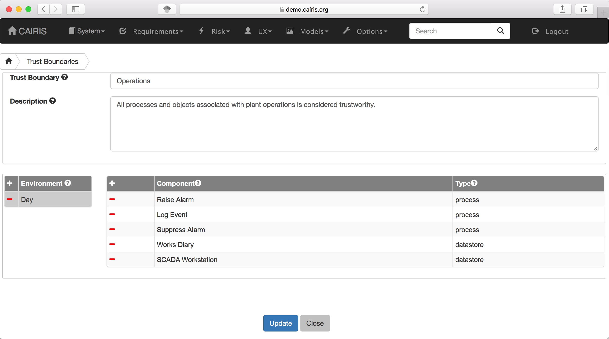
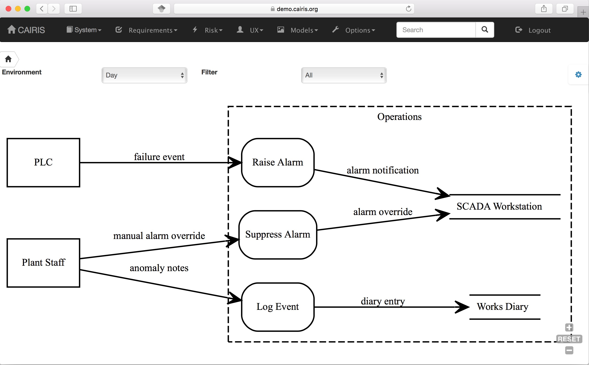

Threats
=======

Adding, updating, and deleting a threat
---------------------------------------

Threats are synonymous with attacks, and can therefore only be defined
if an associated attacker has also been defined. Like vulnerabilities,
threats are associated with one or more assets. However, threats may
also target certain security properties as well, in line with security
values that an attacker wishes to exploit.

A threat is also of a certain type. CAIRIS is pre-loaded with a
selection of these, but these can be modified, or new threat types
created by selecting the Options/Threat Types menu option.

-  Select the Risks/Threats menu to open the Threats table,
   and click on the Add button to open the Threat form.

-  Enter the threat name, the method taken by an attacker to release the
   threat, and select the threat type.

-  Click on the Add button in the environment card, and select an environment to situate the threat in. This will add the new environment to the environment list.

-  Select the threat's likelihood for this environment

-  Associate attackers with this threat by clicking on the Add button above the Attacker table, and selecting one or more attackers specific to the environment.

-  Add threatened assets by clicking on the Add button above the Assets table, and selecting one or more assets specific to the environment.

-  Add the security properties to this threat by clicking on the Add button above the properties table, and selecting a security property, value, and rationale.

-  Click on the Create button to add the new threat.

-  Existing threats can be modified by clicking on the threat in
   the Threats table, making the necessary changes, and clicking on
   the Update button.

-  To delete a threat, click on the Delete button threat next to the threat to be removed in the Threats table.  If any artifacts are dependent on this attacker then a dialog box stating these dependencies are displayed. The user has the option of selecting Yes to remove the threat dependencies and the threat itself, or No to cancel the deletion.

Threat Modelling
================

CAIRIS supports two different techniques for threat modelling.

Data flows and Data Flow Diagrams
---------------------------------

Data flow diagrams (DFDs) are graphical models that model the flow of information (data flows) between external human or system actors external to the system (entities), activities that manipulate data (processes), and persistent data storage (data stores).
Together with attack trees.  In threat modelling, DFD model elements can be encompassed by *trust boundaries*; these occur where entities with different privileges interact.

Adding, updating, and deleting entities, processes, and data stores
~~~~~~~~~~~~~~~~~~~~~~~~~~~~~~~~~~~~~~~~~~~~~~~~~~~~~~~~~~~~~~~~~~~

Entities are synonyms for assets of type *Systems*, *Hardware*, or *People*.  Data stores are synonyms for assets of type *Information*.  To add, update, or delete entities and data stores, you need to add, delete or update the synonymous asset.

Procesess are synonyms for use cases. To add, update, or delete processes, you need to add, delete or update the synonymous use cases.

Adding, updating, or deleting data flows
~~~~~~~~~~~~~~~~~~~~~~~~~~~~~~~~~~~~~~~~

-   To add a data flow, select the UX / Data Flows menu to open the Data Flows table.  Click on the Add button to open a dialog for adding a new data flow.

-   Enter the name for the data flow, and select the environment the data flow is specific to.  You should also select the *from* and *to* types associated with the flow.  These types are Entities, Data Stores, and Processes, where Entities are information, hardware, or people assets, Data Stores are information assets, and Processes are use cases.

-   Click the Add button in the Asset table to choose one or more assets carried by this data flow.

-   Click on the Create button to add the data flow to the Data Flows table.

-   An existing data flow can be edited by clicking on a data flow in the Data Flow table, updating any aspect of the data flow, and clicking on the Update button.

-   Data flows can be deleted by clicking on the Delete button associated with the data flow to be removed in the Data Flows table.

Adding, updating, or deleting trust boundaries
~~~~~~~~~~~~~~~~~~~~~~~~~~~~~~~~~~~~~~~~~~~~~~

:alt: Trust Boundary dialog

-   To add a trust boundary, select the UX / Trust Boundaries menu to open the Trust Boundaries table.  Click on the Add button to open a dialog for adding a new trust boundary.

-   Enter the name and a description for the trust boundary.

-   Click on the Add button in the environment card, and select an environment to situate the trust boundary in. This will add the new environment to the environment list.

-   Click the Add button in the Components table to situate a process or data store within this environment specific trust boundary.

-   Select the level of privilege that the components in this trust boundary operate at.

-   Click on the Create button to add the trust boundary to the Trust Boundary table.

-   An existing trust boundary can be edited by clicking on a trust boundary in the Trust Boundaries table, updating any aspect of the trust boundary, and clicking on the Update button.

-   Data flows can be deleted by clicking on the Delete button associated with the trust boundary to be removed in the Trust Boundaries table.

Viewing Data Flow Diagrams
~~~~~~~~~~~~~~~~~~~~~~~~~~

DFDs can be viewed by selecting the Models/Data Flow menu, and selecting the environment to view the model for.

:alt: DFD

By changing the environment name in the environment combo box, the DFD for a different environment can be viewed. The model can also be filtered by DFD model element.

By clicking on a model element, information about that artifact can be viewed.

For details on how to print DFDs as SVG files, see :doc:`Generating Documentation </gendoc>`.

Attack trees
------------

Attack trees are a formal, methodical way of describing the security of systems.  They are a lightweight approach for modelling attacks; this is a good thing as they are simple enough that people can quickly create and contribute to them.

CAIRIS doesn’t support attack trees, but obstacle models are represented using the same top-down approach notation as attack tree.  This makes them a good candidate for representing the attacks, and the sort of things that need to hold for an attack to be successful.

Attack trees represented in `Dot <https://graphviz.gitlab.io/_pages/doc/info/lang.html>`_ can be imported into CAIRIS by selecting the File/Import Model menu,  selecting 'Attack Tree (Dot)' from the combo box, and choosing the .dot file to import. You will then be prompted for an environment to import the newly generated obstacles and obstacle associations into, together with the name of the contributor who created or imported the tree.

More details on using attack trees with CAIRIS can be found in this `blog post <https://cairis.org/cairis/attacktrees/>`_ .
