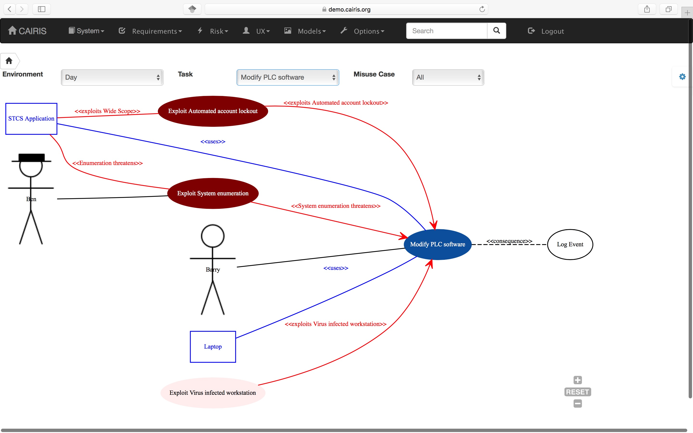

Traceability
============

CAIRIS is based on the IRIS meta-model and, in most cases, traceability between model elements is automatic because the CAIRIS database knows how model elements are connected based on this meta-model.
In some cases, however, it is necessary to add manual traceability relationships, e.g. between one requirement and other.

The table below indicates what manual links are allowed to be set between elements.

+---------------+--------------------+
| From          | To                 |
+===============+====================+
| Requirement   | Task               |
+---------------+--------------------+
| Task          | Vulnerability      |
+---------------+--------------------+
| Requirement   | Vulnerability      |
+---------------+--------------------+
| Asset         | Requirement        |
+---------------+--------------------+
| Requirement   | Role               |
+---------------+--------------------+
| Requirement   | Use Case           |
+---------------+--------------------+
| Use Case      | Task               |
+---------------+--------------------+
| Requirement   | Requirement        |
+---------------+--------------------+
| Requirement   | Document Reference |
+---------------+--------------------+
| Component     | Use Case           |
+---------------+--------------------+

To add manual traceability links, right click on an element with a model table, and select the *Supported by* (pre-traceability link) or *Contributes to* (post-traceability link).  This will open a dialog box for adding the forward or backwards traceability link.

.. figure:: contributesTo.jpg
   :alt: contribute to form

Manual traceability links might be visualised in different ways.  For example, in this example, a consequences link is added between the Log Event use cases and Modify PLC software task, which is visible on task models.

To delete a manual traceability link, select the Options / Traceability menu, select the environment that the traceability link is specific to if appropriate, and select the delete icon.

.. figure:: deleteTraceability.jpg
   :alt: delete traceability
