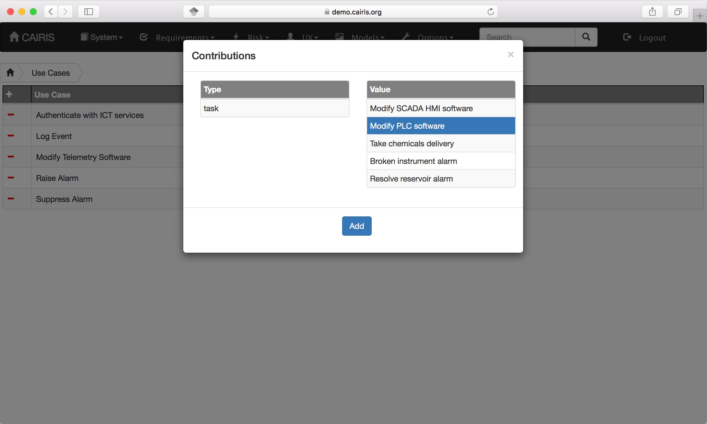
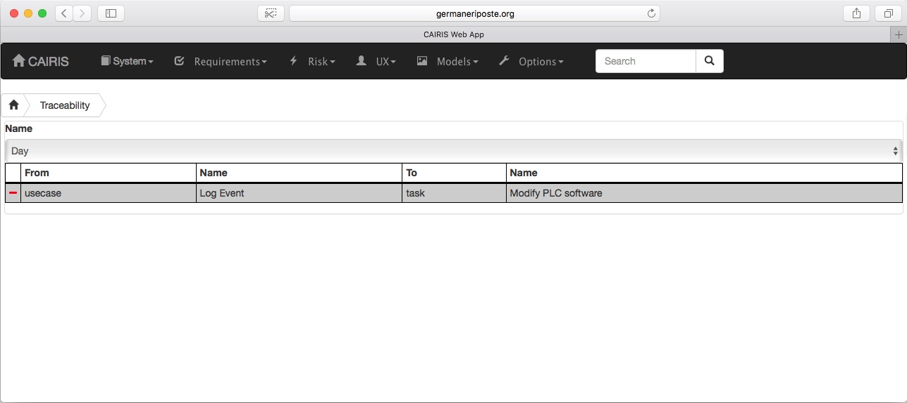

Traceability
============

Allowable manual traceability links
-----------------------------------

CAIRIS is based on the IRIS meta-model.  In most cases, traceability between model elements is automatic because the CAIRIS database knows how model elements are connected based on this meta-model.
In some cases, however, it is necessary to add manual traceability relationships, e.g. between one requirement and other.

The table below indicates what manual links are allowed to be set between elements.

==================  ===================
From                To                 
==================  ===================
Requirement         Task               
Task                Vulnerability
Requirement         Vulnerability
Asset               Requirement
Requirement         Role
Requirement         Use Case
Use Case            Task
Requirement         Requirement
Requirement         Document Reference
Risk                Threat
Risk                Vulnerability
Component           Use Case
Document Reference  Vulnerability
Document Reference  Obstacle
==================  ===================

Editing manual traceability links
-----------------------------------

To add manual traceability links, right click on the left arrow for a *Supported by* (pre-traceability) link, or the right arrow for a *Contributes to* (post-traceability link).  This will open a modal box for adding the forward or backwards traceability link.

If the traceability link is between two requirements, you will also be able to add a label describing the nature of the traceability.

To delete a manual traceability link, select the Options / Traceability menu, select the environment that the traceability link is specific to if appropriate, and select the delete icon.

Visualising manual traceability links
-------------------------------------

Manual traceability links might be visualised in different ways.  For example, in this example, a consequences link is added between the Log Event use cases and Modify PLC software task, which is visible on task models.

   .. figure:: taskModelConsequence.jpg
      :alt: task model consequence
