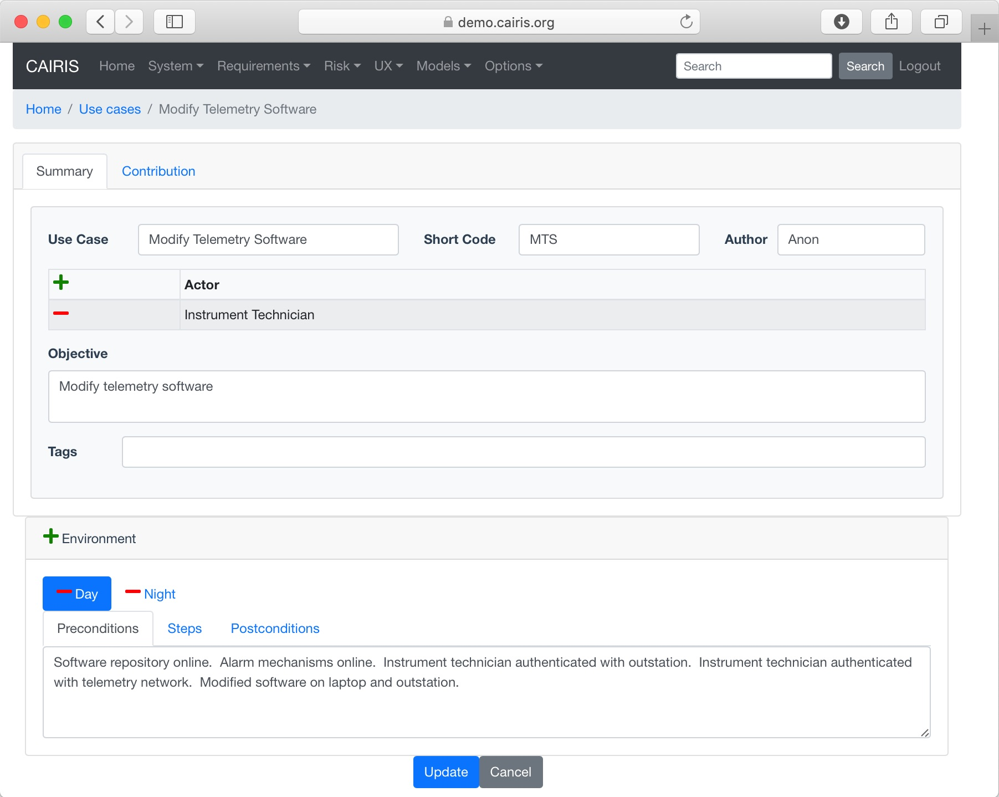
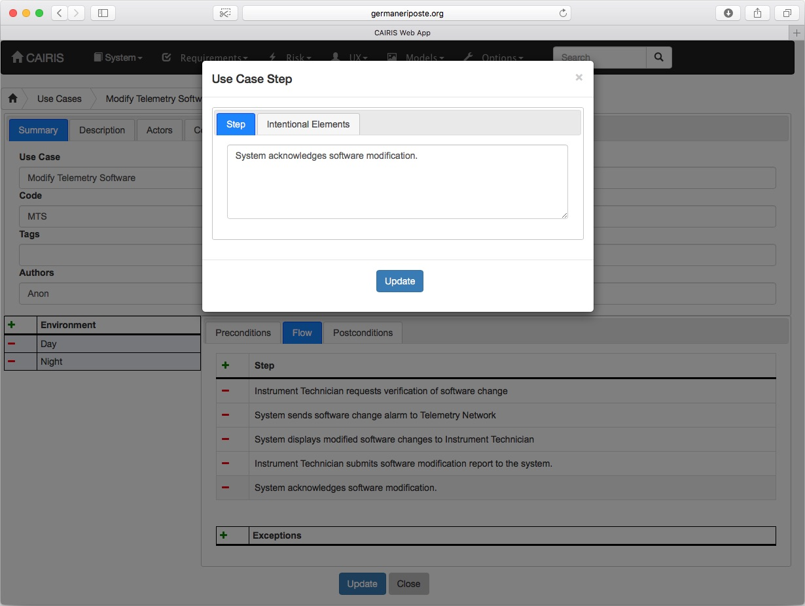
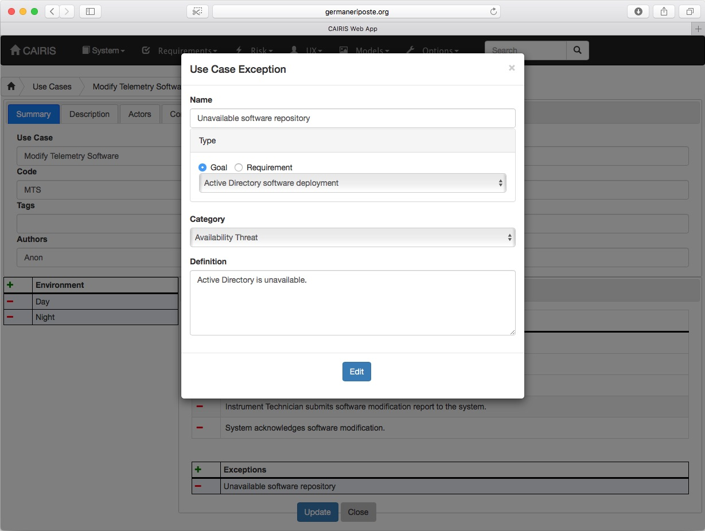

Use Cases
=========

Use cases are sequences of actions a system performs that yields an observable result of value to a particular *actor*; in CAIRIS, *actors* are analogous to *roles*.

Adding, updating, or deleting a use cases
------------------------------------

-  Click on the Requirements/Use Case menu to open the Use Cases table, and click on the Add button to open the Use Case form.

-  Enter a use case name, a short code, details of the author, and -- in the Description folder -- the objective of carrying out the use case.  In the Actors folder, you should also add one or more roles that constitute the actors for this use case.

-  Click on the Add button in the environment card, and select an environment to situate the use case in. This will add the new environment to the environment list.

-  In the Preconditions folder, enter any pre-conditions that need to hold in this context of use before the use case begins.

-  In the Postconditions folder, enter any post-conditions that need to hold in this context of use once the use case completes.

-  In the Flow folder, click on the Add button in the Step table to add a step to the use case.  In the Use Case Step dialog, you should describe how the actor or system interact within this step.  You should then click on Update to add the step to the use case.

-  Click on the Create button to add the new use case.

-  Existing use cases can be modified by clicking on the use case in the Use Cases table, making the necessary changes, and clicking on the Update button.

-  To delete a use case, select the use case to delete in the Use Cases, and click the Delete button. If any artifacts are dependent on this use case then a dialog box stating these dependencies are displayed. The user has the option of selecting Yes to remove the use case dependencies and the use case itself, or No to cancel the deletion.

Add exceptions to use case steps
--------------------------------

-  Select the step and click on the Add button in the Exceptions table.

-  In the Use Case Step Exception dialog, enter the name of the exception, the category of threat, vulnerability, or usability conflict associated with this exception, and a definition of the exception.

-  Select the goal or requirement that this step conflicts with, otherwise select the None radio button.  Goals are visible only if you have added a sub-goal refinement relationship between goals and this use case.  Requirements are visible only if you have added a manual 'Supported by' traceability link between requirements and this use case.

-  Click Add to add the exception to the Exceptions table.  When the use case is created or update, obstacles are generated based on exceptions associated with goals or requirements.

-  Existing exceptions can be modified by double clicking on the step in the Exceptions table, making the necessary changes, and clicking on the Update button.
