User goals and user goal models
===============================

CAIRIS supports the specification, modelling, and validation of user goal models.  These models are based on a subset of the `Goal-oriented Requirements Language (GRL) <https://en.wikipedia.org/wiki/Goal-oriented_Requirements_Language>`_ : a language for modelling intentional relationships between goals.  

There are several reasons why you might find working with user goals useful.

* Expressing persona data using user goals can help elicit intentional relationships that support or refute aspects of a persona’s behaviour.
* Agent-oriented goal modelling language are popular in Requirements Engineering, making a user goal model a potential vehicle for interchange between RE methods, techniques, and tools.
* By exploring the way that user goals contribute to other user goals, it is possible to identify new requirements, threats, or vulnerabilities resulting from goals that are satisfied or denied.

User goals represent the intentional desires of actors, where actors are personas.  Three types of user goals can be specified in CAIRIS:

* [Hard] goals are user goals that can be measurably satisfied.
* Soft goals are user goals with less well-defined success criteria that can be satisficed.
* Beliefs capture perceptions or opinions that are important to the actor.

User goal models can be generated in CAIRIS or, alternatively, can be exported to `jUCMNav <http://jucmnav.softwareengineering.ca/foswiki/ProjetSEG>`_.

Adding, updating, and deleting user goals
-----------------------------------------

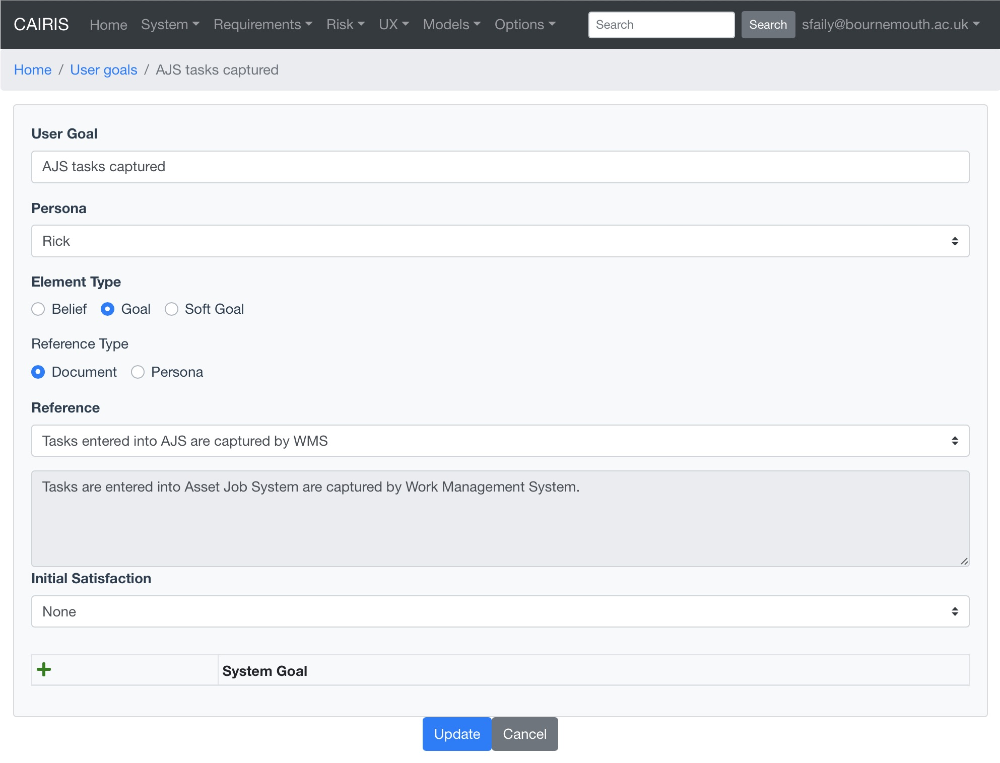

Before you can create a user goal, you first need to create a document reference.  If document references represent the factoids upon which a persona is based, a user goal is this factoid expressed in intentional terms.

* To create a user goal, click on the UX/User Goals menu to open the user goals table, and click on the Add button to open the user goal form.

* Enter the name of the user goal.  Because they expressed intentions, user goals should follow the naming convention of "goal [be] achieved", e.g. "AJS task captured".

* Select the persona associated with this user goal.

* Indicate whether the user goal is a belief, [hard] goal, or soft goal.

* Select the Reference grounding the user goal.  If this is a document reference, select *Document* as the element type and select the document reference name from the combo box.  If the user goal is based on a persona characteristic, select *Persona* as the element type.  To help you phrase the user goal, details of the document reference or persona characteristic are displayed.

* If you wish, you can override the calculated satisfaction score with an initial satisfaction value.  The available values are Satisfied (100), Weakly Satisfied (50), None (0), Weakly Denied (-50), Denied (50). 

* If you wish to associate the user goal with a KAOS goal, click on the Add button in the System Goal table to select the goal.

* Click on the Create button to add a new user goal.

* Existing user goals can be modified by clicking on the user goal in the User Goals table, making the necessary changes, and clicking on the Update button.

* To delete a user goal, select the user goal to delete in the User Goals table, and click on the Delete button.

Adding, updating, and deleting user goal contributions
------------------------------------------------------

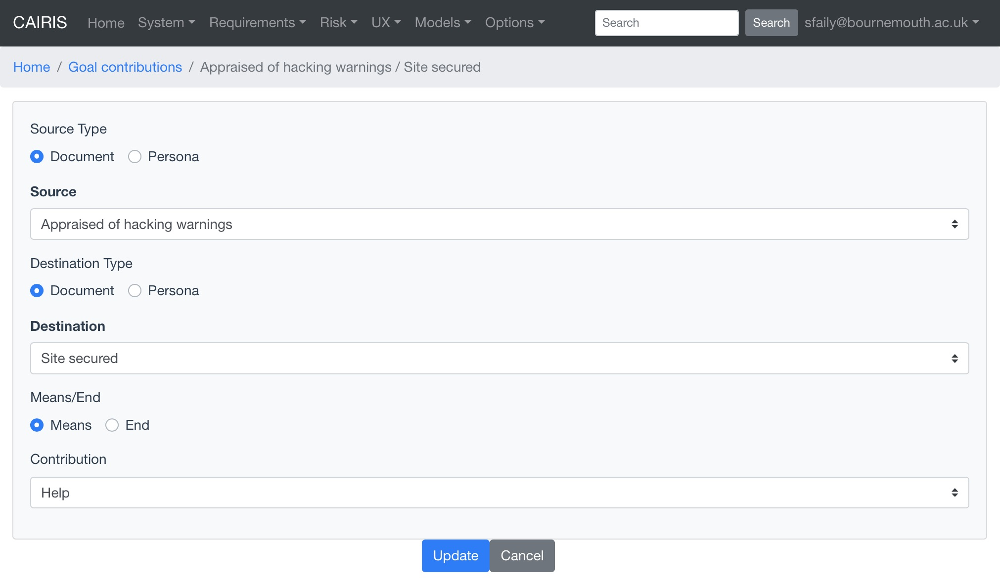

* To create a user goal contribution, click on the UX/User Goal Contributions menu to open the user goal contributions table, and click on the Add button to open the user goal contribution form.

* Depending on the reference grounding the source user goal,  select *Document* or *Persona* as the source type, and select the source user goal name.

* Depending on the reference grounding the destination user goal,  select *Document* or *Persona* as the source type, and select the destination user goal name.

* Indicate whether the source user goal is the *means* or the  *end* of the user goal contribution link.

* Select the strength of the contribution link.  The options available are Make (100), SomePositive (50), Help (25), Hurt (-25), SomeNegative (-50), and Break (-100).

* Click on the Create button button to add a new user goal contribution.

* Existing contribution links can be modified by clicking on the contribution in the user goal contributions table, making the necessary changes, and clicking on the Update button.

* To delete a user goal contribution, select the contribution link to delete in the user goal contributions table, and click on the Delete button.

Task contributions
------------------

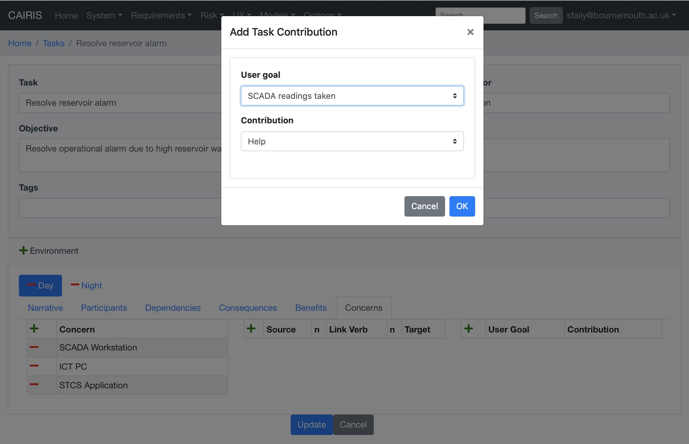

In addition to adding an initial satisfaction level for user goals, you can also set the contribution level that a task has on one or more user goals.

* To add such a contribution link, in the appropriate task, click on the Add button in the User Goal Contribution table in the Concerns folder for the appropriate task environment.  

* From the Task Contribution dialog box, select the user goal concerned with the task in this environment and click Ok.  The task-goal contribution link will be added when the task is created or updated.

Adding User goal elements to persona characteristics
----------------------------------------------------

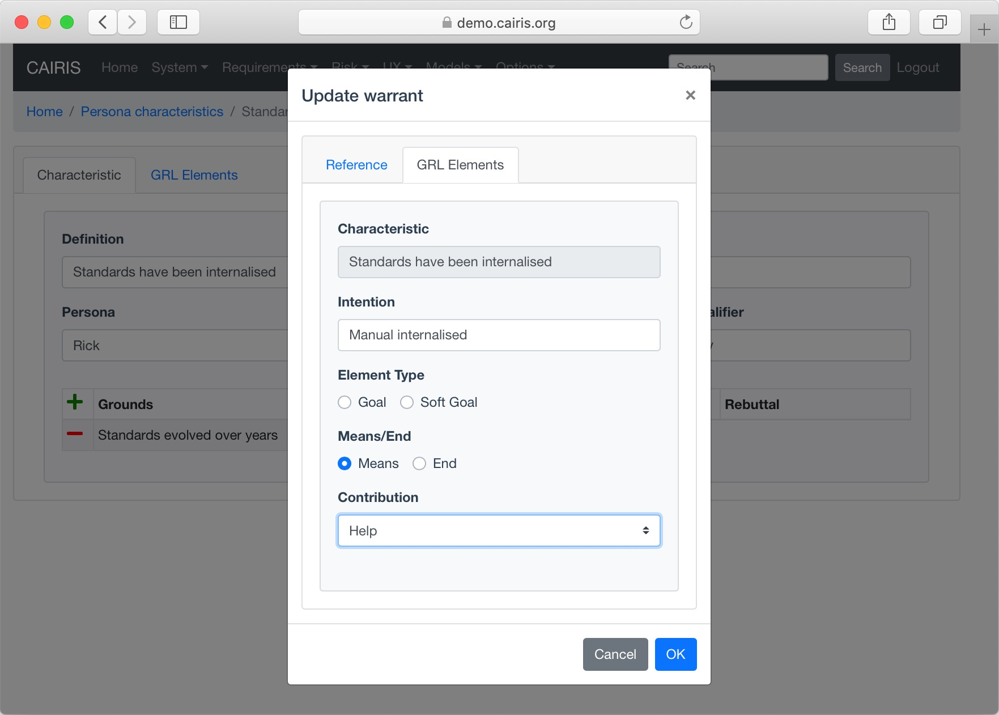

User goals can be associated with persona characteristics, and their supporting grounds, warrants, or rebuttals.  User goals drawn from persona characteristics are implicitly linked with user goals associated with these grounds/warrants/rebuttal elements, so adding user goals while working with persona characteristics is a good way of initially specifying user goal models.

* To add these User goal elements, open the persona characteristic you want to update, and click on the User Goal Elements folder.

* Select the Element type for the user goal.  This can be either a belief, goal, soft goal, or task (tasks are relevant only if exporting to jUCMNav).

* Enter a user goal that expresses the characteristic in intentional terms.

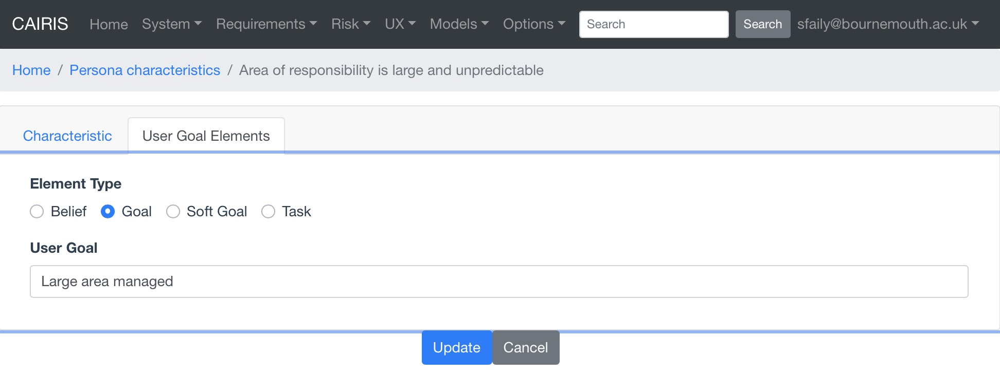

* For each appropriate grounds, warrant, and rebuttal reference, click on the reference to open the characteristic reference dialog.

* Expresses the ground, warrant, or rebuttal reference in intentional terms.

* Select the element type for this synopsis this can be a belief, goal or soft goal.

* Given the intentional relationship between this element and the belief, goal, softgoal, or task associated with the persona characteristic, indicate whether this element is a means for achieving the characteristic element's end by selecting *Means* in the Means/End combo box.  Alternatively, if the characteristic's element is a means for achieving this user goal element end then select *End*.

* Use the Contribution box to indicate how much this reference contributes to achieving its means or end.  Possible values are Make (100), SomePositive (50), Help (25), Hurt (-25), SomeNegative (-50), and Break (-100).

* Click on the Save button to update the persona characteristic, and close the dialog.

* Click on the Update button on the persona characteristic form to save the persona characteristic.

Adding GRL elements to use cases (jUCMNav export only)
------------------------------------------------------

Use cases can make a contribution to GRL elements associated with persona characteristics.  These use cases are associated with GRL goals, and the use case steps are refined as GRL tasks.  These are associated with either asset, component, or role actors.

- To add these GRL elements and contribution relationships, open the use case to be updated, and select the Contribution folder.

- Select the goal or soft goal the use case contributes to, indicate whether the use case is a means or an end in the intention relationships, and -- using the Contribution box -- indicate how much the use case contributes to achieving its means or ends.

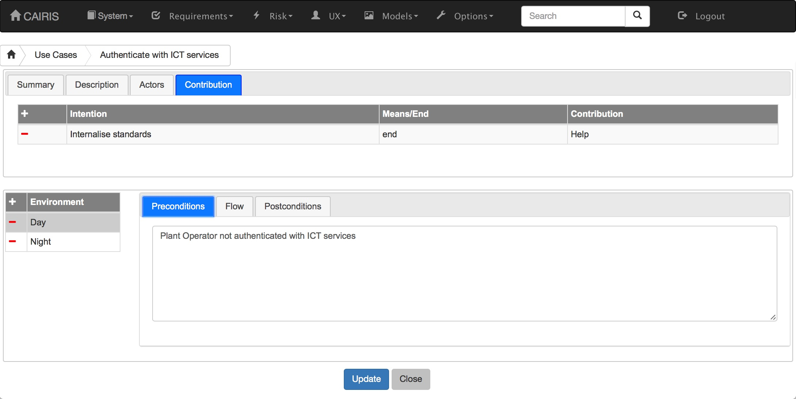

- Click on the Flow folder, and double click on the step you want to associate the GRL task with.

.. figure:: ucsGrl.jpg
   :alt: Associating GRL with a use case step

- Enter a synopsis that expresses the use case step in intentional terms.

- Select the GRL actor type and actor to associate the GRL task with.  Permissable actor types are assets, components, and roles.

- Click on the Update button to update the use case step, and close the dialog.

- Click on the Update button on the use case form to save the use case.

Viewing a user goal model
-------------------------

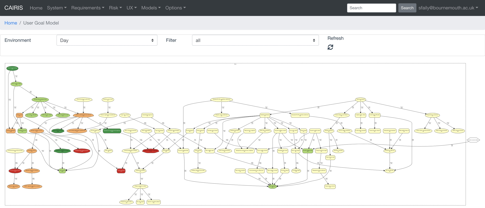

To view the user goal model, click on the Models/User Goal model.  Like other models, clicking on model nodes provides more details on the user goal or task.

Working with workbooks
----------------------

CAIRIS can generate an Excel workbook for capturing user goals and contribution links from persona charactacteristics.  To create a workbook, select the System/Export menu, click on the *User goals (Workbook)* radio button, enter the spreadsheet file to be created, and click on the Export button.

.. note::
   If you have server access, you can also run the cairis/bin/ug2wb.py script, indicating the user account, database, and name of the XLSX file to be generated, i.e.  ``./ug2wb.py --user test --database default RickGoals.xlsx``.

The generated Excel workbook (which is compatible with LibreOffice), contains UserGoal and UserContribution worksheets. Edited cells for both sheets are coloured green.

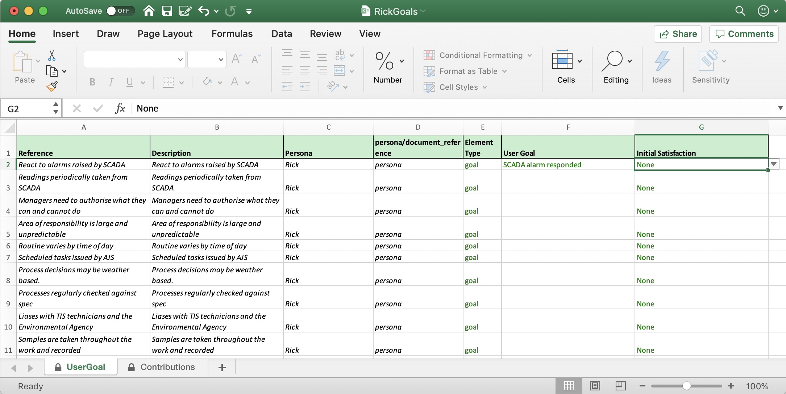

The UserGoal worksheet is pre-populated with read-only data on the persona characteristic or document reference name, its description, the persona it is associated with, and an indicator to whether the *reference* corresponds to a persona [characteristic] or document reference.  When completing the worksheet, you should indicate the intentional elements associated with the persona characteristics or document references providing their grounds, warrants, or rebuttals.  You should also indicate the element type (goal, softgoal, or belief), and - if you wish - the initial satisfaction level using the dropdown lists provided.
When generating a CAIRIS model, new user goals will only be created if cell values for each row are complete.

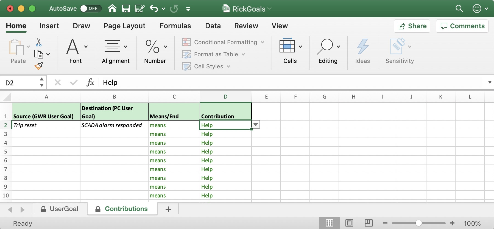

The source and destination cells in the ContributionsSheet are pre-populated once user goals have been added in the UserGoal sheet, so you only need to ensure the means/end and contribution links are set.
When generating a CAIRIS model, contribution links will only be created if both Source AND Destination values have been set, i.e. their associated user goals have been defined.

To re-import the completed workbook back to CAIRIS, select the System/Import menu, select *User goals (Workbook)* from the dropdown box, select the workbook to be imported, and click on the Import button.

.. note::
   If you have server access, you can also run the cairis/bin/wb2ug.py script, indicating the name of the XLSX file to be imported and the name of the CAIRIS model file to be created, i.e.  ``./wb2ug.py --xlsx RickGoals.xlsx  RickGoals.xml``.  The resulting model can be imported into CAIRIS, but take care not to overwrite existing data.

Generating a jUCMNav compatible GRL model
-----------------------------------------

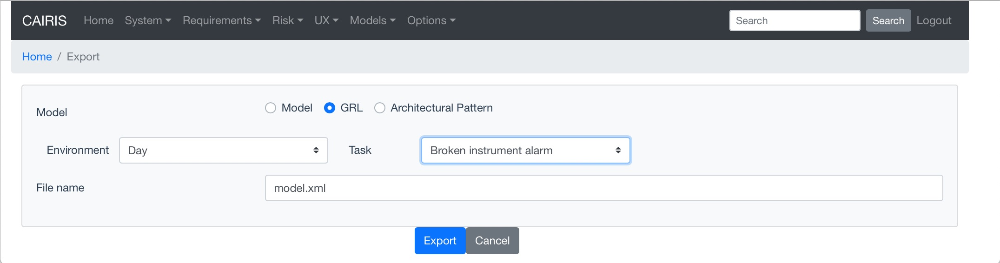

- To generate a GRL model, select the System/Export GRL menu to open the Export GRL modal dialog.

- Select the Environment, Task, and Persona to create the GRL model for, together with the name of the output GRL file.  Persona GRL elements will be present in the exported model only GRL elements have been associated with persona cases.  Task GRL elements will be present only if (i) a traceability link has been added between the use cases where GRL elements are elements.

- Click on the Export button to generate a GRL file.

- Assuming you have a project open in jUCMNav, you can import this GRL file by selecting the File/Import menu in Eclipse to open the Import wizard, selecting the Other | Import UCM / GRL / URN option, and then selecting the generated GRL file.

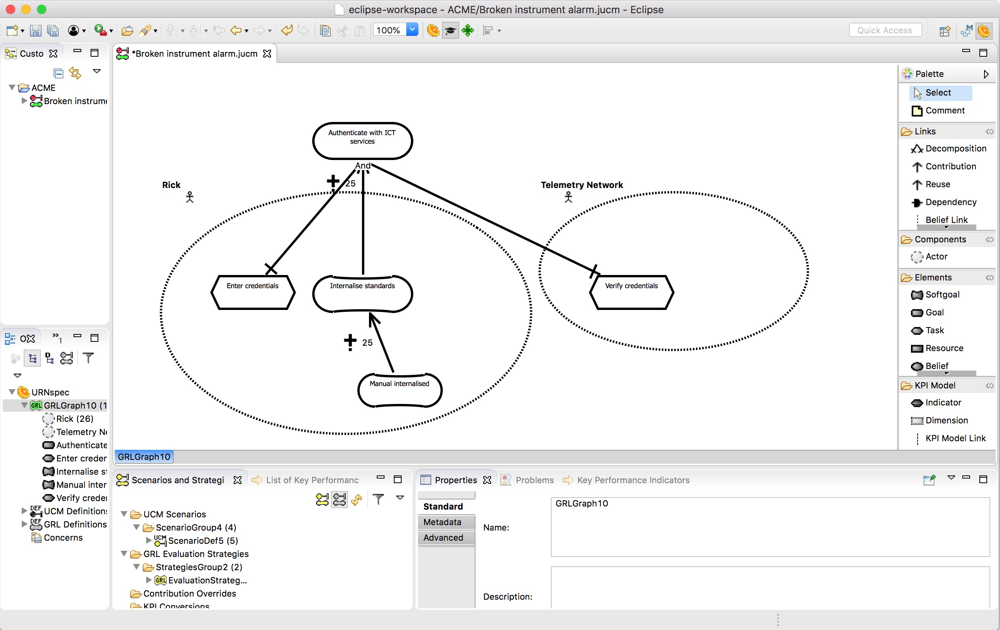
