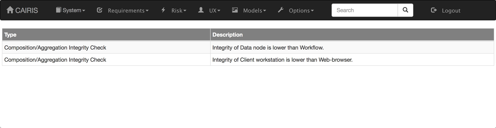

Model Validation
================

CAIRIS can validate models for a given environment based on potential security and privacy design problems.  

To validate a current CAIRIS model, click on the Models/Validate menu and select the environment to check the CAIRIS model for.

General validity checks
-----------------------

The general validity checks currently supported are as follows:

=======================================  ==================================================================================================================================
Check                                    Description
=======================================  ==================================================================================================================================
Reserved characters                      Check object names for the presence of reserved characters.
=======================================  ==================================================================================================================================

Security design checks
----------------------

The security design checks currently supported are as follows: 

=======================================  ==================================================================================================================================
Check                                    Description
=======================================  ==================================================================================================================================
Composition/Aggregation Integrity        For Hardware/Software/Information assets, checks asset integrity for the head asset isn't lower than the tail asset.
Implicit asset inclusion                 Asset implicitly included in an environment because of an asset association but no security or privacy properties have been set.
Implicit vulnerability                   Checks whether a goal dependency is obstructed or a related user goal is denied, thereby introducing a vulnerability due to goal non-fulfilment.
Inherited asset inconsistency            Checks an asset inheriting from another asset doesn't have weaker security or privacy properties.
Inherited asset type                     Checks an asset inheriting from another asset have the same asset type.
New risk contexts                        Risks present in environments that haven't been accounted for.
Obstructed tasks                         Where goals operationalise tasks, check root goals can be satisfied if any of its refined goals are obstructed.
STPA: potential control action conflict  Checks if multiple control flows feed into controlled processes.
Uncovered exception                      Exception present in use case without a related obstacle.
Vulnerable non-valued asset              Asset is vulnerable but no security or privacy properties have been set for it.
=======================================  ==================================================================================================================================

Privacy design checks
----------------------

If personal data has been introduced then the CAIRIS model is checked to ensure it doesn't violate any General Data Protection Regulation (GDPR) principles.  The checks carried out are described below:

======================================  =========================  =================================================================================================================================================
GDPR Principle                          Check                      Description
======================================  =========================  =================================================================================================================================================
Lawfulness, Fairness, and Transparency  Fair data processing       Data with privacy properties is processed only if it's recognised as personal data.
Lawfulness, Fairness, and Transparency  Lawful data handling       A persona working with a task or use case involving personal data is a Data Processor, Data Controller, or Data Subject.
Lawfulness, Fairness, and Transparency  Necessary processing       Use cases involving personal data are associated with a necessary goal or requirement.
Purpose Limitation                      Data purpose               Use cases involving personal data are associated with a necessary goal concerned with that personal data.
Data Minimisation                       Private data processing    Data with privacy properties are accounted for in processes.
Accuracy                                Personal data integrity    Personal data has an Integrity security property.
Storage Limitation                      Unprocessed personal data  Personal data in data stores is processed.
Integrity & Confidentiality             Unmitigated privacy risks  Personal information has confidentiality, integrity, and privacy properties that threats target are not exposed to unmitigated risks.
======================================  =========================  =================================================================================================================================================

.. _ac_checks: 

Access control checks
---------------------

These checks occur only if access needs and policy statements have been defined.

=======================================  ===============================================================================================================================================
Check                                    Description
=======================================  ===============================================================================================================================================
Unauthorised access                      Subject needs access to a resource, but this access is denied in a policy statement.
Absent policy statement                  Subject needs access to a resource, but no policy statement specifies this access. 
Ambiguous policy statement               Subject needs access to a resource, but multiple policy statements specify this access.
No read-up violation                     Subject needs access to a resource, but reading up when the Confidentiality value of the resource is higher than the subject is undesirable.
No write-down violation                  Subject needs access to a resource, but writing down when the Confidentiality value of the subject is higher than the resource is undesirable.
No read-down violation                   Subject needs access to a resource, but reading down when the Integrity value of the subject is higher than the resource is undesirable.
No write-up violation                    Subject needs access to a resource, but writing up when the Integrity value of the resource is higher than the subject is undesirable.
No interaction up violation              Subject needs access to a resource, but interacting up when the Integrity value of the subject is lower than the resource is undesirable.
=======================================  ===============================================================================================================================================