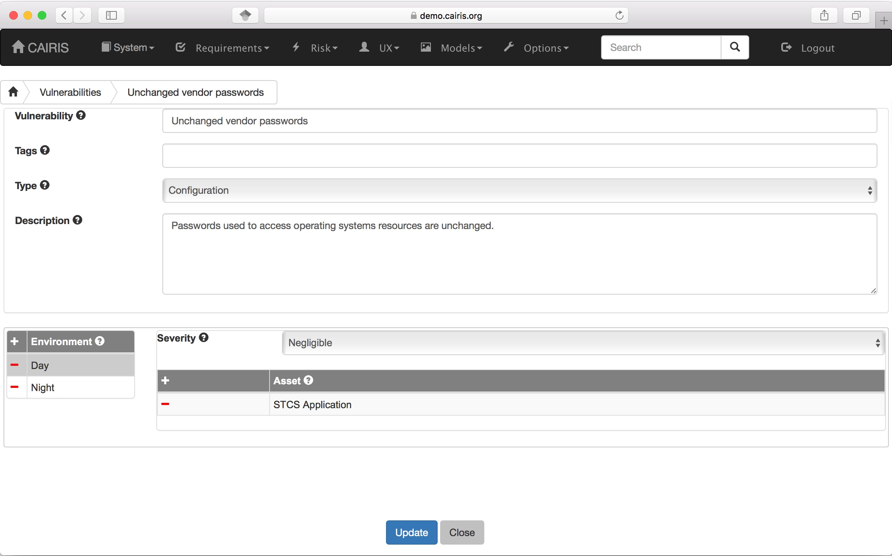
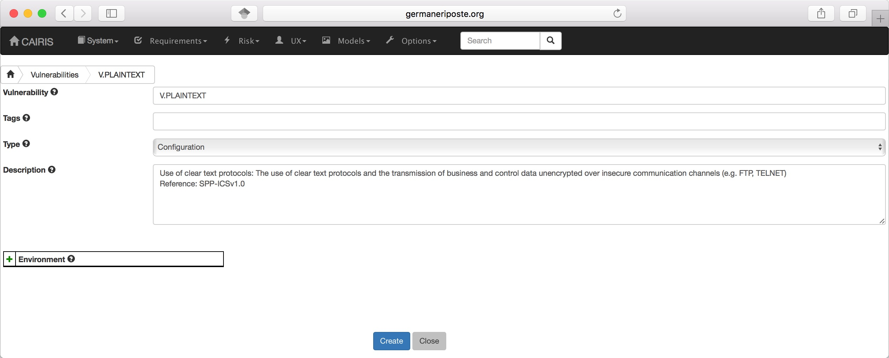

Vulnerabilities
===============

Vulnerabilities are weaknesses of a system that are liable to
exploitation.

Create a vulnerability
----------------------

-  Select the Risk/Vulnerabilities menu to open the Vulnerabilities table.

-  Click on the Add button to open the Vulnerability form.

-  Enter the vulnerability name and description, and select the
   vulnerability type from the combo box.

-  Click on the Add button in the environment card, and select an environment to situate the vulnerability in. This will add the new environment to the environment list.

-  Select the vulnerability's severity for this environment, and add exposed assets by clicking on the Add button in the assets table, and selecting one or more assets from the selected environment.

-  Click on the Create button to add the new vulnerability.

-  Existing vulnerabilities can be modified by clicking on the
   vulnerability in the Vulnerabilities table box, making the necessary
   changes, and clicking on the Update button.

-  To delete an vulnerability, click on the delete button next to the vulnerability to be deleted in the Vulnerabilities table. If any artifacts are dependent on this vulnerability then a dialog box stating these dependencies are displayed. The user has the option of electing Yes to remove the vulnerability dependencies and the vulnerability itself, or No to cancel the deletion.

Introducing template threats and vulnerabilities
------------------------------------

.. figure:: ImportVulnerabilityDialog.jpg
   :alt: Import Vulnerability

Libraries of template vulnerabilities can be imported into the CAIRIS database and introduced to the current CAIRIS model.  Examples of such libraries in cairis/examples/directories. To import one of these,
click on the blue Add button at from the top of Vulnerabilities or Threats table to open the Introduce from vulnerability directory dialog. When a vulnerability is selected, the Vulnerability form is opened, and pre-populated with information from the directory entry.

